<p align="center">
  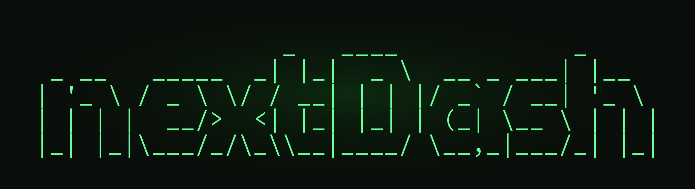
</p>

# nextDash — User Manual

**A complete guide to the keyboard-first bookmark dashboard.**

| | Resource | Where to look |
|---|----------|---------------|
| 🚀 | **Install & security** | [README.md](README.md) — Docker, environment variables, production setup |
| 📋 | **Release history** | [CHANGELOG.md](CHANGELOG.md) — every version, new and fix |
| 🗂️ | **Shortcut cheat sheet** | Press **!** or **F1** on the dashboard (live, searchable). Printable: [PDF](nextDash-cheatsheet.pdf?raw=true) / [HTML](nextDash-cheatsheet.html?raw=true) — regenerate with `npm run generate:cheatsheet`. |
| 💬 | **In-app help** | **Config → Help**, in English, Dutch, German, French, Spanish and Chinese |
| 🎨 | **328 themes, one look studio** | 164 theme families in light and dark, twelve characters, 26 backdrops and twelve ready-made looks — tried live on your own page with **`Shift + A`**, saved only on Apply. See [§16 Appearance](#16-appearance) and [the theme browser](#the-theme-browser) |
| 🏠 | **Self-hosting?** | The [Self-hosted guide](#self-hosted-guide) right below the contents — containers, bookmarks, health and push notifications working as one |
| 🔤 | **Glossary** | [100 key terms](#glossary), each linked to where it is explained |

This manual describes nextDash as it is now. It follows the same topics as Config → Help and goes into more detail. What changed in which release is in the [changelog](CHANGELOG.md).

---

<a id="table-of-contents"></a>

## 📚 Table of contents

**Start here**

| If you… | Read | Then |
|---|---|---|
| 🆕 just installed nextDash | [2 · First launch](#first-launch) → [3 · Core concepts](#3-core-concepts) | [5 · Adding bookmarks](#5-adding-bookmarks) |
| ⌨️ want to stop using the mouse | [7 · Keyboard](#7-keyboard) | [8 · Search, commands and finders](#8-search-commands-and-finders) |
| 🏠 run it next to your own services | [Self-hosted guide](#self-hosted-guide) | [14 · Containers](#14-containers), [12 · Checks & health](#12-checks-health) |
| 🎨 want it to look like yours | [16 · Appearance](#16-appearance) | [15 · Widgets](#15-widgets) |
| 🔤 met a word you don't know | [Glossary](#glossary) | |

**All chapters**

<details>
<summary><a href="#self-hosted-guide">Self-hosted guide: containers, bookmarks and health</a></summary>

- [What it gives you](#sh-what-it-gives-you)
- [Set it up in four steps](#sh-set-it-up)
- [Link each web UI to a bookmark](#sh-link-bookmarks)
- [Monitor it](#sh-monitor)
- [Get told: alerts, push and notices](#sh-get-told)
- [Keep it current](#sh-keep-current)
- [Keep it tidy](#sh-keep-tidy)
- [Unraid](#sh-unraid)
- [A homelab page](#sh-homelab-page)
- [A morning routine](#sh-morning-routine)
- [Keys and commands for daily use](#sh-keys)

</details>

<details>
<summary><b>1.</b> <a href="#1-what-is-nextdash">What is nextDash?</a></summary>

- [What you can do](#what-you-can-do)
- [What nextDash is not](#what-nextdash-is-not)

</details>

<details>
<summary><b>2.</b> <a href="#2-installation-and-first-launch">Installation and first launch</a></summary>

- [Docker Compose (recommended)](#docker-compose-recommended)
- [Build from source](#build-from-source)
- [Which branch to clone](#which-branch-to-clone)
- [First launch](#first-launch)

</details>

<details>
<summary><b>3.</b> <a href="#3-core-concepts">Core concepts</a></summary>

- [Pages](#31-pages)
- [Categories](#32-categories)
- [Bookmarks](#33-bookmarks)
- [The inbox](#34-the-inbox)
- [Views](#35-views)

</details>

<details>
<summary><b>4.</b> <a href="#4-the-dashboard">The dashboard</a></summary>

- [The header](#the-header)
- [The page switcher](#the-page-switcher)
- [The action buttons](#the-action-buttons)
- [The grid](#the-grid)
- [The link preview card](#the-link-preview-card)

</details>

<details>
<summary><b>5.</b> <a href="#5-adding-bookmarks">Adding bookmarks</a></summary>

- [Quick add (`&`)](#51-quick-add)
- [The full form (`+`, `Shift + B`, `Ctrl + Shift + A`)](#52-the-full-form-shift-b-ctrl-shift-a)
- [Paste a URL (`Ctrl + V`)](#53-paste-a-url-ctrl-v)
- [Other routes](#54-other-routes)
- [A link you already have](#a-link-you-already-have)

</details>

<details>
<summary><b>6.</b> <a href="#6-opening-and-editing-bookmarks">Opening and editing bookmarks</a></summary>

- [With the mouse](#with-the-mouse)
- [The right-click menu](#the-right-click-menu)
- [Editing in place](#editing-in-place)
- [Usage](#usage)
- [Recent bookmarks (`*`)](#recent-bookmarks)
- [Hypr mode](#hypr-mode)

</details>

<details>
<summary><b>7.</b> <a href="#7-keyboard">Keyboard</a></summary>

- [Views and panels](#71-views-and-panels)
- [Moving on the grid](#72-moving-on-the-grid)
- [Acting on a bookmark](#73-acting-on-a-bookmark)
- [Acting on a category or widget](#74-acting-on-a-category-or-widget)
- [Selecting several](#75-selecting-several)
- [The cheat sheet](#76-the-cheat-sheet)

</details>

<details>
<summary><b>8.</b> <a href="#8-search-commands-and-finders">Search, commands and finders</a></summary>

- [Just type](#81-just-type)
- [Filters](#82-filters)
- [Beyond the current page](#83-beyond-the-current-page)
  - [Searching the web](#searching-the-web)
- [From the browser's address bar](#84-from-the-browsers-address-bar)
- [Commands (`:`)](#85-commands)
- [Finders (`?`)](#86-finders)

</details>

<details>
<summary><b>9.</b> <a href="#9-pages-categories-and-collections">Pages, categories and collections</a></summary>

- [Pages](#91-pages)
- [Categories](#92-categories)
- [Sorting and folding](#93-sorting-and-folding)
- [Moving and reordering bookmarks](#94-moving-and-reordering-bookmarks)
- [Spreading a category across columns](#95-spreading-a-category-across-columns)
- [Smart collections](#96-smart-collections)
- [Custom and tag collections](#97-custom-and-tag-collections)
- [Page templates](#98-page-templates)

</details>

<details>
<summary><b>10.</b> <a href="#10-tags">Tags</a></summary>

- [Tags on a bookmark](#101-tags-on-a-bookmark)
- [Filtering by tag](#102-filtering-by-tag)
- [Managing tags](#103-managing-tags)
- [Tag suggestions](#104-tag-suggestions)
- [Notes](#105-notes)

</details>

<details>
<summary><b>11.</b> <a href="#11-the-bookmarks-view">The Bookmarks view</a></summary>

- [The rail](#111-the-rail)
- [The toolbar and the list](#112-the-toolbar-and-the-list)
- [The side panel](#113-the-side-panel)
- [Selecting several](#114-selecting-several)
- [The row menu](#115-the-row-menu)
- [Keys](#116-keys)
- [Work through and the header band](#117-work-through-and-the-header-band)
- [Collection health](#118-collection-health)
- [A bookmark's health in large](#119-a-bookmarks-health-in-large)
- [Rot report](#1110-rot-report)
- [Unsorted and Promote](#1111-unsorted-and-promote)
- [Pages & categories modal](#1112-pages-categories-modal)
- [Addresses](#1113-addresses)

</details>

<details>
<summary><b>12.</b> <a href="#12-checks-health">Checks & health</a></summary>

- [Availability modes](#121-availability-modes)
- [Expected response](#122-expected-response)
- [Drift](#123-drift)
- [Alerts](#124-alerts)
- [Maintenance windows](#125-maintenance-windows)
- [Fresh](#126-fresh)
- [Keeping a copy of a page](#127-keeping-a-copy-of-a-page)

</details>

<details>
<summary><b>13.</b> <a href="#13-inbox">Inbox</a></summary>

- [Getting links in](#131-getting-links-in)
- [The view](#132-the-view)
- [Acting on links](#133-acting-on-links)
- [Triage](#134-triage)
- [Keeping a link: Unsorted and Promote](#135-keeping-a-link-unsorted-and-promote)
- [Settings](#136-settings)

</details>

<details>
<summary><b>14.</b> <a href="#14-containers">Containers</a></summary>

- [Opening it](#141-opening-it)
- [The list](#142-the-list)
- [The side panel](#143-the-side-panel)
- [Keys](#144-keys)
- [Actions and updates](#145-actions-and-updates)
- [What it needs](#146-what-it-needs)
- [Disk](#147-disk)
- [The logs window](#148-the-logs-window)
- [Notices](#149-notices)

</details>

<details>
<summary><b>15.</b> <a href="#15-widgets">Widgets</a></summary>

- [The kinds](#151-the-kinds)
- [Adding and arranging](#152-adding-and-arranging)
- [On the dashboard](#153-on-the-dashboard)
- [System widgets and what they need](#154-system-widgets-and-what-they-need)
- [The Custom widget](#155-the-custom-widget)
  - [Step by step](#custom-widget-step-by-step)
  - [Sign-in](#custom-widget-sign-in)
  - [Paths and shapes](#custom-widget-paths)
  - [Presets](#custom-widget-presets)
  - [When it shows nothing](#custom-widget-troubleshooting)
- [Unraid widgets](#156-unraid-widgets)

</details>

<details>
<summary><b>16.</b> <a href="#16-appearance">Appearance</a></summary>

- [Themes](#161-themes)
  - [The theme browser](#the-theme-browser)
  - [Themes that catch the light](#themes-that-catch-the-light)
- [Character](#162-character)
- [Surfaces](#163-surfaces)
- [Type and background](#164-type-and-background)
- [Custom themes](#165-custom-themes)
- [Grid and rows](#166-grid-and-rows)
- [Header and action buttons](#167-header-and-action-buttons)
- [Date and weather](#168-date-and-weather)
- [Finding and resetting](#169-finding-and-resetting)

</details>

<details>
<summary><b>17.</b> <a href="#17-config">Config</a></summary>

- [The sections](#171-the-sections)
- [Tabs and saving](#172-tabs-and-saving)
- [Finding a setting](#173-finding-a-setting)
- [Config → Bookmarks](#174-config-bookmarks)
- [Behavior](#175-behavior)
- [Config → Inbox](#176-config-inbox)
- [Config → Containers](#177-config-containers)
- [Overview, Help and About](#178-overview-help-and-about)
- [Config keys](#179-config-keys)

</details>

**18.** [Statistics](#18-statistics)

<details>
<summary><b>19.</b> <a href="#19-data-backups-and-import">Data, backups and import</a></summary>

- [Backups & data](#191-backups-data)
- [Sources](#192-sources)
- [Webhooks](#193-webhooks)
- [Icons & previews](#194-icons-previews)
- [Trash](#195-trash)
- [Reset](#196-reset)

</details>

<details>
<summary><b>20.</b> <a href="#20-logs">Logs</a></summary>

- [Server logs](#201-server-logs)
- [Activity trail](#202-activity-trail)

</details>

<details>
<summary><b>21.</b> <a href="#21-browser-extension-and-capture">Browser extension and capture</a></summary>

- [The extension](#211-the-extension)
- [Capture without the extension](#212-capture-without-the-extension)

</details>

**22.** [Phones, tablets and the installed app](#22-phones-tablets-and-the-installed-app)

<details>
<summary><b>23.</b> <a href="#23-security-and-self-hosting">Security and self-hosting</a></summary>

- [Production Docker](#231-production-docker)
- [The write token](#232-the-write-token)
- [Local addresses and outgoing requests](#233-local-addresses-and-outgoing-requests)
- [CORS](#234-cors)
- [Content-Security-Policy](#235-content-security-policy)
- [The MCP endpoint](#236-the-mcp-endpoint)
- [What nextDash contacts](#237-what-nextdash-contacts)
- [Analytics](#238-analytics)
- [Operations](#239-operations)

</details>

<details>
<summary><b>24.</b> <a href="#24-troubleshooting">Troubleshooting</a></summary>

- [The dashboard is empty after install](#the-dashboard-is-empty-after-install)
- [The dashboard does not load](#the-dashboard-does-not-load)
- [A change in another tab does not show](#a-change-in-another-tab-does-not-show)
- [A shortcut does not open its bookmark](#a-shortcut-does-not-open-its-bookmark)
- [Bookmarks seem to be missing](#bookmarks-seem-to-be-missing)
- [An import says "0 new"](#an-import-says-0-new)
- [A bookmark with a private address is refused](#a-bookmark-with-a-private-address-is-refused)
- [A self-hosted service shows as broken](#a-self-hosted-service-shows-as-broken)
- [The colours look wrong after the system switched to dark](#the-colours-look-wrong-after-the-system-switched-to-dark)
- [A new release does not seem to have arrived](#a-new-release-does-not-seem-to-have-arrived)
- [The quick-start card does not appear](#the-quick-start-card-does-not-appear)
- [The weather does not show](#the-weather-does-not-show)
- [The Calendar widget shows nothing](#the-calendar-widget-shows-nothing)
- [The RSS widget shows nothing](#the-rss-widget-shows-nothing)
- [A system widget shows no figures](#a-system-widget-shows-no-figures)
- [Browser notifications do not arrive](#browser-notifications-do-not-arrive)
- [The extension cannot save](#the-extension-cannot-save)
- [The Containers view is missing or read-only](#the-containers-view-is-missing-or-read-only)

</details>

<details>
<summary><b>25.</b> <a href="#25-quick-reference">Quick reference</a></summary>

- [Most-used keys](#most-used-keys)
- [Config](#config)
- [Addresses](#addresses)
- [Data location](#data-location)

</details>

**26.** [Glossary](#glossary)

🔤 **[Glossary](#glossary)** — 100 key terms, one line each, linked to where it is explained.
📌 **[Quick reference](#25-quick-reference)** — the keys, config sections and addresses on one screen.

---

<a id="self-hosted-guide"></a>

## 🏠 Self-hosted guide: containers, bookmarks and health

Most people who self-host keep three things apart: a dashboard with links to their services, something that tells them when a service is down, and something to look at their Docker containers. nextDash does all three on one screen, and — more useful than that — it knows they are about the same services. The bookmark for Sonarr, the Sonarr container and the check that watches it are linked, so a problem shows up wherever you happen to look, and the fix is one key away.

This guide shows how the pieces fit together. Each part links to the chapter with every detail.

<a id="sh-what-it-gives-you"></a>

### What it gives you

| Question | Where you see the answer |
|---|---|
| *Is everything running?* | The **Containers view** (`Shift + Y`): every container with a status glow, CPU, RAM, healthcheck, restarts and an orange **↑** for an update waiting ([§14](#14-containers)) |
| *Can I actually reach it?* | The bookmark of its web UI, set to **Monitor**: checked by the server, with uptime, response time and certificate ([§12](#12-checks-health)) |
| *Which link belongs to which container?* | The bookmark mark on a container's row, in the colour of that bookmark's checks — and the cube after the bookmark's name in the Bookmarks view, in the container's state, with **Runs in** on its side panel ([§14.2](#142-the-list)) |
| *What went wrong, and when?* | The container's **Timeline** (crashes with exit code, out-of-memory kills, health changes, updates, rollbacks) and the bookmark's **Health in large** (every check, every outage) |
| *Will I hear about it?* | One set of alert channels and push notifications for sites going down, certificates running out and containers stopping, restarting, turning unhealthy or running hot ([§12.4](#124-alerts), [§14.9](#149-notices)) |
| *Is it up to date?* | Image update checks with release notes, skip and hold, a history, a rollback, and optional nightly updates that roll themselves back on failure ([§14.5](#145-actions-and-updates)) |
| *Where did my disk go?* | The **Disk** tab: images, volumes, build cache and bind mounts, biggest first, with clean-ups that say what they free ([§14.7](#147-disk)) |
| *How is the machine?* | The **Processor**, **Memory**, **Disks**, **Containers** and **Container list** widgets on the dashboard ([§15.4](#154-system-widgets-and-what-they-need)) |

The difference with separate tools is in the links between those rows. A container that keeps restarting is a red glow in the Containers view, a problem on its Container list row, a notice on your phone — and, because its web UI stops answering, a red mark on its bookmark, an outage in that bookmark's history and a downtime alert. Each place leads to the others with a click.

<a id="sh-set-it-up"></a>

### Set it up in four steps

nextDash runs fine without any of this; the steps below add the self-hosting half. [§14.6](#146-what-it-needs) has every detail, including Unraid, Synology and QNAP.

1. **Give it the Docker socket.** Mount `/var/run/docker.sock` and set `NEXTDASH_DOCKER_SOCKET=/var/run/docker.sock`. The Containers view, the Containers widgets and the header icon appear. Read-only (`:ro`) is enough to look.
2. **Decide whether it may act.** `NEXTDASH_DOCKER_CONTROL=1` allows start, stop, pause, restart, update, remove, rollback, automatic updates and Disk clean-ups. Without it the view only reads — a sensible first week.
3. **Set a write token.** `NEXTDASH_WRITE_TOKEN` with a long random string (`openssl rand -hex 32`). Access to the Docker socket is root on the host, so other websites and scripts must not be able to send requests in your name.
4. **Put a gate in front.** The token is not a login: the dashboard hands it to every browser that opens the page. Keep nextDash behind Tailscale or a reverse proxy with authentication ([§23](#23-security-and-self-hosting)) — with actions on, anyone who can open the dashboard can stop your containers.

```yaml
services:
  nextdash:
    image: ghcr.io/jordibrouwer/nextdash:latest
    ports:
      - "8080:8080"
    volumes:
      - ./data:/app/data
      - /var/run/docker.sock:/var/run/docker.sock:ro
      - /mnt:/host/root/mnt:ro,rslave              # for the Disks widget
    environment:
      - NEXTDASH_DOCKER_SOCKET=/var/run/docker.sock
      - NEXTDASH_DOCKER_CONTROL=1
      - NEXTDASH_WRITE_TOKEN=change-me-to-a-long-random-string
      - NEXTDASH_HOST_ROOT=/host/root
      # - NEXTDASH_RUN_AS_ROOT=1                   # only if the log says "owned by gid 0"
    restart: unless-stopped
```

Then open **Config → Containers**. **Connection** shows what the server sees — socket, actions, write token, its own container. Fill in **Docker host address** (the server's LAN address or name, such as `192.168.1.10` or `tower.local`) so port links open on the server rather than on the machine you are browsing from, and switch **Check for image updates** to every 6, 12 or 24 hours.

<a id="sh-link-bookmarks"></a>

### Link each web UI to a bookmark

You probably have bookmarks for your services already. nextDash finds the one that belongs to each container on its own, in this order, and stops at the first step that finds exactly one:

1. the bookmark you chose in the container's side panel, under **Bookmark**;
2. a bookmark on the same port of this server — `http://192.168.1.10:8989` for a container publishing 8989;
3. a bookmark whose subdomain is the container's name — `sonarr.example.com`, as a reverse proxy gives it;
4. a bookmark titled after the container.

Once linked, the container's row shows a small bookmark mark: green when its checks pass, red when it is broken or down, an outline when nothing checks it. A click opens the bookmark in the Bookmarks view. The other way round, the bookmark's row in the Bookmarks view carries a cube in the container's state ([§11.2](#112-the-toolbar-and-the-list)), and its side panel shows **Details → Address → Runs in**, a link to the container.

The links, and what comes out of them:

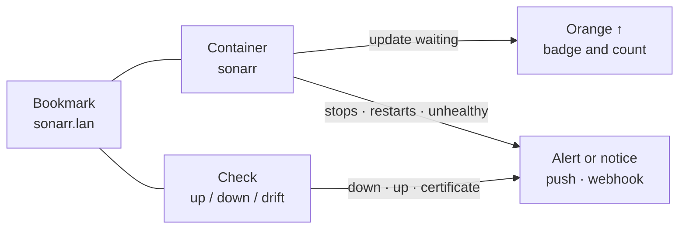
```mermaid
flowchart LR
    B[Bookmark<br>sonarr.lan] --- C[Container<br>sonarr]
    B --- H[Check<br>up / down / drift]
    C -->|update waiting| U[Orange ↑<br>badge and count]
    C -->|stops · restarts · unhealthy| A[Alert or notice<br>push · webhook]
    H -->|down · up · certificate| A
```

**When the guess is wrong** — two bookmarks on one port, a service behind a path rather than a subdomain — choose the bookmark by hand under the container's **Bookmark → Linked bookmark**, or *No bookmark*. A container without a bookmark at all is a hint: add one, so it shows on your dashboard and can be monitored.

**When the web UI is somewhere else** — behind your reverse proxy, on another port — set it in the side panel's **Custom → Web UI address**. `[IP]` stands for this server. The list, the Container list widget, search and `:docker <name> open` all use it.

<a id="sh-monitor"></a>

### Monitor it

A running container is not the same as a working service. A container can be *up* while its web UI shows an error page, its database is gone or its certificate has expired. The bookmark checks the service the way you use it — from the outside.

1. Open the bookmark (from the container's row, or the Bookmarks view) and set its availability to **Monitor** — `Shift + C` on the dashboard, `c` in the Bookmarks view.
2. Choose how often: 5 minutes to 24 hours, 15 minutes by default.
3. For a service that answers *200* while it is broken, open **Expected response** and give it a phrase that only shows when it works, or the status codes that count as healthy.
4. For a service behind a sign-in, give it an **Address to check instead** — a `/health` or `/api/status` endpoint — and, if needed, a stored sign-in from a Custom widget.
5. A self-signed certificate on your LAN? Tick **Accept a certificate this machine does not trust**.

Local addresses are checked once **Allow local bookmarks** is on ([§23.3](#233-local-addresses-and-outgoing-requests)). Planned downtime — the nightly backup that stops a database — goes in a **maintenance window** ([§12.5](#125-maintenance-windows)), so it opens no incident and sends no alert.

**Collection health** shows uptime and certificates for every monitor at once; the **Uptime** and **Certificates** widgets put the same on a dashboard page.

<a id="sh-get-told"></a>

### Get told: alerts, push and notices

There is one place where bad news goes, and both halves use it.

**Where it goes.** Set it up once under **Behavior → Status & alerts**:

- **Downtime alerts** — Slack, Discord, Telegram, Gotify, **ntfy**, **Pushover** or your own JSON receiver. **Send test alert** proves the route. ntfy alerts carry **Open link** and **Health** buttons, and failures go out at a higher priority than recoveries.
- **Browser notifications** — push to your phone, tablet or desktop, even with nextDash closed. Press **Enable on this device** on each device. On iPhone and iPad, add nextDash to the home screen first, and serve it over HTTPS ([§22](#22-phones-tablets-and-the-installed-app)).

**What arrives there:**

| From | Message |
|---|---|
| A monitored bookmark | Down, after the failures in a row you chose (3 by default), and up again with how long it was down |
| A certificate | 30, 7 and 3 days before it expires |
| A container | Stopped unexpectedly, keeps restarting (three crashes in ten minutes), turned unhealthy — and recovered |
| A container running hot | Above the CPU or memory line for longer than you allow (90 % for 10 minutes until you change it), and back under it |
| An automatic update | Done, rolled back and why, or not possible |

For containers on your phone, also switch on **Notify when a container stops, keeps restarting or turns unhealthy** under the browser notifications.

**Keeping it quiet.** nextDash leaves out what you did yourself: a stop you asked for is not a notice, nor is a crash the restart policy fixes within 30 seconds. One incident is one notice; four or more at once become one message, and a host that takes many bookmarks down together sends one downtime alert. Mute what you do not care about — a container with `m` or its row menu, a bookmark with **Do not alert me about this bookmark** — and it still shows its state on screen. **Config → Containers → Muted containers** says where container notices go, and **Hidden containers** keeps test containers out of the view and the widget count altogether.

**For other programs.** Outgoing webhooks send `health.down`, `health.up` and `health.cert-expiring`, signed, to anything that listens — Home Assistant, n8n, a script ([§19.3](#193-webhooks)).

<a id="sh-keep-current"></a>

### Keep it current

With **Check for image updates** on, nextDash asks each image's registry for a newer version on the interval you chose. A container with one waiting gets an orange **↑**, the header icon a count, and the **Updates** filter lists them all. The side panel's **What's new** tab shows the release notes behind the update before you take it.

- **Update one** — `u` on the row, or `:docker sonarr update`. Update and remove always ask first.
- **Update a stack** — **Group by project**, then **Update (n)** on the compose project's row.
- **Update a selection** — tick rows with `x`, then **Update** in the bar.
- **Skip this version** — when a release is known to be bad. A newer one counts again.
- **Hold updates** — for a container you pin on purpose, such as a database.
- **Roll back** — while the old image is still on the host, **Roll back to …** puts the container back on it, without a download, and skips the version it leaves.

**Update automatically** lets nextDash do it for you, in a nightly window (03:00 to 05:00 until you change it). Each container is updated one at a time and then watched for five minutes. If it stops, starts again on its own or turns unhealthy, it is rolled back to the image it had and that version is skipped — and you get a notice either way. Good candidates are stateless apps with a healthcheck; keep databases and anything with a migration on **Hold** and update those by hand.

Because the bookmark is monitored too, an update that leaves the container running but breaks the web UI still raises a downtime alert in the morning.

<a id="sh-keep-tidy"></a>

### Keep it tidy

- **Disk** (`d` in the Containers view) shows what images, volumes and the build cache take up, and what can be reclaimed. Clear unused or dangling images, the build cache and stopped containers in bulk; volumes go one at a time, after typing **delete**. A dangling image that is still a container's way back says *rollback for …* before you remove it. On Unraid, **Bind mounts** lists the appdata folders each container uses, with **Measure** to size one.
- **The logs window** (`l`, or `:docker <name> logs` from anywhere) follows a container's log live, with search, a filter, stdout and stderr apart, and download.
- **The timeline** keeps thirty days of what happened to each container — useful after a night of automatic updates, or when a container *seemed* fine.
- The **Containers** widget can show **reclaimable** space, so a filling disk shows up on the dashboard before it becomes a problem.

<a id="sh-unraid"></a>

### Unraid

nextDash reads an Unraid server through its own API — Unraid 7.2, or an older Unraid with the Unraid Connect plugin. Set it up once under **Config → Unraid**: the address, an API key with the role **Viewer** (Settings → Management Access → API Keys in Unraid), and a test. From then on:

- **Seven widgets** show the server on a page: an overview, the array with every disk, parity, shares by where they live, VMs, the UPS and Unraid's notifications ([§15.6](#156-unraid-widgets)).
- **Alerts** reach you through the channels downtime and container alerts use: Unraid's own ALERT notifications, the array stopping, a parity check that finished with errors, a disk whose error count went up.
- **Read only.** nextDash never starts, stops or changes anything on the server.

More is on the way: further Unraid integration is being worked on for future versions of nextDash.

<a id="sh-homelab-page"></a>

### A homelab page

Give your services their own page — *Homelab*, *Server* — and put the bookmarks for every web UI on it, grouped the way you think of them: *Media*, *Network*, *Home*, *Tools*. Then add widgets beside them ([§15](#15-widgets)):

| Widget | Why on this page |
|---|---|
| **Containers** | Running and total, failing healthchecks, restarts, updates waiting, reclaimable space, incidents in 24 hours, the three busiest |
| **Container list** | Every container on its own row, problems first; a click opens it in the Containers view or goes straight to its web UI |
| **Uptime** | The monitored bookmarks on this page, worst first, with a heartbeat |
| **Certificates** | The ones that run out soon |
| **Health** | Broken, down and changed bookmarks on this page; each figure opens its filter |
| **Processor**, **Memory**, **Disks** | The machine itself — name `/mnt/user` and `/mnt/cache` on Unraid |
| **Custom** | Figures from the services themselves — the queue in Sonarr, blocked queries in Pi-hole, a sensor in Home Assistant, CPU and memory in Proxmox — 41 services filled in ([§15.5](#155-the-custom-widget)) |

<p align="center">
  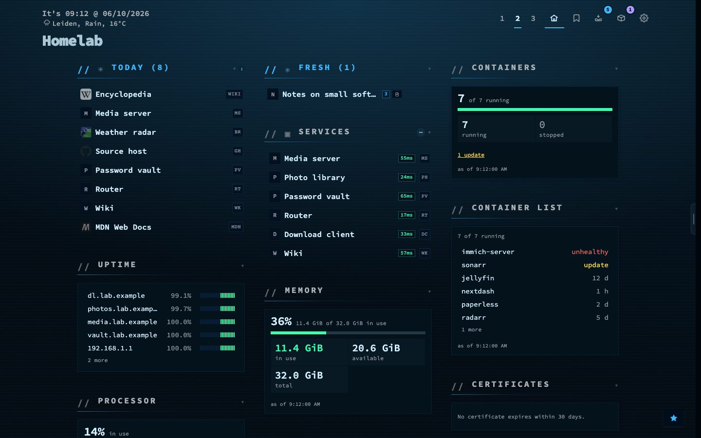
</p>
<p align="center"><sub>A homelab page: web UI bookmarks with response times, beside the Containers, Container list, Uptime, Memory and Certificates widgets.</sub></p>

Set a widget to two columns and it says more, not the same thing larger: the container failing by name, the expiry date of a certificate, the load behind the processor's percentage.

<a id="sh-morning-routine"></a>

### A morning routine

What a check of your setup can look like, all from the keyboard:

1. Open the homelab page. The Containers widget says *0 incidents*, Uptime is green, nothing waits in Certificates.
2. Or not: a notice on your phone said the automatic update of Paperless was rolled back at 04:09, and its bookmark sent a downtime alert and a recovery around the same time. `Shift + Y` opens the Containers view; Paperless runs again, on its old image.
3. `Enter` opens its side panel. The **Timeline** shows the update at 04:05, the crashes after it and the rollback. **Updates → History** names both versions.
4. `l` opens the logs window; search for `error` to see why the new version failed.
5. The version stays skipped until a newer one arrives. **Hold updates** if you would rather wait for a fix before nextDash tries again.
6. Click its bookmark mark: the bookmark's **Health** tab shows the minutes of downtime that matched the crashes.
7. `d` for Disk: the new image that failed is still on the host, used by nothing. Clear **Unused images** once you are sure — a later update downloads what it needs.
8. Elsewhere, an orange **↑**: `#docker?filter=updates`, read **What's new** for each, and update what you trust.

<a id="sh-keys"></a>

### Keys and commands for daily use

| Key or command | Does |
|---|---|
| <kbd>Shift</kbd> + <kbd>Y</kbd> | Open the Containers view |
| `:docker <name>` | Find a container from anywhere; add `open`, `logs`, `start`, `stop`, `restart`, `pause`, `update` or `remove` |
| <kbd>s</kbd> · <kbd>r</kbd> · <kbd>p</kbd> · <kbd>u</kbd> | Start or stop, restart, pause, update the selected container |
| <kbd>l</kbd> · <kbd>m</kbd> · <kbd>d</kbd> | Logs window, mute notices, Disk |
| <kbd>x</kbd> · <kbd>Shift</kbd> + <kbd>X</kbd> · <kbd>Ctrl</kbd>/<kbd>Cmd</kbd> + <kbd>A</kbd> | Tick one, a run, everything the filter shows |
| <kbd>/</kbd> | Search the containers |
| <kbd>Shift</kbd> + <kbd>C</kbd> | Change a bookmark's availability (Off, Periodic, Monitor) on the dashboard |
| `#docker?filter=updates` | The containers with an update waiting |
| `#bookmarks?health=monitored` | Every monitored bookmark, with its uptime |

The full list is in [§14.4](#144-keys) and on `!`.

---

<a id="1-what-is-nextdash"></a>

## 1. ✨ What is nextDash?

nextDash is a **self-hosted bookmark dashboard** you open in your browser.

- **No accounts.** One installation, one set of data on disk.
- **No cloud.** Your bookmarks live as plain JSON files in a directory you control.
- **Keyboard first.** Search, switch pages, add, edit and run commands without the mouse.

Bookmarks are grouped by **page** (Work, Home) and **category** (Dev, News). Around that sit search, a command palette, a Bookmarks view with link health checks and uptime monitoring, an inbox for links you have not filed yet, a Containers view for the machine's own Docker containers, and widgets that show something other than links.

<a id="what-you-can-do"></a>

### ✅ What you can do

| Area | Examples |
|------|----------|
| **Organise** | Pages, categories, drag and drop, pins, tags, notes, smart collections |
| **Find** | Type to search, filters, a command palette, finders for other sites |
| **Add** | One-line quick add, the full form, paste a URL, browser extension, share sheet, bookmarklet, imports |
| **Watch** | Broken links, uptime monitoring, certificate expiry, page drift, alerts |
| **Show** | Widgets for health, inbox, feeds, weather, calendar, your machine, your containers and your own services |
| **Customise** | 164 theme families, backdrops, surfaces, layout, header and action buttons, six languages |
| **Keep** | Automatic backups, a 30-day trash, local copies of pages, HTML and CSV export |

<a id="what-nextdash-is-not"></a>

### 🚫 What nextDash is not

- Not a multi-user service. Anyone who can reach the address can read and change the data — see [Security and self-hosting](#23-security-and-self-hosting).
- Not a feed reader. Fresh and the RSS widget tell you what is new; they do not store articles.

<sub>[↑ Contents](#table-of-contents)</sub>

---

<a id="2-installation-and-first-launch"></a>

## 2. ⚙️ Installation and first launch

<a id="docker-compose-recommended"></a>

### 🐳 Docker Compose (recommended)

```yaml
services:
  nextDash:
    image: ghcr.io/jordibrouwer/nextdash:latest
    container_name: nextDash
    ports:
      - "8080:8080"
    volumes:
      - ./data:/app/data
    environment:
      - PORT=8080
    restart: unless-stopped
```

```sh
docker compose up -d
```

Open `http://localhost:8080`.

From a git checkout, `docker-compose.prod.yml` is the production file (only `./data` is mounted; the assets are built into the binary) and `docker-compose.yml` is for development (it mounts `./static`, `./locales` and `./templates`). The development file ships with `NEXTDASH_DOCKER_CONTROL=0` and `NEXTDASH_RUN_AS_ROOT=0` and the Docker socket commented out. Put your own mounts and variables in a `docker-compose.override.yml` beside it: Compose reads that file on its own, and your changes stay out of the checkout.

<a id="build-from-source"></a>

### 🧱 Build from source

```sh
go build -o nextDash && ./nextDash
```

Data is stored in `./data` next to the binary. `NEXTDASH_DATA_DIR` points it elsewhere.

<a id="which-branch-to-clone"></a>

### 🌿 Which branch to clone

| Branch | Use it for |
|--------|------------|
| **`main`** (default) | Self-hosting and Docker builds — the released code |
| **`dev`** | Contributing — tests, scripts and work in progress |

<a id="first-launch"></a>

### 🚦 First launch

1. **Quick-start card.** A small card asks for your language and dark mode, your column layout and your weather location. Skip it whenever you like; every setting stays in config. It then becomes a short checklist — add a bookmark, tag one, open config, see the cheat sheet — that closes itself when done.
2. **Example bookmarks.** A new install starts with a few example bookmarks and a Health widget, so there is something to try the keys on.
3. **Your own bookmarks.** Import your browser's bookmark file under **Config → Data & backups** ([§19](#19-data-backups-and-import)), or add them with **+** and **&** ([§5](#5-adding-bookmarks)).
4. **Config.** Press **`Shift + S`** or click the gear. Config is a view inside the dashboard; **`Escape`** takes you back.

**The first hour.** Split your bookmarks across a few pages, give the ten you open daily a shortcut, and switch on link checking under Config → Behavior → Status & alerts. Everything else can wait until you know what you want.

<sub>[↑ Contents](#table-of-contents)</sub>

---

<a id="3-core-concepts"></a>

## 3. 🧠 Core concepts

> [!NOTE]
> **In short:** everything is a page, a category on a page, or a bookmark in a category. Links you have not filed wait in the inbox, and five views share one browser tab.

<a id="31-pages"></a>

### 3.1 Pages

A **page** is a separate set of categories and bookmarks — Work, Home, a project. Each page has a name, an optional emoji and an optional colour dot. Switch with **`1`–`9`**, **`Shift + ←/→`**, the page switcher in the header, or the pages panel (**`,`**). A page remembers where you were scrolled.

<a id="32-categories"></a>

### 3.2 Categories

A **category** is a section on a page. It has a name, an optional icon, a sort (manual, A–Z or Recent) and can be spread across several columns. Category names are unique per page; the same name on two pages is two categories. Bookmarks without a category collect under *Other* at the end of the page.

<a id="33-bookmarks"></a>

### 3.3 Bookmarks

| Field | Purpose |
|-------|---------|
| **Name** | The label. A bookmark without a name shows its host name. |
| **URL** | The address (http or https; private addresses only when allowed) |
| **Page / Category** | Where it is filed |
| **Tags** | Free labels, stored in lower case |
| **Shortcut** | One or two letters that open it from the dashboard |
| **Note** | Plain text, searchable |
| **Pinned** | Keeps it at the top of its category |
| **Icon** | Fetched automatically, or set by hand |
| **Availability checking** | **Off**, **Periodic** or **Monitor** — see [§12](#12-checks-health) |

nextDash also records when a bookmark was added and last changed, how often it was opened and when last, and its preview (title, description, image) and health.

<a id="34-the-inbox"></a>

### 3.4 The inbox

The **inbox** holds links you want to keep before you know where they belong. It is a list of its own, not a page. **Keep** sends a link to **Bookmarks → Unsorted** rather than filing it, for a link worth holding on to with no page yet. See [§13](#13-inbox).

<a id="35-views"></a>

### 3.5 Views

The dashboard has five views: the **dashboard grid**, the **Bookmarks view**, the **inbox**, the **Containers view** and **config**. They are all part of one page — switching never reloads. **`Escape`** backs out to the dashboard grid, and the browser's **Back** button returns to the view you came from. Changing a filter inside a view is not a history step.

This manual calls the page of categories and widgets the **dashboard grid**, to keep it apart from the **Bookmarks view** — the library of every bookmark, with its own rail, list and side panel ([§11](#11-the-bookmarks-view)).

<sub>[↑ Contents](#table-of-contents)</sub>

---
<a id="4-the-dashboard"></a>

## 4. 🖥️ The dashboard

> [!NOTE]
> **In short:** the dashboard grid is your start page: a header with clock, weather and page switcher, then categories and widgets in columns. Bookmarks, Inbox, Containers and config are icons in the header.

```
┌───────────────────────────────────────────────────────────────────────────┐
│ It's 09:12 · Thursday          1  2  3  4  +5   ⌂  📚  📥  🐳  ⚙          │
│ Leiden, rain, 16°C                                                        │
│ main                                                                      │
├───────────────────────────────────────────────────────────────────────────┤
│ // today (15)        // other            // vps             // weather     │
│   bookmark rows        bookmark rows       bookmark rows      widget       │
│                                                                           │
│                        [ + ] [ > ]   ← action buttons (dock)               │
└───────────────────────────────────────────────────────────────────────────┘
```

<p align="center">
  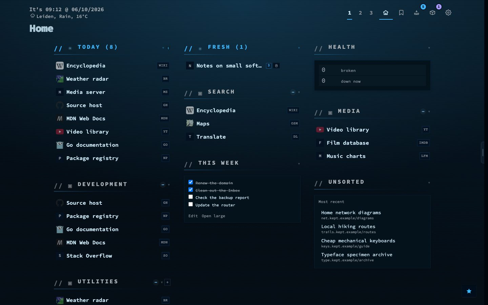
</p>
<p align="center"><sub>The dashboard: header with clock, weather and the page switcher, then categories and widgets in columns.</sub></p>

<a id="the-header"></a>

### 🧭 The header

The header has three zones.

- **Left — clock, weather and name.** The time and date, the weather line, and the name of the page or view (*main*, *config*). Click the date for a week overview; a **Calendar URL** (Appearance → Date & weather) adds an *Open calendar* link. **Clock and weather** chooses where they stand: beside the view name (the default), in a column of their own, or on their own line with the name underneath.
- **Middle — the page switcher.** See [below](#the-page-switcher).
- **Right — the destinations.** **Dashboard** (⌂), **Bookmarks** (a badge for a broken link or another problem), **Inbox** (an unread count), **Containers** (a badge for updates waiting) and **config** (the gear). Each destination can be switched off; its key keeps working. There is no Health icon — its badge and its list live on the Bookmarks icon now.

**Button style** draws the header controls plain (underlined when current) or each in its own box. As the window narrows, the header folds its parts away in a fixed order, so the switcher and the destinations stay reachable.

<a id="the-page-switcher"></a>

### 🔢 The page switcher

| Style | What it looks like |
|-------|--------------------|
| **Numbers beside the destinations** (default) | `1 2 3 4 +5` |
| **One segmented control** | The pages as one joined control |
| **Plain text, underlined** | The page names as tabs |
| **One button with a list** | The current page, with a list of the rest |

**Page tabs shown before "+N"** (3–9, default 4) sets how many pages show before the rest fold into a **+N** list. Every page keeps its digit key. **Show page names in tabs** and **Show the dashboard title** sit in the same group. Double-click a page tab to rename it and give it an emoji and a colour dot.

`:switcher`, `:maxtabs` and `:buttonstyle` change these from the command palette.

<a id="the-action-buttons"></a>

### 🎛️ The action buttons

| Button | Key | Opens |
|--------|-----|-------|
| Add | `+` | The full bookmark form |
| Search | `>` | The search panel |
| Commands | `:` | The command palette |
| Finders | `?` | Finders |
| Tag cloud | `/` | The tag cloud |
| Recent | `*` | Recent bookmarks |
| Pages | `,` | The pages panel |
| Fold all | `.` | Folds or unfolds every category and widget |
| Cheat sheet | `!` | The cheat sheet |

Every button is on to begin with. Switch the ones you do not want off under **Config → Appearance → Action bar**. Hiding a button leaves its key working: `+` adds a bookmark, `>` opens search, `!` the cheat sheet. With every button off, the surround disappears too.

**Where the fixed buttons stand.** A fresh install puts the bar in **a column on the right** that slides into the edge after **2 seconds**, so the page has it out of the way until it is wanted.

| Position | Behaviour |
|----------|-----------|
| **In a column on the right** (default) / **on the left** | A vertical column along that edge; the page moves aside to make room. |
| **In a dock at the bottom** | Centred at the bottom. |
| **In the header** | Beside the destinations. **Action buttons shown before "+N"** (default 2) folds the rest behind one control whose menu lists each action with its key. |
| **Behind one menu in the header** | One control; every action is in its menu. |

**A bar that slides away.** **Slide a docked bar away after** takes *always in view*, 2 (default), 5, 10 or 30 seconds, and applies to the three docked positions. The bar comes back when the pointer touches that edge or when focus moves into it, and then slides away again after the delay. Brought back with **`'`** or **`Shift + O`** it stays until you press the key again, or until the pointer has passed over it and left — from then on the delay runs as usual. Switching page or view leaves it where it is. A bar in use — the pointer over it, the keyboard in it, or a menu of its own open — never leaves while you are using it.

While it is away, a small **handle** stands on that edge, so the place it came from stays visible. It grows and brightens as the pointer comes near, and a click on it brings the bar back. There is no handle for a bar in the header or behind the menu, and none on a touch screen, where nothing hovers.

**The keys.** **Show the key on each button** adds a key chip to every button. It starts **on** for a new install and **off** on a dashboard that already existed — a bar of nine chips is a lot to meet on upgrade. With the chips off, resting on a button for a moment shows that button's key beside it, so the key is still there to find.

`:buttons` and `:maxactions` change these from the command palette.

The **★** button in the bottom-right corner opens the release notes. It is left out on a window as narrow as a phone; `:whatsnew` and Help still open them.

<details>
<summary>📷 Screenshot — the action buttons, each with its key</summary>

<p align="center">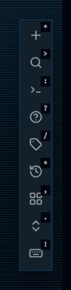</p>

</details>

<a id="the-grid"></a>

### 🗂️ The grid

Categories and widgets stand in columns — as many as **Columns per row** allows and the window has room for, and one on a phone held upright. Each category header shows `//`, its icon and name, a count, and chips for sorting (manual, **A–Z**, **Recent**), a **+** to add a category and a **⋯** menu. Click the header to fold the category. A spread category shows **↔ N** with the number of columns it takes. Smart collections (*Today*, *Recently opened*, …) and custom collections appear as groups among your categories.

A bookmark row shows its icon, name, optional tags, the shortcut letters and, when checked, its status and ping. How the row looks is set under **Appearance → Rows** ([§16](#16-appearance)).

**A key legend** under the grid shows the four most useful keys once you start moving with the keyboard; switch it under Behavior → Keyboard & search.

**Occasional tips.** Now and then the dashboard shows one keyboard tip, never the same one twice. Switch them off under Behavior → Privacy & sync → Onboarding.

<a id="corner-cards"></a>

**Corner cards** offer things once, one card at a time: a round of link review, a round of tag suggestions, browser notifications, the theme browser, Fresh, spreading a category, and once you have eight bookmarks a pointer to the feature overview on nextdash.cc, which opens in a new tab. Each can be dismissed, and each review card has a switch under Behavior → Privacy & sync → Onboarding. The same place lists every card with **Answered** or **Not shown yet**, and **Show again** brings an answered one back the next time its moment arrives.

<a id="the-link-preview-card"></a>

### 🃏 The link preview card

Hovering a bookmark — or pressing **`Shift + V`** on the selected row — opens a card in a fixed order:

1. **What the page is** — icon, title, one address and a status pill.
2. **What it says** — image, description, publisher, author and date where the page declares them, your note and tags. A bookmark that is a video — YouTube, Vimeo, Dailymotion, or a file that ends in `.mp4` — carries a small **▶** on the corner of its icon (beside the name when icons are off), and the card opens on the thumbnail with a play button over it.
3. **What you know about it** — last check and ping, uptime, certificate expiry, the Fresh count, opens and last opened, shortcut and location.

A row with nothing to say is left out. **Config → Appearance → Rows → Link preview cards** offers **Off**, **On hover** (default) and **Keyboard only**, a hover delay, and a checklist of rows — the player is the **Video player** row in that list. `Shift + V` works in every mode and keeps the card open with **Copy**, **Refresh** and **Edit**.

**Playing a video.** Nothing reaches YouTube or Vimeo while you hover: the poster is the picture your own server already fetched, and the player is built when you press it. From the keyboard, `Shift + V` puts the cursor on the play button and `Enter` starts it. `Esc` closes the card and ends the video, and so do the **✕** over the player and a click anywhere else — a click inside the player hands the keyboard to the provider, so `Esc` only works again once your pointer leaves the card.

The picture and the site icon are fetched **by your server** and stored under `data/preview-images/`, so hovering never tells the site you looked. The first hover shows the text at once and the picture a moment later. Untick **Image** and no picture is fetched or stored; set the cards to **Off** and nothing is fetched for them at all. **Data & backups → Icons & previews** caps the stored pictures at 50, 200 or 500 MB and can remove them all. Pictures are left out of backups; they are fetched again when needed.

<details>
<summary>📷 Screenshot — the link preview card</summary>

<p align="center">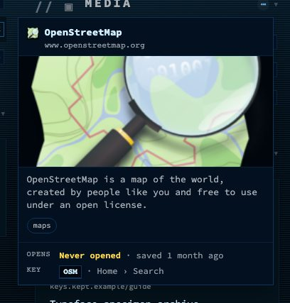</p>

</details>

<sub>[↑ Contents](#table-of-contents)</sub>

---

<a id="5-adding-bookmarks"></a>

## 5. ➕ Adding bookmarks

> [!NOTE]
> **In short:** add a bookmark with one line (`&`), the full form (`+`) or by pasting a URL. The extension, the share sheet and imports bring in more.

<a id="51-quick-add"></a>

### 5.1 Quick add (`&`)

Press **`&`**, type one line — `name | url | shortcut` (shortcut optional) — and press **Enter**.

```
GitHub | https://github.com | gh
```

<details>
<summary>📷 Screenshot — quick add with a line typed</summary>

<p align="center">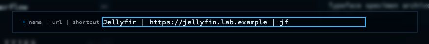</p>

</details>

<a id="52-the-full-form-shift-b-ctrl-shift-a"></a>

### 5.2 The full form (`+`, `Shift + B`, `Ctrl + Shift + A`)

One bookmark form is used everywhere: the dashboard, the Bookmarks view, the inbox, config and `:new`.

- **`+`** on the dashboard, or the add button.
- **`Shift + B`** from anywhere on the dashboard, unless you are typing in a field.
- **`Ctrl + Shift + A`** from anywhere.

The form is one column, in the order you fill it in: **address**, **name**, the **preview card**, **tags**, **page › category** and **shortcut**, **pin** and **availability checking**, and the **note**. It opens with the cursor in the address field, adding and editing alike.

**One read of the page.** When you leave the address field, the page is read once, and that one read fills in the rest:

- **The icon** — with a **✎** on it for **Upload…**, **Fetch again** and **Clear**. An icon you uploaded, or one the bookmark already had, is kept when the address changes; a fetched one is replaced.
- **A name** — left empty, the name field shows the page's own title, *Suggested from the page · Clear*; a name you typed stays, with *Page: … · Use* under it to take the page's title instead.
- **The card** — the page's host, its own line and its picture. It says **Reading the page…** while a slow site answers, and **No preview** with **Try again** when the page could not be read; the bookmark saves fine without one.
- **Suggested tags** — chips under the tags field, from the same sources as Tag suggestions ([§10.4](#104-tag-suggestions)). **+** adds one, **✕** turns it down for that site everywhere, and **↻** asks again. Editing a bookmark shows its suggestions straight away, from the words stored for it.

Change the address and the whole read starts again; only the latest one counts.

- **Page › category** is one field. It opens the same list as **Move to…** (`Shift + M`), with a filter at the top: type to narrow it, arrows and `Enter` to pick. Its first rows are **New category on …** and **New page…**; after a new page, the form asks for its first category.
- **ⓘ** beside **Tags**, **Shortcut** and the checking choice explains each one.
- **Availability** is the same **Off / Periodic / Monitor** choice as everywhere, with the interval for Monitor.
- The **shortcut** field warns when a shortcut is taken, and says which letters the grid itself uses.
- **Save** or **`Ctrl + Enter`** saves. **Create + New** saves and clears the form for the next one, keeping page and category.
- **Before it saves**, the form asks: with no page it says a bookmark needs one; with no category it asks **Save without** or **Choose a category**; a link already on another page is named, with **Save anyway**; a link already on the same page is refused, naming the bookmark that has it.
- **The keyboard alone** fills in the whole form: `Tab` walks the fields in order and wraps round inside the form, and `Escape` closes the innermost thing first — the tag list, the icon menu, the page list — and the form last. The dashboard behind it does not scroll.
- On a phone the form leaves out the icon and note fields; existing values are kept.

This same form, titled **Promote bookmark**, is how an Unsorted bookmark from the inbox or the Bookmarks view gets a page ([§11.11](#1111-unsorted-and-promote)).

<details>
<summary>📷 Screenshot — the full bookmark form</summary>

<p align="center">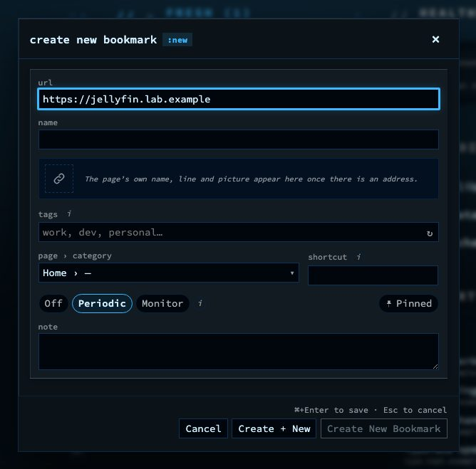</p>

</details>

<a id="53-paste-a-url-ctrl-v"></a>

### 5.3 Paste a URL (`Ctrl + V`)

With no field active, paste a URL on the dashboard. A dialog offers **Save to Inbox** (`1`) or **Add bookmark** (`2`). Set a fixed answer under **Config → Inbox → Collecting → Paste destination** — *Ask each time*, *Always add bookmark* or *Always save to Inbox*.

<a id="54-other-routes"></a>

### 5.4 Other routes

- **Browser extension** — saves the current tab ([§21](#21-browser-extension-and-capture)).
- **Share sheet and bookmarklet** — save to the inbox from a phone or any browser ([§21](#21-browser-extension-and-capture)).
- **Import** — a browser bookmark file, a CSV file, or a source such as GitHub stars ([§19](#19-data-backups-and-import)).
- **Add bookmark** in the Bookmarks view's toolbar — the same form, on the page the list is filtered to ([§11](#11-the-bookmarks-view)).
- **`:new`** and **`:add`** in the command palette.

<a id="a-link-you-already-have"></a>

### ♻️ A link you already have

nextDash compares addresses loosely: a trailing slash, a `#fragment`, the case of the host and a default port do not make a link different.

- **Same page** — refused. Two identical rows on one page are never intended.
- **Another page** — you are asked, and told where it is: *"You already saved this on Work · Docs"*, with a link. **Save anyway** keeps the second copy.

The form, quick add and the extension all ask. Imports skip duplicates and say how many.

<sub>[↑ Contents](#table-of-contents)</sub>

---

<a id="6-opening-and-editing-bookmarks"></a>

## 6. 🔖 Opening and editing bookmarks

> [!NOTE]
> **In short:** click a bookmark or press its shortcut letters to open it; the right-click menu and editing in place change it. Usage and recent bookmarks show what you reach for.

<a id="with-the-mouse"></a>

### 🖱️ With the mouse

| Gesture | What it does |
|---|---|
| Click a bookmark | Opens it and counts the open. The row flashes briefly. |
| Middle-click / `Ctrl`-click | Opens it in a new tab, and counts the open |
| Right-click a bookmark | The actions menu. Inside a selection it acts on the whole selection. `Shift` + right-click gives the browser's menu. |
| Drag a bookmark | Reorders it, or moves it to another category |
| Long-press a bookmark (~500 ms) | Edit in place |
| Hover a bookmark | The preview card |
| Click a category header | Folds or unfolds it |
| Long-press or double-click a category header | Renames it |
| Right-click a category header | Rename, spread, add, icon, delete |
| Drag the `//` in a category title | Reorders categories |
| Double-click a page tab | Renames the page, sets its emoji and colour |
| `Alt`-click / `Shift`-click | Adds to, or extends, a selection |

**Open in new tab** follows Behavior → General; `Ctrl/Cmd + Enter` always opens a new tab.

<a id="the-right-click-menu"></a>

### 📋 The right-click menu

| Item | Key | What it does |
|------|-----|--------------|
| Open in new tab | `Ctrl/Cmd + Enter` | Opens it in the background |
| Copy URL | `Ctrl + C` | Copies the address |
| Share… / Copy name + URL | `Shift + L` | The system share sheet where the browser offers one (HTTPS only); otherwise copies name and address |
| QR code | `Shift + J` | Shows the address as a QR code, to open it on a phone; drawn in the browser, so the address goes nowhere. **Copy URL** in the window copies it |
| Edit | `Shift + E` | Edit in place |
| Pin / Unpin | `Shift + P` | |
| Tags… | `Shift + T` | The quick tag picker |
| Move to… | `Shift + M` | Another category or page |
| Checking | `Shift + C` | Off / Periodic / Monitor |
| Show in Health | `Shift + R` | Opens the bookmark in the Bookmarks view, on its Health tab |
| Select / Select all in category | `x` / `X` | Starts a selection |
| Delete | `Shift + D` | Asks first; undo in the toast; the trash keeps it 30 days |

The menu also opens with **`Shift + F10`** or the **Menu** key, beside the row.

<a id="qr-code"></a>

> [!TIP]
> **A link on your phone.** Select the bookmark and press **`Shift + J`**, or pick **QR code** in this menu, then scan the code with the phone's camera. On an inbox row the code holds the item's own link, as Share does. The code is drawn in the browser, so the address is not sent anywhere.

<details>
<summary>📷 Screenshot — the right-click menu</summary>

<p align="center">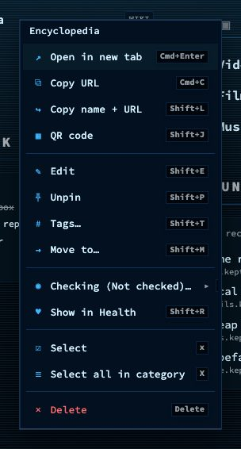</p>

</details>

<a id="editing-in-place"></a>

### ✏️ Editing in place

**`Shift + E`**, a long press, or **Edit** opens the bookmark form over the row, with the page dimmed behind it. **Save** or **`Ctrl + Enter`** writes it; **`Esc`** or a click outside closes it, asking first when something changed. While it is open, the grid keys, swiping and paste are paused. Deleting from the form asks first and offers undo.

<a id="usage"></a>

### 📈 Usage

Every open — from the grid, search, the recent panel or the Bookmarks view — adds one to the bookmark's open count and records the time. This feeds *Recently opened*, *Most used*, *Stale*, statistics and the Bookmarks view's Health tab. Opening the same site from the browser's address bar does not count. The counts are in your data files and travel with backups.

<a id="recent-bookmarks"></a>

### 🕘 Recent bookmarks (`*`)

A narrow panel with what you opened recently on this page: one row per bookmark, with its category, when and how often. The arrow keys move, `Enter` opens. `:open last 5` opens several at once.

<a id="hypr-mode"></a>

### 🪟 Hypr mode

**Behavior → General → Hypr mode** makes a click open the bookmark in a new browser tab and then close the installed app's window, the way an app launcher works. It pairs with nextDash installed as an app ([§22](#22-phones-tablets-and-the-installed-app)).

<sub>[↑ Contents](#table-of-contents)</sub>

---
<a id="7-keyboard"></a>

## 7. ⌨️ Keyboard

> [!NOTE]
> **In short:** every action on a bookmark is `Shift` plus a letter, and the cheat sheet (`!` or `F1`) lists them all. This chapter is the full key map.

Every action on a bookmark is **`Shift` plus a letter**. Bare letters belong to search until the cursor is on the grid, and then to the grid. The right-click menu shows each key, and the cheat sheet (**`!`** or **`F1`**) lists all of them.

<a id="71-views-and-panels"></a>

### 7.1 Views and panels

| Keys | Action |
|------|--------|
| `1`–`9` | Go to a page |
| `Shift + ←` / `Shift + →` | Previous / next page |
| `Shift + I` | Inbox |
| `Shift + H` | The Bookmarks view, on the broken ones |
| `Shift + U` | The Bookmarks view, on Unsorted |
| `Shift + Y` | Containers |
| `Shift + S` or `<` | Config (and back) |
| `Shift + A` | The theme browser |
| `>` `:` `?` | Search, commands, finders |
| `+` · `Shift + B` · `&` | Full bookmark form · from anywhere · quick add |
| `/` | Tag cloud |
| `*` | Recent bookmarks |
| `,` | Pages panel (`n` there makes a new page) |
| `!` or `F1` | Cheat sheet |
| `.` | Fold or unfold every category and widget |
| `Shift + N` | Add a category to this page |
| `'` or `Shift + O` | Slide a docked action bar away or back |
| `Shift + F` | Filter this page in place |
| `Shift + Q` | Switch whether letters search names or shortcuts |
| `Esc` | Close the panel; on a bare grid, go to the first page; on the first page, open search |

The Containers view opens with `Shift + Y`, its header icon or `:docker`.

<a id="72-moving-on-the-grid"></a>

### 7.2 Moving on the grid

| Keys | Action |
|------|--------|
| `↑` `↓` `←` `→` | Move the cursor. The first arrow key starts it. |
| `k` / `j` | Up / down, once a row is selected |
| `Tab` / `Shift + Tab` | Next / previous bookmark |
| `Home` / `End` | First / last bookmark in the category |
| `Ctrl + Home` / `Ctrl + End` | First / last bookmark on the page |
| `Page Up` / `Page Down` | One screen up / down |
| `G` then `1`–`9` | First bookmark in that category or collection |
| `G` then `P` | First pinned bookmark |
| `G G` | First bookmark on the page |
| `Enter` / `Space` | Open |
| `Enter` on **+ N more** | Show or hide the rest of a long category |
| `Esc` | Clear the cursor; undo a drag that has not saved yet |

With the cursor on a row, a bookmark's own **shortcut** opens it. The letters the grid uses — `g`, `j`, `k`, `t`, `x` — keep their grid meaning; reach a bookmark with such a shortcut through search.

<a id="73-acting-on-a-bookmark"></a>

### 7.3 Acting on a bookmark

| Keys | Action |
|------|--------|
| `Shift + E` | Edit in place |
| `Shift + V` | Preview card, kept open |
| `Shift + M` | Move to another category or page |
| `Shift + T` | Tags |
| `Shift + D` or `Delete` | Delete (asks first; undo in the toast) |
| `Shift + P` | Pin or unpin |
| `Shift + C` | Availability checking — `o` off, `p` periodic, `m` monitor |
| `Shift + L` | Share, or copy name and URL |
| `Shift + J` | The bookmark as a QR code, to open it on a phone |
| `Shift + R` | Open the bookmark in the Bookmarks view, on its Health tab |
| `Ctrl + C` | Copy the URL |
| `Ctrl/Cmd + Enter` | Open in a new tab |
| `t` | Filter the grid by this bookmark's tag |
| `Alt + ↑` / `Alt + ↓` | Move it within its category (manual order) |
| `Shift + Alt + ←` / `→` | Move it into the category beside it |
| `Shift + F10` or Menu key | The right-click menu |

<a id="74-acting-on-a-category-or-widget"></a>

### 7.4 Acting on a category or widget

`Shift + Home` steps from the rows up to the header. There:

| Keys | Action |
|------|--------|
| `Enter` / `Space` | Fold or unfold |
| `F2` | Rename |
| `Shift + W` | Spread across columns (on a widget: one or two columns) |
| `Alt + ←` / `Alt + →` | Move the category one place |
| `Delete` | Delete the category (bookmarks are kept) or close the widget |
| `Shift + F10` | The header menu |

The arrow keys walk into a widget and through its rows; `Enter` does what clicking the row does.

<a id="75-selecting-several"></a>

### 7.5 Selecting several

| Keys | Action |
|------|--------|
| `x` | Tick the row and move to the next |
| `X` | Tick the whole category |
| `Shift + ↑` / `Shift + ↓` | Extend the selection |
| `Ctrl/Cmd + A` | Tick everything on screen |
| `Alt` + click / `Shift` + click | Add one / extend with the mouse |
| `Delete` | Delete the selection (one confirmation, undo in the toast) |
| `Esc` | Clear the selection |

A toolbar appears with **Move**, **Tags**, **Pin**, **Checking**, **Open**, **Copy links** and **Delete**. The tag picker shows a **✓** for tags the whole selection has and *on 2 of 3* for tags only some have. Above them, **Suggested** lists up to three tags the selection is likely to want ([§10.4](#104-tag-suggestions)); a suggestion that fits only some of the rows says *on 1 of 3*, and choosing it tags only those rows. While a selection is open, a plain click clears it instead of opening a bookmark. A bulk change can be undone from its toast for eight seconds, and deleted bookmarks stay in the trash for 30 days.

<a id="76-the-cheat-sheet"></a>

### 7.6 The cheat sheet

**`!`** or **`F1`** opens the cheat sheet with a filter box. It opens on the section for the view you are in, and lists more than 200 keys and commands across Navigation, Bookmarks, Widgets, Selecting several, the **Bookmarks view**, the **Inbox view** and **Inbox triage**, the **Containers view**, the Config view, search modes and every command. A printable version is linked at the top of Config → Help and at the top of this manual. Keys cannot be rebound.

While a panel is open, the grid behind it does not react. `Tab` stays inside the panel, and `Escape` closes it and puts focus back where it was.

<details>
<summary>📷 Screenshot — the cheat sheet (<kbd>!</kbd>)</summary>

<p align="center">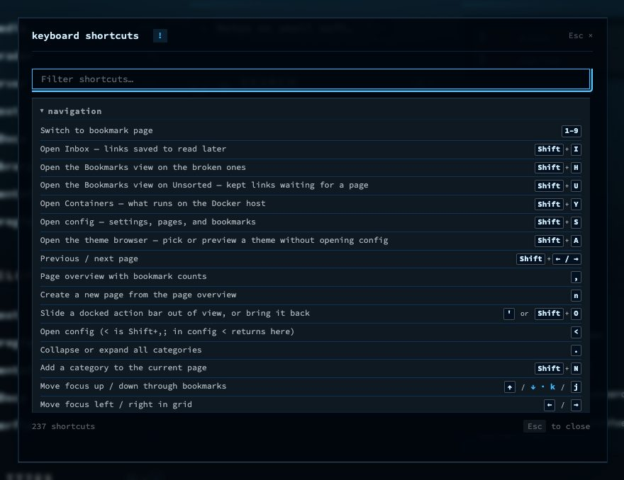</p>

</details>

<sub>[↑ Contents](#table-of-contents)</sub>

---

<a id="8-search-commands-and-finders"></a>

## 8. 🔎 Search, commands and finders

> [!NOTE]
> **In short:** one panel with three modes: type to search your bookmarks, `:` for commands, `?` for finders that search another site. Filters narrow it, and it can reach other pages and the web.

Search, commands and finders are three modes of one panel.

```
>  search     — your bookmarks, with filters
:  commands   — actions: :theme, :open last 5, …
?  finders    — ?g query → another site
@  everywhere — search all pages at once
⇧↵ the web    — the same words, asked of a search engine
```

<a id="81-just-type"></a>

### 8.1 Just type

The dashboard's search line is always listening. Letters narrow the list; **`Enter`** opens the top result, **`↑`/`↓`** pick another, **`Ctrl/Cmd + Enter`** opens in a new tab, **`Esc`** closes. Results are ranked by match and by how often you open them. The panel also searches notes and the description nextDash fetched from each page.

<p align="center">
  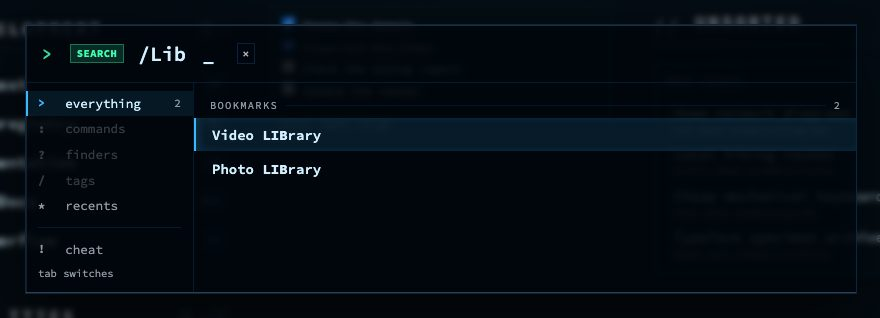
</p>
<p align="center"><sub>Typing on the dashboard opens the search panel; here <code>/Lib</code>, a name search, finds two bookmarks.</sub></p>

Links still waiting in the inbox that match a name search appear in their own group at the end of the results; snoozed ones stay out, as they do in the inbox's own list.

With the panel empty, your recent and saved searches show as chips (`←`/`→` and `Enter`).

**Typing a bookmark shortcut** (Behavior → Keyboard & search) has three answers:

| Setting | What happens |
|---------|--------------|
| **Open the moment it matches** (default) | The bookmark opens as soon as what you typed equals its shortcut. Fastest; can cut off an ordinary word that starts with those letters. |
| **Open after a short pause** | The shortcut waits until you stop typing. |
| **Press Enter to open** | Typing only narrows the list; the shortcut leads it. |

**Switch search mode** (Behavior → Keyboard & search, or **`Shift + Q`**) decides whether bare letters look for a shortcut or a name. When one finds nothing and the other would, the panel adds a row that searches the other way.

**Behavior → Keyboard & search** also holds fuzzy suggestions for near-misses, *include finders in search*, *keep search open when empty* and the search hint. *Search unsorted bookmarks* (on by default) lets search reach links kept on **Bookmarks → Unsorted** ([§11.11](#1111-unsorted-and-promote)); they stay out of every other list.

<a id="82-filters"></a>

### 8.2 Filters

| Filter | Examples |
|--------|----------|
| `tag:` | `tag:work` |
| `category:` | `category:dev` |
| `page:` | `page:2`, `page:current`, `page:all` |
| `status:` | `online`, `offline`, `broken`, `ok`, `checked`, `unchecked`, `pinned`, `unpinned`, `tagged`, `untagged`, `noted`, `unnoted`, `feed` |
| `opened:` | `today`, `week`, `month`, `year`, `never` |
| `added:` | `today`, `week`, `month`, `year` |
| `-` before any filter | `-tag:archive`, `-status:pinned` |

Filters combine with each other and with plain words: `tag:dev -status:pinned api`. They are offered as you type.

<a id="83-beyond-the-current-page"></a>

### 8.3 Beyond the current page

- **`@`** at the start searches every page; each result names its page.
- **`Shift + F`** is the opposite: a bar above the grid that hides non-matching rows on this page and keeps the layout and cursor. `Escape` clears it, a second `Escape` closes it.
- **`:find text`** does the same from the command palette.

<a id="searching-the-web"></a>

#### 🌐 Searching the web

With an engine set, the search panel also searches the web. Nothing leaves the server while you type: the last row, **Search the web: …**, waits for **`Shift + Enter`** (or a click). Then the results appear under **From the web**, below your own bookmarks.

- **The engine** — Behavior → Keyboard & search → **Web search**: **Off** (the default), **SearXNG** with the address of your own instance, or the **Brave Search API** with a key from api.search.brave.com. SearXNG must have `json` under `search.formats` in its `settings.yml`. **Test connection** runs a search for *test* and says how many results came back, or why not.
- **Private by design** — the server asks the engine, so the engine sees your server and never your browser. A result loads nothing until you open it: no favicons, no thumbnails. Web searches are not written to the activity log, and the server keeps no record of them.
- **Categories** — Web, News, Video, and IT with SearXNG. **`Shift + ←`/`→`** steps between them.
- **A site you already keep** — a result from a host you have a bookmark for shows *In your bookmarks: ‹name›*. **`Alt + Enter`** opens your bookmark instead of the result.
- **Reading before opening** — **`→`** on a result shows its title, address, date and text in a column beside the list; **`←`** closes it. Not on a phone.
- **Nothing found** — the panel says why (no results, an engine that did not answer, a rejected key, SearXNG refusing JSON) and offers **Open in ‹engine›** to search on the engine's own page.
- **Recent on the web** — the last eight web searches, in this browser only, as a folded group in the empty panel, with a row to clear them.
- An answer is kept for a minute, so the same search again is instant; the engine has five seconds to answer. At most 20 results per search.

<a id="84-from-the-browsers-address-bar"></a>

### 8.4 From the browser's address bar

nextDash describes itself to your browser as a search engine (`/opensearch.xml`).

- **Firefox** — Settings → Search → Search shortcuts; give it a keyword.
- **Chrome, Edge, Brave** — Settings → Search engine → Manage search engines → Site search; shorten the keyword, for example to `nd`.
- **Safari** — not supported.

Then type the keyword, `Tab`, a term and `Enter`. A search also has an address of its own, `#search?q=your+terms`, which can be bookmarked or opened from a script. Behind a reverse proxy, `X-Forwarded-Proto` and `X-Forwarded-Host` are honoured.

With web search on ([§8.3](#83-beyond-the-current-page)), nextDash offers a second engine, **‹title› Web** (`/opensearch-web.xml`), which opens the dashboard with the web results already asked: `#search?web=your+terms`.

<a id="85-commands"></a>

### 8.5 Commands (`:`)

A lone **`:`** lists every command in five groups — Bookmarks, Search & navigate, Look & layout, Smart collections, Settings & tools — with your recent commands on top. Commands with an argument complete as you type. A toggle keeps the palette open and shows its new state.

| Command | What it does |
|---------|--------------|
| `:new` / `:add` | Full form / quick add |
| `:edit` · `:move` · `:copy` · `:note` · `:pin` · `:unpin` · `:remove` | On the selected bookmark |
| `:tag` · `:tag work` · `:tag +name` · `:tag -name` | List tags, browse a tag, add or remove a tag on the selected bookmark |
| `:filter <tag>` / `:filter clear` | The dashboard tag filter |
| `:find <text>` / `:find clear` | Filter this page |
| `:open all` · `:open pinned` · `:open tag <name>` · `:open category <name>` · `:open last [n]` | Open several in tabs (at most 15 at once) |
| `:page <name or n>` · `:page new <name>` | Switch page · create one |
| `:category <name or n>` · `:category new <name>` | Jump to a category · create one |
| `:recent` · `:overview` | Recent bookmarks · pages panel |
| `:save` · `:saved` · `:history` | Saved searches and search history (saved searches are kept in settings) |
| `:sort order\|az\|recent` | Sort the focused category |
| `:stale [days]` · `:duplicates` | Cleanup lists |
| `:goto <url>` · `:goto config\|stats\|docker` | Go somewhere |
| `:inbox` · `:inbox triage` | The inbox |
| `:health [broken\|duplicate\|stale\|unused\|unchecked\|missing-preview\|shortcut-conflict\|healthy\|all\|refresh]` | Opens the Bookmarks view on that filter, and re-scans on `refresh` |
| `:health page <name>` | The Bookmarks view on one page |
| `:docker` | The Containers view |
| `:docker <name> open` · `:docker <name> logs` · `:docker <name> start\|stop\|restart\|pause\|update\|remove` | One container: `open` goes to its web UI, or to the view when it has none; the actions need `NEXTDASH_DOCKER_CONTROL=1` |
| `:monitor` · `:monitor off` | How many bookmarks are checked · switch checking off everywhere (asks first) |
| `:config [section]` | A config section, for example `:config appearance` |
| `:backup` · `:export` · `:trash` | Backups · download a backup · the trash |
| `:favicons fetch` · `:favicons on\|off` | Download every icon again · show icons |
| `:metadata` | Bookmarks without a preview |
| `:theme <name>` · `:dark` | Theme · flip light and dark |
| `:depth` · `:glow` · `:contrast` · `:backdrop` · `:pattern` · `:harmonize` | Surfaces ([§16](#16-appearance)) |
| `:layout <preset>` · `:density` · `:columns <1-6>` · `:width on\|off\|all` · `:rows` · `:packed` · `:fontsize` | Grid |
| `:switcher` · `:buttonstyle` · `:maxtabs` · `:maxactions` · `:buttons` · `:header` | Header and action buttons |
| `:preview` · `:title` · `:opacity` · `:animations` · `:status` · `:shortcuts` · `:lang` | Display toggles |
| `:locklayout` | Lock or unlock drag and drop |
| `:collections` | Smart collections on or off |
| `:telemetry on\|off` | Analytics (reloads the page) |
| `:cheat` · `:help` · `:whatsnew` · `:reload` | Cheat sheet · release notes · reload |

<details>
<summary>📷 Screenshot — the command palette (<kbd>:</kbd>)</summary>

<p align="center">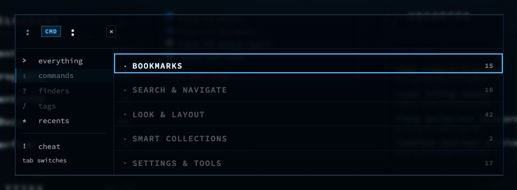</p>

</details>

<a id="86-finders"></a>

### 8.6 Finders (`?`)

`?shortcut query` sends the query to another site: `?g nextdash` searches Google. A fresh install has DuckDuckGo on `du`. `?w` without a query opens the site's own search page.

**Structure → Finders** manages them: a name, a shortcut and a URL with `%s` where the query goes (for example `https://github.com/search?q=%s`). Names and shortcuts must be unique. Rows can be dragged or moved with `↑`/`↓`, carry tags, and show how often each finder was used. **Include finders in search** (Behavior → Keyboard & search) shows them among ordinary results.

<sub>[↑ Contents](#table-of-contents)</sub>

---

<a id="9-pages-categories-and-collections"></a>

## 9. 🗂️ Pages, categories and collections

> [!NOTE]
> **In short:** organise with pages, categories and collections: sort, fold and spread categories over columns, move bookmarks, and let smart, custom and tag collections gather links for you.

<a id="91-pages"></a>

### 9.1 Pages

- **Create** — **New page** in the pages panel (`,`, then `n`), `:page new`, **Structure → Pages**, or **New page…** in the bookmark form.
- **Rename, emoji, colour** — double-click the page tab, or use Structure → Pages.
- **Reorder** — drag a row in Structure → Pages, or `↑`/`↓` on a focused row.
- **Delete** — the × in the pages panel (asks twice) or Structure → Pages. The page goes to the trash with its categories and bookmarks.
- **Duplicate** — on the page row in Structure → Pages; asks whether the bookmarks come too.
- **Share or import** — **Share this page…** and **Import a page…** in the page switcher, **Save as template…** on the page row in Structure → Pages, or the palette ([§9.8](#98-page-templates)).

Page names are unique. Each row in Structure → Pages shows how many bookmarks the page holds.

<a id="92-categories"></a>

### 9.2 Categories

- **Create** — the **+** in a category header or **`Shift + N`** (on the page you are on), `:category new`, **New category…** in the bookmark form, or **Structure → Categories**.
- **Rename** — `F2`, a long press or double-click on the header, the right-click menu, or Structure → Categories.
- **Icon** — right-click the header → **Icon…** and type an emoji.
- **Reorder** — drag the `//` in the title, `Alt + ←/→` on the header, or Structure → Categories.
- **Delete** — `Delete` on the header, the right-click menu, or Structure → Categories. The bookmarks are kept and lose their category; the category goes to the trash.
- **Duplicate** — on the row in Structure → Categories, with its width, icon and sort, and optionally its bookmarks.

A category you just created stays visible even with *hide empty categories* on, until you leave the page.

<a id="93-sorting-and-folding"></a>

### 9.3 Sorting and folding

Each category header has a **⋯** menu with **Manual**, **A–Z**, **Last opened**, **Newest** and **Most opened**. The chosen sort shows as a short chip in front of the ⋯ (*A–Z*, *Rec*, *New*, *Top*); click it to go back to manual order. **Last opened** and **Most opened** put bookmarks never opened last. Pinned bookmarks always stay on top. A sorted category cannot be dragged — the cursor and a short note say so. Sorting is only a view; the stored order changes when you drag.

Click a header, or press `Enter` on it, to fold the category. **`.`** folds or unfolds everything on the page, widgets included; the state is kept per page. **Start with categories collapsed** (Appearance → Grid) starts every category folded.

<a id="94-moving-and-reordering-bookmarks"></a>

### 9.4 Moving and reordering bookmarks

- Drag a row within its category or onto another. A click still opens; a long press still edits.
- `Alt + ↑/↓` moves the selected bookmark within its category; `Shift + Alt + ←/→` moves it to the next category.
- `Shift + M` moves it to any category or page.
- Moves can be undone from the toast for eight seconds.
- **Lock layout** (Behavior → General, or `:locklayout`) turns dragging off for bookmarks and categories.

<a id="95-spreading-a-category-across-columns"></a>

### 9.5 Spreading a category across columns

A category can run across several columns, so a long list of short entries flows across instead of down.

| Route | How |
|-------|-----|
| Mouse | Right-click the header → **Spread across columns** |
| Keyboard | **`Shift + W`** on the header |
| Command | `:width on` / `:width off`, or `:width all` to switch every category back |
| Config | The ↔ button on the row in Structure → Categories |

The number of columns is not a setting: it follows from **items per category** and the number of bookmarks. With a limit of fifteen:

| Bookmarks | Columns |
|---|---|
| 1–15 | 1 |
| 16–30 | 2 |
| 31–45 | 3 |

The column count of the grid is the ceiling. Spreading needs a limit on items per category and at least two columns. With **Pack columns tightly** on, the categories after a spread one fill in beside and below it. On a phone held upright every category is one column wide. **Appearance → Grid → Categories across columns** holds the limit, whether new categories start spread, and whether *turn spreading off everywhere* covers this page or all pages. A walkthrough is under Config → Help → Structure & bookmarks.

<a id="96-smart-collections"></a>

### 9.6 Smart collections

**Structure → Collections** turns them on. Each has its own item limit (0 = unlimited) and can be limited to certain pages.

| Collection | Shows |
|------------|-------|
| **Today** | What you tend to open at this time, tuned by keywords for office hours, evenings and weekends |
| **Recently opened** | What you opened last |
| **Recently added** | What you saved last (off by default) |
| **Most used** | Ranked by opens; appears once you have opened bookmarks from the dashboard |
| **Stale** | Not opened within the stale threshold |
| **Fresh** | Bookmarks whose site published since you last opened them ([§12.6](#126-fresh)) |

Editing or deleting a bookmark inside a collection changes the real bookmark.

<details>
<summary>📷 Screenshot — the Today smart collection on the grid</summary>

<p align="center">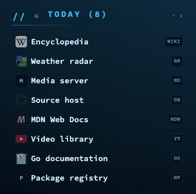</p>

</details>

<a id="97-custom-and-tag-collections"></a>

### 9.7 Custom and tag collections

**Custom collections** (Structure → Collections) take a name, an icon and rules on tag, category or shortcut, combined with AND or OR, including *excludes*. The value fields suggest what is already in use.

**Tag collections** turn each tag used by enough bookmarks into its own group; raise the minimum to keep one-off tags out.

<a id="98-page-templates"></a>

### 9.8 Page templates

A page can be saved as a **template file** and imported on another install, or kept as a starting point. The file holds the layout, the categories, the widgets and the links; it never holds when a link was opened, how it checked, stored sign-ins or other settings.

- **Share.** **Share this page…** in the page switcher (or **Save as template…** in Structure → Pages, or `Share “name” as a template file` in the palette) lists the addresses on your own network — `192.168.1.10`, `nas.lan` — and turns each into a name you can change, such as `jellyfin`. The importer fills in their own address for each service once. Public addresses go as they are, and **Include the text of notes** is off until you tick it. **Download** saves the file, or copy it to paste into a post. Icons travel inside the file.
- **Import.** **Import a page…** (or `Import a page from a template file` in the palette) takes a file or pasted text and shows what is in it — categories, widgets, links — and asks for one address per service. A link whose service is left empty is skipped, as are links with an address that is not allowed and widgets this version does not know; the result says how many. Importing always makes a **new page**; nothing on your other pages changes.
- **Start from a template.** An empty page offers **Start from a template…**: the template fills that page instead of making another.

A file is at most 2 MB.

<sub>[↑ Contents](#table-of-contents)</sub>

---

<a id="10-tags"></a>

## 10. 🏷️ Tags

> [!NOTE]
> **In short:** tags are free labels, stored in lower case. Add them in the form or with `Shift + T`, filter by them, manage them in one place and accept suggestions. Notes are covered here too.

<a id="101-tags-on-a-bookmark"></a>

### 10.1 Tags on a bookmark

- Set them in the bookmark form, the side panel in the Bookmarks view, with `Shift + T`, or with `:tag +name`. The form, the side panel, `Shift + T` and the selection's tag picker each show the tags this bookmark is likely to want, under **Suggested**; `Shift + T` opens at the top of its list, with those first.
- Stored in lower case, trimmed, without duplicates. Autocomplete offers the tags you already use.
- **Tags on rows** (Appearance → Rows) shows them as chips on the dashboard — the first few, then a count. Click a chip to filter.

<a id="102-filtering-by-tag"></a>

### 10.2 Filtering by tag

- **The tag cloud** (`/`) sizes each tag by use. Click or press `Enter` on several; the dashboard shows bookmarks with **any** of them. Chips under the page title remove one tag each; `Escape` on the dashboard clears the filter.
- While a tag filter is active, a toolbar offers **Open**, **Copy links**, **Move** and **Delete** for everything shown.
- `t` on a selected bookmark filters by its tag.
- `tag:work` in search narrows results without changing the dashboard.

<a id="103-managing-tags"></a>

### 10.3 Managing tags

**Config → Bookmarks → Tags** lists every tag with how many bookmarks carry it. Rename or delete a tag everywhere at once; renaming onto an existing tag is refused. Expand a tag to see its bookmarks and remove it from one. `↑`/`↓` move and `/` focuses the filter.

<a id="104-tag-suggestions"></a>

### 10.4 Tag suggestions

**Config → Bookmarks → Tag suggestions** proposes one tag for a whole group of bookmarks. Its sources:

- **Your rules** (the **Your rules** tab) — `github.com → #code`, a site or a site plus one section. They win over everything.
- **Your own tags** — when most tagged bookmarks on a site share a tag, the rest are offered it.
- **A shipped list** of 463 subjects and the sites that belong to them. Your own words win: a subject called `dev` is offered as `#code` if that is what you use.
- **Read their pages** (optional) — fetches the pages nothing else can place and files them by what they are about. It says what it will cost, shows progress and can be stopped. Only a dozen keywords per page are kept.

Each row names its source and its count. The count opens the group, so single bookmarks can be left out. **Apply** tags the rest (undo in the toast); **No thanks** stops the proposal from coming back, and refusals are listed with a way back. At most 25 rows show at a time. **Forget the scanned keywords** (here or under Data & backups → Icons & previews) clears what *Read their pages* kept.

The same proposals appear, one bookmark at a time, in the bookmark form, the Bookmarks view's side panel, `Shift + T` and the selection's tag picker ([§10.1](#101-tags-on-a-bookmark)). Turning one down there counts as **No thanks** here, and the list on this tab follows.

A corner card offers a round when ten proposals are waiting; it can be switched off under Behavior → Privacy & sync → Onboarding.

<a id="105-notes"></a>

### 10.5 Notes

Notes are plain text. Edit them in the form, the side panel or with `:note`. Search matches them, and the preview card shows them.

<sub>[↑ Contents](#table-of-contents)</sub>

---

<a id="11-the-bookmarks-view"></a>

## 11. 📚 The Bookmarks view

> [!NOTE]
> **In short:** the Bookmarks view is the library of every bookmark on every page: a rail of filters, a list and a side panel. It is also where health, uptime and drift are watched.

The **Bookmarks view** is the library: every bookmark on every page, in one workbench with a rail of filters, a list and a side panel. It replaced Config → Bookmarks → List, and it is where availability checking, uptime and drift are watched.

<p align="center">
  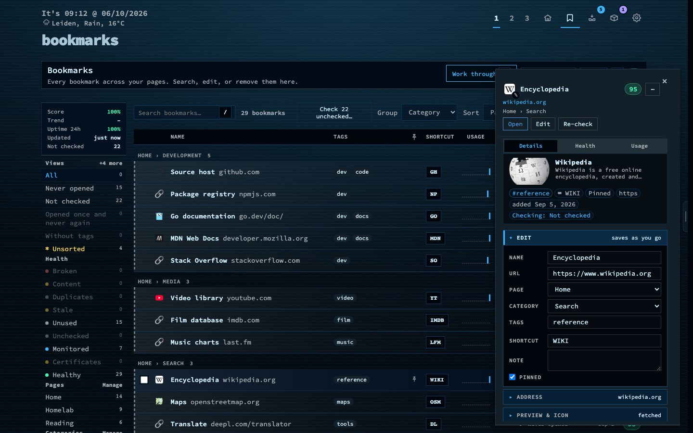
</p>
<p align="center"><sub>The Bookmarks view: filters on the left, the list in the middle, the focused bookmark in the side panel.</sub></p>

Open it with **`Shift + H`** (on the broken ones), **`Shift + U`** (on Unsorted), the Bookmarks icon, `:health`, or `/#bookmarks`. Old `/#health` and `/#health/monitors` addresses, and `:health`, still land here, on the matching filter; a search that came with them (`hv_q`) comes along, and `hv_refresh` still re-scans on arrival. See [§11.13](#1113-addresses) for the current address scheme.

<a id="111-the-rail"></a>

### 11.1 The rail

A summary at the top shows the score, the trend, the broken count and uptime over 24 hours — the same readouts the old health view carried, plus how many bookmarks nothing checks at all. Below it, filter groups (each block can be switched off under Config → Bookmarks → View → Rail):

| Group | Shows |
|---|---|
| **Views** | **All**, and questions about the filed library: never opened, not checked, opened once, untagged, not on HTTPS, no icon, duplicates, changed recently — plus **Unsorted** (✻), always shown, which swaps the pool for links kept from the inbox with no page yet |
| **Health** | Broken, Content, Duplicates, Stale, Unused, Unchecked, Monitored, Certificates, Healthy |
| **Pages** | Every page, with a **Manage** link to the pages & categories modal |
| **Categories** | Every category, narrowed to the selected page once one is picked |
| **Tags** | Every tag in use, with an **all** link once there are more than a dozen |

Active filters show as removable tokens above the groups, with **Clear filters** to drop them all at once.

<a id="112-the-toolbar-and-the-list"></a>

### 11.2 The toolbar and the list

The toolbar sits above the list: a **search** field (`/`) that matches name, URL, category, note, shortcut and tags; a count of what is shown; **Group** (No groups, Page, Category, Site, Status, Tag); **Sort** (Page order, Name A–Z, URL, Category, Recently added, Last opened, Most opened, Pinned first, Tags, Shortcut, Usage, Health score); the row-density toggle shared with the other list views; and **Add bookmark**, which opens the full form on the page the list is filtered to.

Rows show icon, name, host, tags, open count and last opened, plus a score column and status glow once Health has joined in. Only the rows near the screen are drawn, so thousands of bookmarks stay fast.

A bookmark that is a container's web UI carries a small **cube** after its title, in the container's state: green running, amber paused or restarting, grey stopped. A click opens that container in the Containers view ([§14.2](#142-the-list)). The match is the Containers view's own, and the cubes stay away when the Docker socket is not set up or the Containers view is switched off.

**Column headings** name the columns View shows and stay in place while the list scrolls (not at phone width). Every heading with a value under it sorts: a click sorts by that column in its natural order — Name and Tags A to Z (by the first tag, untagged last), Shortcut the keyed ones first, Usage the most opens in the sparkline's window first, Opens, Last opened and Added highest or newest first, Pinned the pinned ones first, Score the worst first — and a second click turns it round. An arrow on the heading shows which way the list runs; **Sort** follows, and picking from **Sort** starts afresh in the natural order. `Enter` or `Space` on a focused heading does the same.

<a id="113-the-side-panel"></a>

### 11.3 The side panel

Focusing a row opens the side panel: **Details**, **Health** and **Usage**, switched with **`1`/`2`/`3`** or **`[`/`]`**, or **`i`** to open or close the panel itself.

- **Details** edits the bookmark in place — name, URL, page, category, tags (with autocomplete and suggestions), shortcut, note, pin, availability checking and interval. Lists and checkboxes save on change, text fields when you leave them; `Escape` puts the old value back. It also offers **Open** and **Edit in dialog** (`Shift + E`). An **Unsorted** bookmark shows a primary **Promote** button here instead of a page and category ([§11.11](#1111-unsorted-and-promote)).
- **Health** shows the availability mode and interval, **Expected response** ([§12.2](#122-expected-response)), and the reasons a bookmark is flagged, each with the score it costs.
- **Usage** shows opens, last opened and the same activity the dashboard counts.

The panel's head carries two menus:

- **✎ on the icon** — **Choose app icon…**, **Use letter** and **Automatic**, the same three a container has, with the one in force ticked. **Automatic** is no icon of the bookmark's own: the app's icon where the icon sets know the address, else the favicon. **Use letter** keeps the letter tile on the dashboard and stops nextDash fetching an icon for it — the background fill and **Refresh all favicons** pass it by. Choosing or uploading an icon later ends it ([§19.4](#194-icons--previews)).
- **⋯ beside the score** — the rest, under headings: **Checks** (detect redirect, reporting, snooze 30 days, merge a duplicate group — while the bookmark has a finding), **Refresh** (title, favicon), **Copies** (open the archived copy, save a local one), **Elsewhere** (share link, show on dashboard), and **Delete** at the foot.

Closed with the mouse — **×** or a click beside it — the row lets go as well, so the arrow keys and `Space` scroll the page again; closed with `Esc` or `i`, the row stays the cursor for the keys. **Details → Address** also offers **Open in new tab**, **Copy URL**, **Share** and **QR code** (`Shift + J` on the dashboard opens the same). A bookmark that is a container's web UI says so under **Details → Address → Runs in**, with a link to that container ([§14.2](#142-the-list)).

On a narrow window the rail becomes a drawer and the side panel a sheet. What you filtered to is kept in the address, so a filtered list is a link.

<details>
<summary>📷 Screenshot — the side panel on Details</summary>

<p align="center">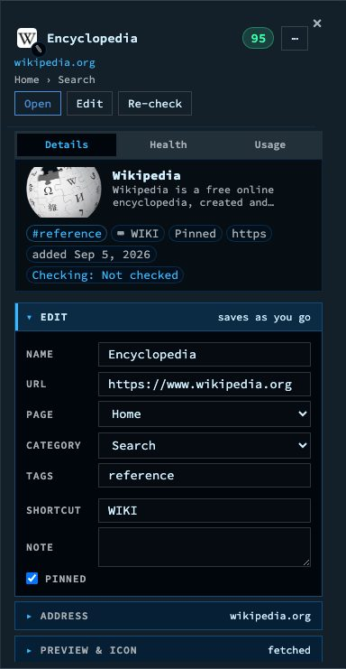</p>

</details>

<a id="114-selecting-several"></a>

### 11.4 Selecting several

Tick rows (`x` / `X` for the whole page shown, or **Select all** in the ⋯ menu) and the selection bar appears above the list — ticking does not open the side panel, as in Inbox and Containers. The bar counts what is ticked and offers **Edit…**, **Re-check**, **Mute alerts**, **Export CSV**, **Delete** and **Clear selection**. **Edit…** opens the form for the selection in the side panel (one ticked row opens its own panel): page, category, tags (add, replace, remove), pin all / unpin all, checking and interval, **Mute alerts** / **Unmute**, **Re-check**, **Follow redirects**, **Accept drift**, **Rebuild previews**, **Refresh favicons**, **Save a copy on this disk**, **Export CSV**, and **Delete**. Fields that differ read *mixed*. The slow ones run one page at a time behind a progress bar, wait out a rate limit, and can be stopped. A selection survives a filter change; bulk changes and moves can be undone from the toast.

<a id="115-the-row-menu"></a>

### 11.5 The row menu

The row menu (right-click, `Shift + F10`, or `m`) offers open, copy URL, share, **Promote…** (only on an Unsorted bookmark), edit, checking, health details, **Health charts…** (the bookmark's health in large, [§11.9](#119-a-bookmarks-health-in-large)), **Merge…** on a duplicate, filters (only this category, page or tag), and delete.

<a id="116-keys"></a>

### 11.6 Keys

| Key | Action |
|---|---|
| `j` / `k`, arrows | Move |
| `g` / `G` | First / last row |
| `Enter` / `o` | Open the bookmark under the cursor |
| `i` | Open or close the side panel |
| `1` / `2` / `3`, `[` / `]` | Details, Health or Usage in the side panel |
| `e` / `Shift + E` | Edit in the side panel / in the full dialog |
| `x` / `Shift + X` | Select a row / a range |
| `d` | Delete (undo is offered) |
| `/` | Search the list |
| `f` | Work through the list |
| `h` | Collection health |
| `Shift + H` (on a row) | That bookmark's health in large |
| `p` | Re-check |
| `s` / `c` | Score / checking, in the Health tab |
| `n` / `z` | Ignore / snooze what the report says |
| `m` | The row menu |
| `Shift + R` | Refresh the health report |
| `Shift + P` / `Shift + C` | Pages and categories over the list |
| `Esc` | Clear the selection, close the panel, then leave the view |

<a id="117-work-through-and-the-header-band"></a>

### 11.7 Work through and the header band

Above the list, **Work through** (**`f`**) takes you through the bookmarks that need a decision, one at a time.

**1. Choose a pile.** It opens on a list of piles, each with its count and a line on what it holds. The pile that needs you most comes first:

| Pile | Holds |
|---|---|
| **Broken links** | Down, refused or not found — fix the address or let them go |
| **Changed or wrong content** | Moved, retitled, or no longer the page you saved |
| **Stale** | Not opened within **count as neglected after** — still worth keeping? |
| **Never opened** | Saved and never used |
| **This list, as it is filtered now** | Every bookmark the list shows, in its order — always last |

`↑`/`↓` choose, `Enter` starts, `Esc` leaves. Empty piles are left out.

**2. One bookmark at a time.** The card shows the pile and your place in it (*Broken links · 3 of 12*), the bookmark with its page and category, when it was last opened, its preview, and **Why it is here**: the reasons from the health report. The main button follows from the reason:

| Key | Action | What it does |
|---|---|---|
| `p` | **Re-check now** | Main button for broken and changed links. Checks it again; when the problem is gone it counts as *fixed* and leaves the pile |
| `o` | **Open it and decide** | Main button for stale and never-opened links. Opens it in a new tab; also the **Open** button and the title |
| `e` | **Fix the address** | Opens the bookmark form over the card. A save checks the new address, so a link that answers there leaves the pile |
| `d` | **Delete** | Asks first, then moves it to the trash |
| `y` | **Keep** | Fine as it is: this reason will not come up again for this bookmark. Undo it from the side panel's Health tab |
| `z` | **Ignore 30d** | Silences the reason for 30 days, as the row menu's `z` does |
| `j` / `k` | **Skip** / back | Next or previous card, without a decision |
| `Esc` | | Leaves; the list stays as it was |

Re-check stays in the row beside the main button when that button is Open. Keep and Ignore appear only when there is a reason to silence.

**3. The end of a pile.** Work through counts what the run did — fixed, deleted, kept, snoozed — and offers the next pile that still has bookmarks (**Start: …**), or **Back to the list**.

When the row has a preview nextDash could fetch but the bookmark does not store, its reason reads *"Preview fetched, not saved yet"* and a **Save preview** button (**`s`**) writes it onto the bookmark.

Beside it, the **Collection ▾** menu gathers what a whole-collection toolbar used to hold, in groups:

- **Look at** — **Collection health** (`h`, [§11.8](#118-collection-health)) and **Rot report**.
- **Organise** — **Pages & categories** (`Shift + P`), **Merge duplicate group…** when exactly one group exists, **Turn on checking…** for everything still Off.
- **Checks** — **Retest all**, **Open broken links…**, **Fetch previews…**, **Checking off…**.
- **Export CSV**, **Refresh report** (`Shift + R`), and **Health settings**.

An **ⓘ** beside the menu explains the view.

<a id="118-collection-health"></a>

### 11.8 Collection health

**`h`**, or **Collection health** in the menu, opens a modal over the list with three tabs:

- **Overview** — a row of key figures (bookmarks, healthy, need attention, average score, never opened, pinned, with a shortcut, with a local copy), the score over time, where bookmarks stand, what is wrong by kind, the score distribution, health by page, checking coverage, monitors and certificates. Cards add **Fix first** (the lowest-scoring bookmarks and why), **When last checked**, **How often opened** and **Why they fail** (the broken ones, by error).
- **Monitors** — a row of figures (down now, average response over 24 hours, outages and total downtime over 30 days, the longest outage, the monitor with the most outages), then fleet cards: uptime across all monitors, the least available over 7 days, what got slower than last week, and outages — which monitors went down, how often and for how long, drawn as a 30-day lane per monitor (the full list behind **Show list**).
- **Trend** — a trend chart over 90 days with series pills (healthy %, score, broken, monitors down, stale, unchecked) and its figures beside it: now, change over the period, lowest, highest, average, spread, days up and down, the biggest rise and fall in a day. Under it, **Every monitor, per day**: a bar a day for the uptime of all monitors together and the day's mean response as a line, with its own figures (checks, days without a miss, lowest and slowest day, uptime over 30 days), and **Uptime by weekday**.

The charts here, in Statistics and in a bookmark's health in large have a time axis and a value axis, a tooltip, a drag to zoom, and the arrow keys with the point read out under the chart; a screen reader gets each chart as a table.

It fits one screen, and steps its cards down on a small window.

<details>
<summary>📷 Screenshot — Collection health, Overview tab</summary>

<p align="center">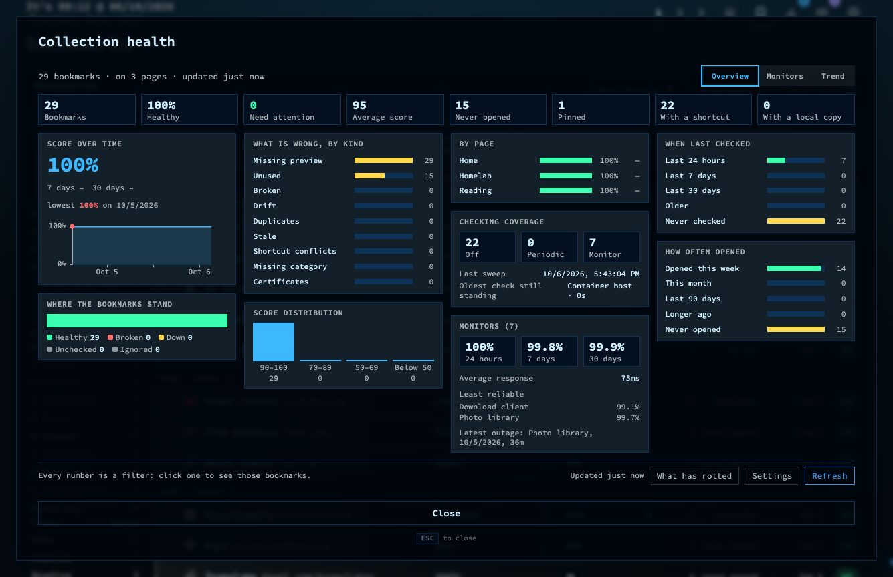</p>

</details>

<a id="119-a-bookmarks-health-in-large"></a>

### 11.9 A bookmark's health in large

**`Shift + H`** on a row, or **Health charts…** from the row menu, opens that bookmark's own health in large, with two tabs:

- **Overview** — uptime, response time, days, status codes, outages and the score.
- **Checks** — checks by hour as a heatmap, the certificate, **Kept copies** (how long checks are retained), checks in the last 24 hours, and **Every check**: every check in the period with a search, **Only failures**, and **Export CSV**.

A period select (today, 7, 14, 30 or 90 days) applies across the panel.

<a id="1110-rot-report"></a>

### 11.10 Rot report

**Rot report**, under the Collection menu, lists what has gone, what has moved or been rewritten, what has failed for over a month, what is broken and never opened, and what broke this week.

<a id="1111-unsorted-and-promote"></a>

### 11.11 Unsorted and Promote

**Unsorted** holds bookmarks kept from the inbox with no page yet ([§13.5](#135-keeping-a-link-unsorted-and-promote)). They stay off the dashboard, the tag cloud, smart collections and the health summary, but the **Views** block in the rail always shows the Unsorted count, and search reaches them while *Search unsorted bookmarks* is on.

- Opening the Unsorted view swaps the pool: the filters, the search box and the bulk actions work on it exactly as they do on the filed library.
- An Unsorted bookmark's side panel shows a primary **Promote** button in place of a page and category; the row menu has the same entry. Both open the bookmark form, titled **Promote bookmark**, on the last page of the dashboard — pick a page and category and **Save** files it there.
- The **Unsorted widget** ([§15.1](#151-the-kinds)) also opens the Bookmarks view on Unsorted, with that bookmark's side panel already open.

<a id="1112-pages-categories-modal"></a>

### 11.12 Pages & categories modal

**`Shift + P`** / **`Shift + C`**, **Manage** beside Pages or Categories in the rail, or **Pages & categories** in the Collection menu opens a modal over the list for dragging, moving, merging and tidying pages and categories without leaving the Bookmarks view.

<a id="1113-addresses"></a>

### 11.13 Addresses

```
#bookmarks[/<page>]?q=&cat=&filter=&health=&tag=&sort=&rev=&group=
#unsorted
#health                      → redirects here, on Broken
```

`health=` takes one of the Health filter keys (`broken`, `content`, `duplicate`, `stale`, `unused`, `unchecked`, `monitored`, `certificates`, `healthy`, and a few more reachable only from Collection health, such as `drift`); `q=` is a search term; `rev=1` turns the sort round. `Shift + U` and the address `#unsorted` open the view on Unsorted directly.

<sub>[↑ Contents](#table-of-contents)</sub>

---

<a id="12-checks-health"></a>

## 12. 💓 Checks & health

> [!NOTE]
> **In short:** set a bookmark to **Off**, **Periodic** or **Monitor** and nextDash checks it for you. Expected response and drift catch pages that answer but are wrong, and alerts and maintenance windows decide who hears about it.

The states a monitored bookmark moves through:

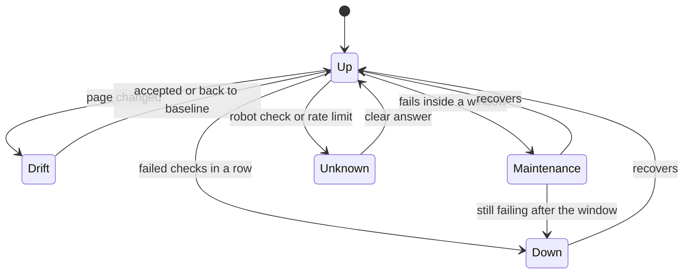
```mermaid
stateDiagram-v2
    [*] --> Up
    Up --> Drift: page changed
    Drift --> Up: accepted or back to baseline
    Up --> Down: failed checks in a row
    Down --> Up: recovers
    Up --> Maintenance: fails inside a window
    Maintenance --> Up: recovers
    Maintenance --> Down: still failing after the window
    Up --> Unknown: robot check or rate limit
    Unknown --> Up: clear answer
```

<a id="121-availability-modes"></a>

### 12.1 Availability modes

Every bookmark has one of three modes:

| Mode | What happens |
|---|---|
| **Off** | Never checked |
| **Periodic** | Checked now and then; flagged when broken |
| **Monitor** | Checked by the server on its own interval (5 minutes to 24 hours, default 15 minutes), with 30 days of history, uptime, outages and alerts. Includes everything Periodic does. |

Set the mode in the bookmark form, the Bookmarks view's side panel, the right-click menu, with **`Shift + C`**, or with **`c`** in the Bookmarks view. On a monitored row the menu also shows the **check interval**: 5m, 15m, 30m, 1h, 6h or 24h.

**Nothing checked at all?** Once 20 or more bookmarks are set to **Off**, a card in the bottom-left corner offers to switch them all to **Periodic** in one go, naming the count. It shows at most once a month; declining once brings it back next month, declining a second time offers to stop asking for good.

**Behavior → Status & alerts** holds the rest:

| Group | Settings |
|---|---|
| **Checks in this browser** | How often, skip fast pings, retries for offline bookmarks |
| **Monitored bookmarks on the dashboard** | How much they stand out: only when there is a problem (default), always, or never |
| **Checks on the server** | Re-check in the background (on by default) and how often, the **check timeout** (5–30 s), **spot pages that answer 200 but say "not found"**, **Serve uptime badges** and when certificate warnings start |
| **Downtime alerts** | See [§12.4](#124-alerts) |
| **Maintenance windows** | See [§12.5](#125-maintenance-windows) |
| **Quiet hours** and **Reminders** | See [§12.5](#125-maintenance-windows) |
| **Browser notifications** | See [§12.4](#124-alerts) |

**What a check records.** A failure stores its cause — DNS, timeout, refused, TLS, redirect, content or an HTTP status. A failed check is tried again five seconds later and only counts if that fails too. A page that asks *are you a robot*, a rate limit or anything else unclear reads as **unknown**, not broken. Certificates are read from every HTTPS check.

**Services behind a sign-in.** On a bookmark's Health tab, **Expected response** offers:

- **Address to check instead** — for example a status endpoint, while the bookmark keeps its own address.
- **Sign in with** — a stored sign-in. Sign-ins are created in a Custom widget's settings and kept in their own file, outside backups unless you include stored tokens. A sign-in is never sent when a check is redirected to another host.
- **Accept a certificate this machine does not trust.**

<a id="122-expected-response"></a>

### 12.2 Expected response

On a monitored bookmark, **Expected response** opens a panel:

- **Text the page must contain** — a phrase that only appears when the page works. **Fail if present instead** reverses it.
- **Status codes that count as healthy** — `200`, `200-299`, `200,301,401`. By default anything below 500 counts. A code that cannot be read is ignored.
- **Watch for redirects, retitling and rewrites** — drift ([§12.3](#123-drift)).
- **Do not alert me about this bookmark** — muting ([§12.4](#124-alerts)).

Failures of these tests go to the **Content** filter, not Broken. Clearing both test fields clears the failure.

**The same address on two pages.** It is checked once per round. A copy with its own expected response, drift setting, check address or credential is checked with those too, and gets its own result; uptime, history and alerts stay one per address, from the first copy.

**Pages that say "not found" with a 200.** With **Spot pages that answer 200 but say "not found"** on, a monitored check reads the title and opening text for a not-found message in five languages, and once a day per site asks the host what it does with an address that cannot exist. A site that sends everything to a sign-in page is left alone.

<a id="123-drift"></a>

### 12.3 Drift

**Drift** notices a page that still answers but is no longer the page you saved. Tick **Watch for redirects, retitling and rewrites** on a monitored bookmark. The next check becomes the **baseline**; every later check is compared with it.

- **Redirect drift** — the link lands somewhere else. http→https, `www.`, trailing slashes and tracking parameters are ignored.
- **Title drift** — the title changed. Titles like *Domain for sale* or *404* are named outright.
- **Content drift** — the text became a different page.

One finding per check, in that order. The row badge reads *Moved*, *Retitled* or *Changed*; the **Drift** filter (reached from Collection health → what is wrong, by kind, or `#bookmarks?health=drift`) lists them. A page that returns to its baseline clears itself. **Accept drift** on selected rows clears the finding and drops the baseline, so the next check records the page as it is now. Drift reads the page body, so it is opt-in and for monitored bookmarks only.

<a id="124-alerts"></a>

### 12.4 Alerts

**Downtime alerts** (Behavior → Status & alerts) post when a monitored bookmark goes down and again when it recovers, with how long it was down.

| Service | Needs |
|---|---|
| **Slack**, **Discord** | Webhook URL |
| **Telegram** | Bot URL and chat ID |
| **Gotify**, **ntfy** | URL |
| **Pushover** | Application token and user key |
| **Apprise** | The notify URL of a configuration key on your apprise-api (`http://apprise:8000/notify/<key>`), and optionally a **Tag** |
| **Raw JSON** | Your own receiver's URL |

- **Apprise** passes an alert on to everything it reaches — mail, Matrix, Signal, Teams and a hundred more — and keeps those services' passwords itself. A **Tag** sends only to the destinations that carry it. **Send test alert** explains Apprise's refusals: 424, it could not deliver or no destination had the tag; 404, there is no configuration under that key.
- **Alert after** — failures in a row before a bookmark counts as down (default 3, 1–10).
- **Send test alert** — sends one made-up failure the same way a real one goes.
- **ntfy** alerts carry **Open link** and **Health** buttons, and a failure is sent at a higher priority than a recovery. Fill in **Address of this dashboard** for the Health button; it links to `/#health`, which redirects into the Bookmarks view.
- Local addresses are refused unless *Allow local bookmarks* is on.
- **Many at once** — when a host takes many bookmarks down together, the alerts are collapsed into one message. Certificate warnings are always separate.
- **Certificates** — warnings at 30, 7 and 3 days before expiry, through the same channels, and to any webhook subscribed to `health.cert-expiring` ([§19.3](#193-webhooks)).

<a id="muting-one-bookmark"></a>

**Muting one bookmark.** Tick **Do not alert me about this bookmark** in its Expected response panel. It is still checked and shows as down with a *Muted* badge; only the message is held back. Un-muting during an outage still alerts. **Mute alerts** and **Unmute** in the Bookmarks view's selection bar change several rows at once.

<a id="browser-notifications"></a>

**Browser notifications** reach a device even with nextDash closed. Switch them on from the dashboard card or under Behavior → Status & alerts, then press **Enable on this device** and allow notifications. A test notification follows.

| Notifies about | Default |
|---|---|
| Downtime and recovery | On once enabled |
| Automatic backup results | Off |
| A new release | Off |

They need a secure context: Safari and every browser on iPhone and iPad require HTTPS (not `http://localhost`); desktop Chrome, Edge and Firefox also accept `http://localhost`. On iPhone and iPad, add nextDash to the home screen first. Subscriptions live in `data/push-subscriptions.json`; deleting it unsubscribes every device. **Show the invitation again** brings the card back.

<details>
<summary>📷 Screenshot — the downtime alert settings</summary>

<p align="center">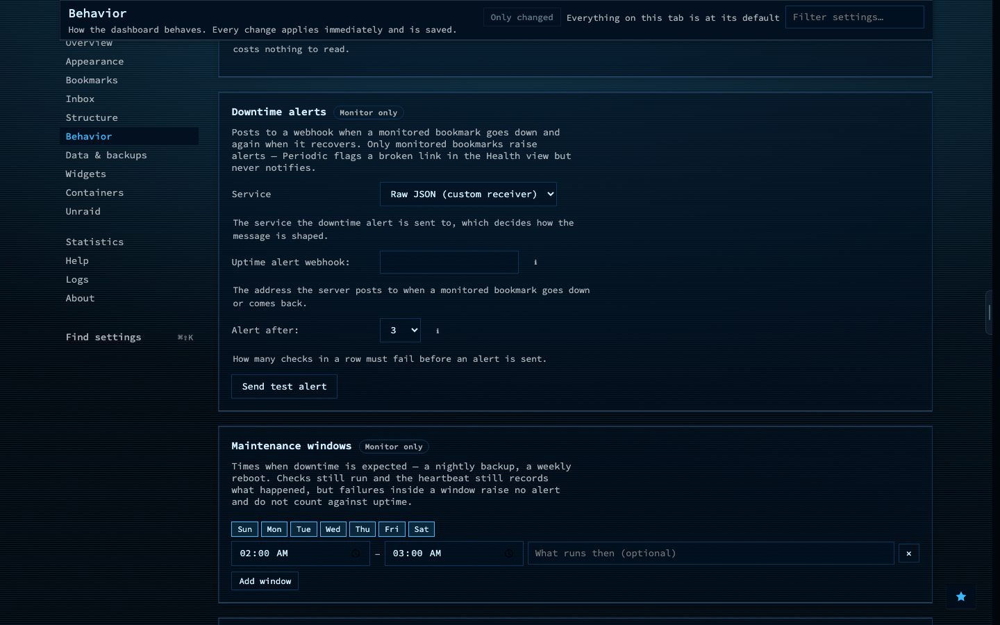</p>

</details>

<a id="125-maintenance-windows"></a>

### 12.5 Maintenance windows

A window is a recurring period when downtime is expected — days, a start and an end. An end before the start runs past midnight. Windows apply to every monitor.

Inside a window, checks still run and the heartbeat still records them, but a failure opens no incident, does not count against uptime or toward the failures an alert waits for, and sends no alert. A failure that continues after the window raises the alarm as usual.

<a id="quiet-hours"></a>

**Quiet hours.** Under **Behavior → Status & alerts → Quiet hours**, **Hold notices during quiet hours** holds alerts from monitors, containers, Unraid and backups while a window is open — the same editor as maintenance windows. When the hours end, one summary says what is still going on and what recovered by itself. Unlike a maintenance window the downtime still counts. **Always let through** lists the kinds that break the quiet: an expired certificate, a mass outage (several at once) and a failed backup by default, and a container that stops or restarts if you tick it. A line under the list says whether it is quiet now, until when, and how many notices are held. Outgoing webhooks ([§19.3](#193-webhooks)) are outside it and get every event. A muted bookmark or container never raises a notice, and a maintenance window drops it before the quiet hours would hold it.

<a id="reminders"></a>

**Reminders.** **Remind me about an outage that is still going** sends another message for a monitor or container that is still down: **Remind after** 15, 30 or 60 minutes, or 2 or 4 hours, **At most** 1, 2, 3 or 5 times. Not during quiet hours; the summary that ends them says what is still down.

<a id="uptime-badges"></a>

**Uptime badges.** **Serve uptime badges** (off by default) lets `/badge/uptime.svg?url=<address>&days=7` (or `30`) return a small SVG for a README or a forum post: the uptime percentage, green from 99.9 %, amber from 99 %, red below. It answers for monitored addresses only; any other address reads *no data*, so the badge never tells whether an address is known. Anyone who knows a monitored address can read its badge, which is why it is off until you switch it on.

<a id="126-fresh"></a>

### 12.6 Fresh

**Fresh** shows whether a bookmarked site has published something since you last opened it.

- Switch it on under **Behavior → Fresh**. It reads each saved page once for an RSS or Atom feed and remembers pages without one for a month. **Find feeds now** repeats the round and says how many bookmarks publish a feed.
- A bookmark with news carries a count on its row, and the **Fresh** collection lists them, newest first. Opening the bookmark clears the count.
- Feeds are polled on the background re-check interval with conditional requests. A feed that fails five times in a row is dropped; the Feeds widget shows it with **Retry**.
- The bookmark editor shows a **Feed** line when there is one. `status:feed` / `-status:feed` search for them. **Mark rows that publish** (off by default) puts a quiet dot on those rows.
- Fresh stores no articles, only counts. It is off by default because it contacts other servers on a schedule. A walkthrough is under Config → Help → Monitoring.

<a id="127-keeping-a-copy-of-a-page"></a>

### 12.7 Keeping a copy of a page

Set up under **Data & backups → Sources**.

- **Web Archive** — **Archive new bookmarks** asks the Internet Archive to keep a copy the day you save a link. An archive.org key pair ([archive.org/account/s3.php](https://archive.org/account/s3.php)) raises the daily allowance; **Save a copy…** tests it. The panel says what became of a capture.
- **Local copies** — saves a whole page (text, styling, images) as one file in your data directory, using [monolith](https://github.com/Y2Z/monolith), which the container includes. Pages up to 52 MB. **Bookmarks → Local copies** lists copies per bookmark, says why a copy failed or saved an empty page, and can remove them all (it says how much space that frees).
- **archive.today** — a second archive that keeps what it captured.

On a bookmark's Health tab, **Find in Web Archive** reads the archive's index for the last capture that was a real page.

<sub>[↑ Contents](#table-of-contents)</sub>

---

<a id="13-inbox"></a>

## 13. 📥 Inbox

> [!NOTE]
> **In short:** the inbox holds links you saved but have not filed. Triage them one key at a time, or keep them in Unsorted until they earn a category.

The inbox holds links you want to keep before you decide where they go. Items live in `data/inbox.json`.

A link comes in one way and leaves in one of three:

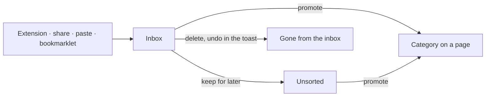
```mermaid
flowchart LR
    X[Extension · share · paste · bookmarklet] --> I[Inbox]
    I -->|promote| K[Category on a page]
    I -->|keep for later| U[Unsorted]
    U -->|promote| K
    I -->|delete, undo in the toast| D[Gone from the inbox]
```

<a id="131-getting-links-in"></a>

### 13.1 Getting links in

- **Paste** a URL on the dashboard and choose **Save to Inbox** — or set **Always save to Inbox** under Config → Inbox → Collecting → Paste destination.
- **The extension** — **Save to Inbox** in its popup, the right-click entry, or `Ctrl/Cmd + Shift + U`.
- **The share sheet, the bookmarklet and `/add`** — see [§21](#21-browser-extension-and-capture).
- **The API** — `POST /api/inbox`.

A URL already in the inbox is not added again: a toast says *Already in Inbox* and the view jumps to it.

<a id="132-the-view"></a>

### 13.2 The view

Open it with **`Shift + I`**, the inbox icon or `:inbox`. The icon's tooltip says how many links are kept Unsorted.

<p align="center">
  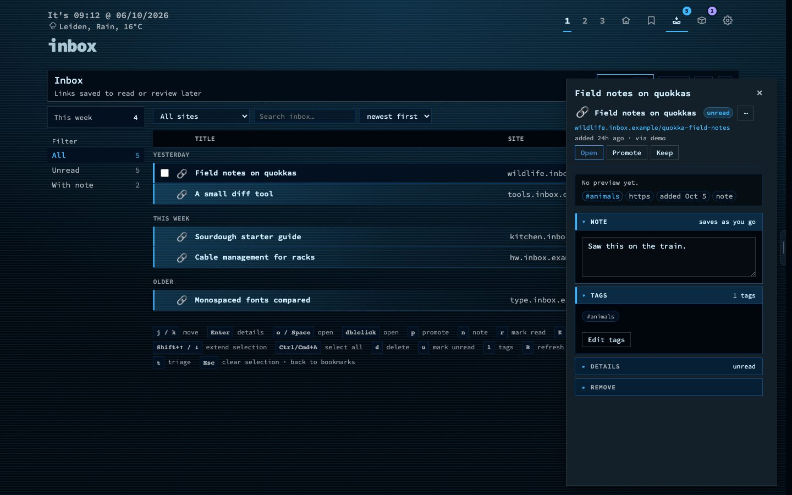
</p>
<p align="center"><sub>The inbox: links you have not filed yet, with the selected link's details on the right.</sub></p>

- **A rail of filters** on the left, each with its count: **All**, **Unread**, **Snoozed** and **With note** (the last two only when they hold something) — it can fold behind a **Filters** button (Config → Inbox → Panel & clicks). *This week* is a readout above them.
- **Narrowing** — by site, by tag (click a tag chip) and by search. Every count follows what is shown, and *Mark all read* becomes *Mark shown read*.
- **Sort** — newest first (default), oldest first, title or site. The column headings sort too: **Title** and **Site** A to Z, a second click Z to A; **Added** switches between newest and oldest first. Under Snoozed, which keeps its wake order, the headings do not sort.
- **Rows** are one line each and follow the app-wide density; the header stays in place. There are no tabs — a kept link goes straight to Bookmarks → Unsorted, not to a second list here ([§13.5](#135-keeping-a-link-unsorted-and-promote)).
- **The side panel**, in the same style as the Bookmarks view's, shows the link in focus: Open, Promote, Keep, note, tags — suggested tag chips live in its Tags section — details and delete.
- **The address** keeps filter, sort, site, tag and search (`ib_filter`, `ib_sort`, `ib_dir`, `ib_domain`, `ib_tag`, `ib_q`); filter, sort and site also return next time.
- The **ℹ** explains the inbox; a sentence under the toolbar explains the active filter.

<a id="133-acting-on-links"></a>

### 13.3 Acting on links

| Key | Action |
|---|---|
| `j` / `k` | Move |
| `g` / `G` / `Home` / `End` | First / last |
| `Enter` | Open the side panel |
| `o` / `Space` | Open the link |
| `p` | Promote to a bookmark |
| `n` | Note |
| `r` | Mark read |
| `Shift + K` | Keep — to Bookmarks → Unsorted (undo in the toast) |
| `z` | Snooze |
| `x` | Tick and move on |
| `Shift + ↑/↓`, `Ctrl/Cmd + A` | Extend / select all shown (again to untick) |
| `d` | Delete (undo in the toast) |
| `u` | Mark unread |
| `l` | Edit tags |
| `t` | Triage |
| `R` | Reload |
| `Esc` | Clear the selection, then back to the queue, then back to the bookmarks |

- **Read** — a link is unread until opened or marked read. `u`, or the right-click menu, marks it unread again.
- **Snooze** — three hours, tomorrow, the weekend, next week, or a date (waking at 09:00). A snoozed link is left out of every count; a line under the list says how many are asleep. **Wake now** brings one back.
- **Notes and tags** — plain-text notes; tags from the capture show as chips in the side panel's Tags section, and can be edited from there or the right-click menu.
- **Promote** — opens the bookmark form filled in, with every page and category. The inbox entry goes when the bookmark is saved.
- **Keep** — takes a link out of the queue for good, with its note and tags, and puts it on Bookmarks → Unsorted. A toast says *"Kept — in Bookmarks → Unsorted"*, with **Undo**; the row flies toward the Bookmarks icon.
- **Several at once** — promote (to one page and category), keep, tags, open, copy links, mark read, snooze, delete — each with undo. **Select all** in the ⋯ menu ticks every link the filters leave, and reads **Deselect all** once they all are.
- **Mark all read** and **Clear read** — for the whole (shown) list. Clear read leaves snoozed links alone.
- **Stats** — how many links were added, promoted and deleted, and how long links wait.
- **Export and import** — CSV and JSON of what is shown; **Import** reads a JSON export back, skips links already there, and stops when the inbox is full rather than pushing older links out.

<a id="134-triage"></a>

### 13.4 Triage

**Triage** (the button, `t`, or `:inbox triage`) takes you through unread links one at a time, in the same shape as Work through ([§11.7](#117-work-through-and-the-header-band)).

**1. Choose a pile.** Triage counts unread links that are not snoozed. The fullest pile comes first:

| Pile | Holds |
|---|---|
| **Waiting longest** | Unread for over a week, oldest first |
| **New this week** | Saved in the last week, newest first |
| **With a note** | Links you left yourself a reason on |
| **This list, as filtered now** | Every unread link the list shows, in its order — always last |

`↑`/`↓` choose, `Enter` starts, `Esc` leaves. Empty piles are left out; with nothing unread, triage says *Nothing to triage*.

**2. One link at a time.** The card shows the pile and your place in it (*Waiting longest · 1 of 3*), the link, its preview, and **Where it came from**: how it arrived (the browser extension, a paste, another app, an import, or by hand), how long ago, whether it was ever opened, and your note.

| Key | Action | What it does |
|---|---|---|
| `p` | **Promote to a page** | The main button. Opens the bookmark form to file it on a page; after the save, triage carries on at the next link |
| `Shift + K` | **Keep in Unsorted** | Makes it a bookmark in **Bookmarks → Unsorted** without a page ([§13.5](#135-keeping-a-link-unsorted-and-promote)) |
| `n` | **Note** | Adds or edits the note; the card stays |
| `d` / `Delete` | **Delete** | Removes it from the inbox |
| `z` | **Snooze** | Picks when it comes back; it leaves the pile until then |
| `r` | **Mark read** | Marks it read and moves on |
| `o` / `Enter` / `Space` | **Open** | Opens it in a new tab and marks it read |
| `j` / `k` | **Skip** / back | Next or previous card |
| `Esc` | | Back to the list |

**3. The end of a pile.** Triage counts what the run did — promoted, kept, deleted, snoozed, read — and offers the next pile that still has links, or **Back to the inbox**.

<details>
<summary>📷 Screenshot — a triage card</summary>

<p align="center">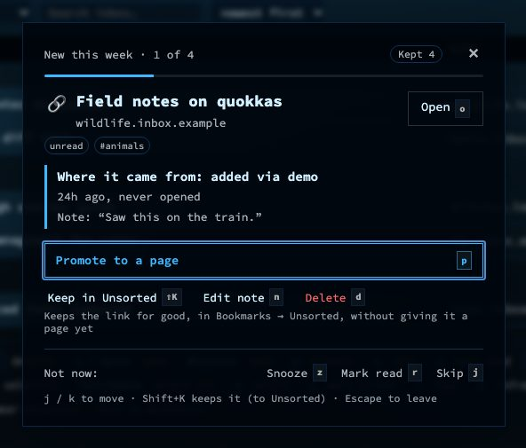</p>

</details>

<a id="135-keeping-a-link-unsorted-and-promote"></a>

### 13.5 Keeping a link: Unsorted and Promote

There is no Kept tab any more. **Keep** — `Shift + K`, the row button, or the right-click menu — takes a link straight to a hidden page called **Unsorted**, in the Bookmarks view, rather than to a second inbox list. **`Shift + U`** or the address `#unsorted` opens the Bookmarks view there directly.

An Unsorted bookmark stays off the dashboard, the tag cloud, smart collections and the health summary. It is promoted onto a real page from its **side panel** (a primary **Promote** button) or its **row menu**, in the Bookmarks view — the same bookmark form Inbox's Promote uses, titled **Promote bookmark**, opening on the last page of the dashboard. Search still reaches Unsorted bookmarks while **Search unsorted bookmarks** (Behavior → Keyboard & search) is on, and the **Unsorted widget** shows them on a dashboard page, newest first, at random or by tag; its overflow row reads **Open Unsorted**. See [§11.11](#1111-unsorted-and-promote) for the full picture from the Bookmarks view's side.

<a id="136-settings"></a>

### 13.6 Settings

Inbox settings moved to their own config section — **Config → Inbox** ([§17.6](#176-config-inbox)): whether the inbox is on at all, showing it in the header, quick-adding a pasted URL, keeping links without filing them, filing a kept link where its neighbours already are, the paste destination, and removing an inbox entry once it is promoted.

The first visit plays a five-step tour: the waiting room the inbox is, the three ways a link leaves (promote, keep, delete), where a kept link goes (Bookmarks → Unsorted), how to keep one, and the keys. **Tour**, above the list, plays it again; so does Behavior → Privacy & sync → Onboarding.

<sub>[↑ Contents](#table-of-contents)</sub>

---

<a id="14-containers"></a>

## 14. 🐳 Containers

> [!NOTE]
> **In short:** the Containers view shows the Docker containers on this machine, with logs, updates and disk use. Looking needs the Docker socket; acting needs `NEXTDASH_DOCKER_CONTROL=1` and a write token.

The **Containers view** shows the Docker containers on the machine nextDash runs on — the same connection the Containers widget and system widgets use. It needs the Docker socket ([§14.6](#146-what-it-needs)).

> [!IMPORTANT]
> It needs setting up first: the Docker socket, `NEXTDASH_DOCKER_CONTROL=1` for actions, a write token, and on some hosts `NEXTDASH_RUN_AS_ROOT=1`. See [§14.6](#146-what-it-needs).

<a id="141-opening-it"></a>

### 14.1 Opening it

Open it with **`Shift + Y`**, the Containers icon in the header, `:docker`, or `/#docker`. Search also finds containers by name, and the **Containers** widget's tile opens the view. Two tabs sit above the list: **Containers** and **Disk** ([§14.7](#147-disk)). The **ℹ** beside **Tour** in the header explains the view in five short parts: the list, acting on containers, the side panel, updates and Disk.

<a id="142-the-list"></a>

### 14.2 The list

| Filter | Shows |
|---|---|
| **All** | Every container |
| **Running** | Containers that are up |
| **Stopped** | Containers that are down or paused |
| **Updates** | Containers with a newer image waiting |

<p align="center">
  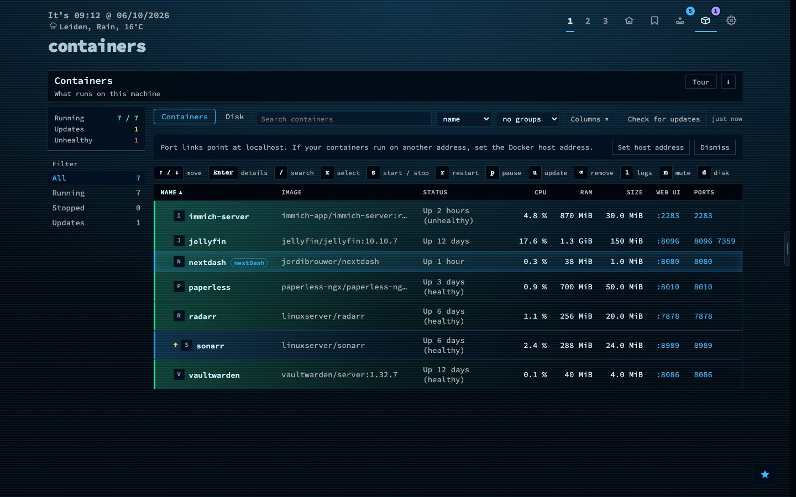
</p>
<p align="center"><sub>The Containers view: every container with its status, load, size and links.</sub></p>

**Group by status** folds the list under Updates, Running, Paused and Stopped, each band with its count (*Updates · 9*); **by network** under the network each container runs in (its network mode, else the first network it joined); **by image** under its image, whatever the tag; **group by project** folds it under each compose project, and a project's row has **Start**, **Stop** and **Restart** for the whole stack, and **Update (n)** for the *n* containers in it with an update waiting — not a skipped or held version, not an image no check has looked at. Stop and Update ask first, naming the containers, and they go one at a time.

Each row shows its name, image, status, **CPU** and **RAM**, its **Size** — what the container wrote, with the size including its image on hover — a link to its web UI and its ports. A container with an update waiting has an orange **↑** in front of its name. Name and image stay on one line, cut short with the whole text on hover, and the image drops its registry host and a `:latest` tag (`lscr.io/linuxserver/sonarr:latest` reads `linuxserver/sonarr`). The first three published ports show in the row; more go behind **+N**, which opens a list of all of them with the port inside the container and tcp or udp. A port published for both counts once in the row. Sizes are measured in the background every half hour (the Docker daemon takes a while to work them out) and when Disk is refreshed; a container not measured yet shows —. CPU and RAM are the last reading, taken every 30 seconds; they are there while **Config → Containers → Keep the last hour of CPU and memory** is on. On a narrower screen the Image column goes first (below 1100 pixels), then CPU, RAM and Size (below 900). Click **Name**, **Status**, **CPU**, **RAM**, **Size** or **Restarts** to sort, and again to turn the order round; the sort menu also offers uptime, CPU, memory, size and restarts, highest first. A container without a figure — stopped, or not measured yet — goes last either way.

**Columns** in the toolbar ticks which columns show: Image, Status, CPU, RAM, Size, **Restarts** (off at first: how often the container started again in the last 24 hours, from its timeline), Web UI and Ports. Name always shows. The choice is kept in this browser; **Reset columns** puts them back. CPU and RAM show only while the stats history is on, ticked or not.

The web UI link is the address you set in the side panel's **Custom** section, else the one the container's own labels offer (Unraid's template), else its first published TCP port. A local address shows as its port (`:8123`), another as its host. A port link goes to the host you opened nextDash on unless **Config → Containers → Docker host address** names the server — its LAN address or name only, without `http://` or a port, for example `192.168.1.10` or `tower.local`, so port 8080 opens `http://192.168.1.10:8080`. A line under the field checks what you type and cuts a full `http://…:8080` down to its host when it is saved; opened through a domain — a reverse proxy — that is rarely right. While the address is empty the view says where port links point, above the list, with a button to that setting and one to dismiss the note; an address of your own has a dot in front of it, and a long one is cut short, with the whole address on hover.

**The web UI's bookmark.** When a bookmark is saved for a container's web UI, a small bookmark mark follows the link, in the colour its checks give it: green when they pass, red when it is broken or a monitor finds it down, an outline when nothing checks it. Hover says which bookmark and how it was found; a click opens it in the Bookmarks view, its row in view and in focus, its side panel on Details. nextDash finds it in this order and stops at the first step that finds exactly one address — two at one step is no guess at all:

1. the one you chose in the side panel's **Bookmark** section ([§14.3](#143-the-side-panel)), or none if you chose *No bookmark*;
2. a bookmark on the same port of this server (the Docker host address, the address you opened nextDash on, or the container's own LAN address);
3. a bookmark whose subdomain is the container's name — `sonarr.example.com`, as a reverse proxy gives;
4. a bookmark titled after the container.

The bookmark's own side panel says it back: **Details → Address → Runs in** names the container, a link to its side panel.

**Selecting several.** Tick containers with the box in front of the name, `x` or `Space`; `Shift`-click a box, `Shift + X` or `Shift + ↑/↓` ticks a run, and `Ctrl/Cmd + A` ticks everything the filter shows (again to clear). A bar above the list then offers **Start**, **Stop**, **Restart**, **Update**, **Remove**, **Mute notifications** and **Update automatically** ([§14.5](#145-actions-and-updates)) for the lot, one container at a time with a count, and ends with one notice such as *3 restarted, 1 failed*. **Remove** asks once, naming the ones that still run, and stops those first; `⌫` or `Delete` with containers ticked does the same, and so does a right-click on one of the ticked rows, whose menu then offers the bar's actions for all of them. The container nextDash runs in is left out. Without actions switched on ([§14.6](#146-what-it-needs)) the bar offers only muting. **Clear selection** or `Esc` lets go. The header badge counts containers with an update waiting; a skipped or held update does not count.

<a id="143-the-side-panel"></a>

### 14.3 The side panel

Selecting a container opens its side panel, with four tabs. Its head shows the container's web UI address under the name, tagged **Custom** when it is one you set; the tag opens the Custom section. A click beside the panel closes it, one on another row moves it there (**Config → Containers → Close on a click beside it**).

- **Overview** — an accordion of **Details**, **Health**, **Updates**, **Timeline**, **Network**, **Custom**, **Bookmark**, **Volumes** and **Environment**. **Health**, for a container with a healthcheck, shows its status, how many checks failed in a row, the check it runs, and the last five checks — each a mark and a time, a failed one with its exit code and output. **Volumes** lists each mount by where it appears in the container, with where it comes from under it and a tag for its kind (bind, volume) and for read-only. **Updates** is [§14.5](#145-actions-and-updates). **Timeline** is what happened to the container, newest first: starts and stops (by you or by nextDash), crashes with their exit code, out-of-memory kills, a run of crashes as one *Kept restarting* line, health changes, pauses, updates and rollbacks. nextDash writes these down from Docker's own events, whatever the notices are set to — a hundred per container, for thirty days, from the moment this version runs. **Details** also gives its size (written, and with its image) and says whether its notices are on, muted or off. **Custom** holds the container's **Web UI address**: an `http://` or `https://` address of your own, where `[IP]` stands for this server. Empty uses the container's default. The address is used everywhere the web UI opens: the list, the Container list widget and `:docker <name> open`. **Back to the default** removes it. **Bookmark** shows the bookmark of its web UI — name, address, what its checks say and how it was found — with **Open in Bookmarks**, and **Linked bookmark** to choose: *Automatic* (naming what it found), *No bookmark*, or any bookmark by hand.
- **Resources** — CPU, memory, size, **Network** (in and out) and **Disk I/O** (read and written), with four charts under them: CPU, memory, network and disk I/O over the last hour — one cursor across the four, a tooltip, a drag to zoom (double-click or `0` back), and the arrow keys to walk the points with the value read out. Network and disk are rates between two samples, so they show a dash until there are two. nextDash samples the running containers every 30 seconds and keeps the samples in memory, so a restart starts the charts again. **Config → Containers → Keep the last hour of CPU and memory** switches the sampling and the charts off.
- **Logs** — the last lines, with **Refresh** and **Open logs window** ([§14.8](#148-the-logs-window)).
- **What’s new** — the release notes behind an available update.

<details>
<summary>📷 Screenshot — a container's side panel</summary>

<p align="center">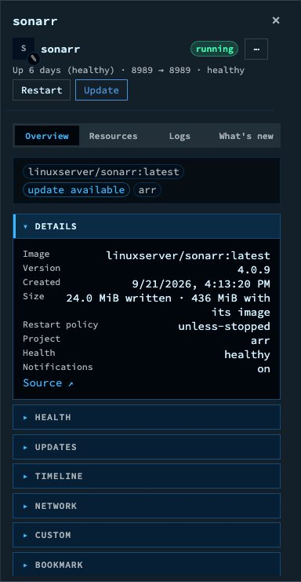</p>

</details>

<a id="144-keys"></a>

### 14.4 Keys

| Key | Action |
|---|---|
| `↑` / `↓` | Move through the containers |
| `x` / `Space` | Tick or untick the selected container |
| `Shift + X` / `Shift + ↑/↓` | Tick a run of containers |
| `Ctrl/Cmd + A` | Tick every container the filter shows; again to clear |
| `Enter` | Open the side panel |
| `/` | Search the containers |
| `s` | Start or stop the selected container |
| `r` | Restart it |
| `p` | Pause it |
| `u` | Update it |
| `⌫` / `Delete` | Remove it (asks first; a running one is stopped first); with containers ticked, the ticked ones |
| `l` | Open its logs window |
| `m` | Mute or unmute its notices |
| `d` | Switch between the list and Disk |
| `Esc` | Clear the ticks, then the selection, close the panel, then leave the view |

The legend above the list names them; **Config → Containers → The key legend** puts it below the list or hides it. Without actions switched on, the legend leaves out the keys that act on Docker.

<a id="145-actions-and-updates"></a>

### 14.5 Actions and updates

Starting, stopping, pausing, restarting, updating and removing a container are all behind **`NEXTDASH_DOCKER_CONTROL=1`**, on top of the write token if the install has one — read-only access to the socket is not enough by itself. Update and remove always ask first; **Config → Containers → Safety** can add the same confirmation to stop and restart.

Image update checks run on request and on an interval (Config → Containers → Updates: off, 6, 12 or 24 hours), asking the image's registry whether a newer tag is available. An optional GitHub token (Config → Containers) raises the rate limit for images hosted there. The container nextDash itself runs in refuses stop, pause, restart, remove and update.

The side panel's **Updates** part says where the image stands and keeps your say over it:

- **Skip this version** — the version on offer stops counting as an update: no badge, no count, and an update of a selection leaves it out. A newer version counts again. **Undo skip** takes it back.
- **Hold updates** — the image never counts as having one until you choose **Resume updates**; the row shows a quiet *held* label.
- **History** — what updates did, newest first, with the versions where the image names them.
- **Roll back to …** — while the image the last update replaced is still on the host, this puts the container back on it after asking: the old image gets its tag back and the container is recreated on it, without a download. The version it leaves is skipped, so it is not offered straight back. Pruning dangling images ([§14.7](#147-disk)) removes the images a rollback needs.

Updating by hand still works on a skipped or held image.

**Update automatically** — a switch in the same part, or the selection bar for several — lets nextDash update the container on its own, in the nightly window set in **Config → Containers → Updates** (03:00 to 05:00 until you change it; a window past midnight, 22 to 4, works too). Inside it, every five minutes, a container with this switch on and an update waiting — as the last check found it; not skipped, not held, never nextDash's own — is updated as the Update button would, one at a time, and tried once per night for a given image. It is then watched for five minutes: if it stops, starts again on its own or turns unhealthy, it is rolled back to the image it had, started again, and that version is skipped. A stop or restart you make yourself during those five minutes is left alone. A container that was not running is updated and left stopped, without the watch. Each update, rollback or failure sends a notice ([§14.9](#149-notices)). It needs `NEXTDASH_DOCKER_CONTROL=1`, and the update check switched on — that is what finds a newer image.

<a id="146-what-it-needs"></a>

### 14.6 What it needs

> [!IMPORTANT]
> **Nothing in this chapter works until the container can reach Docker.** Four settings decide what the view can do:
>
> | Setting | Needed for | Why |
> |---|---|---|
> | Mount `/var/run/docker.sock` and set `NEXTDASH_DOCKER_SOCKET=/var/run/docker.sock` | Seeing anything at all | nextDash talks to Docker through its socket. Without it the view shows a setup card and the Containers widget is hidden. `:ro` is enough to look. |
> | `NEXTDASH_DOCKER_CONTROL=1` | Start, stop, pause, restart, update, remove | Off by default, so a mounted socket only reads. |
> | `NEXTDASH_WRITE_TOKEN` | Keeping other sites and scripts out | Access to the socket is root on the host: `:ro` on the mount does not stop the Docker API from accepting writes. The token refuses requests that do not carry it — another website, a script that only knows the address. It is not a login: the dashboard gives it to every browser that opens the page. Keeping the actions yours also needs a gate in front — Tailscale, or a reverse proxy with authentication ([§23](#23-security-and-self-hosting)). |
> | `NEXTDASH_RUN_AS_ROOT=1` | Only when the socket belongs to gid 0 | See below. |

> [!WARNING]
> With `NEXTDASH_DOCKER_CONTROL=1`, anyone who can open the dashboard can stop, update or remove your containers, and access to the Docker socket is root on the host. Put nextDash behind a gate first ([§23](#23-security-and-self-hosting)).

**Why root is sometimes needed.** The container starts as root, fixes the ownership of `/app/data`, then drops to its own `nextdash` user. Before it does, it looks at the group that owns the socket and adds `nextdash` to it — the `docker` group, gid 281 on Unraid — so the unprivileged user can read the socket. When the socket is owned by root's own group (gid 0), as on Docker Desktop and some NAS systems, joining that group would amount to root anyway, so the entrypoint does not; the log then says `nextdash: /var/run/docker.sock is owned by gid 0; set NEXTDASH_RUN_AS_ROOT=1 to use it`, and Config → Containers shows **No access to the socket**. `NEXTDASH_RUN_AS_ROOT=1` keeps the whole app running as root. Set it only in that case.

**Docker Compose:**

```yaml
services:
  nextdash:
    volumes:
      - ./data:/app/data
      - /var/run/docker.sock:/var/run/docker.sock:ro
    environment:
      - NEXTDASH_DOCKER_SOCKET=/var/run/docker.sock
      - NEXTDASH_DOCKER_CONTROL=1
      - NEXTDASH_WRITE_TOKEN=change-me-to-a-long-random-string
      # - NEXTDASH_RUN_AS_ROOT=1        # only if the log says "owned by gid 0"
```

**Unraid** (Docker → nextDash → Edit):

| Config Type | Name | Container Path / Key | Host Path / Value |
|---|---|---|---|
| Path | Docker socket | `/var/run/docker.sock` | `/var/run/docker.sock` |
| Variable | Docker socket variable | `NEXTDASH_DOCKER_SOCKET` | `/var/run/docker.sock` |
| Variable | Write token | `NEXTDASH_WRITE_TOKEN` | a long random string |
| Variable | Docker actions | `NEXTDASH_DOCKER_CONTROL` | `1` (the template starts at `0`) |
| Variable | Run as root | `NEXTDASH_RUN_AS_ROOT` | leave at `0` |

All five are in the template. **Docker actions** starts at `0`, so the view only reads until you set it to `1`. Unraid's socket belongs to the `docker` group, so **Run as root** stays at `0` there.

**Synology and QNAP** use the same `/var/run/docker.sock` path. If the log names gid 0, add `NEXTDASH_RUN_AS_ROOT=1`.

**Checking it.** Config → Containers shows the connection as the server sees it: whether the socket answers, whether actions are on, whether a write token is set, and whether nextDash recognises the container it runs in. [§15.4](#154-system-widgets-and-what-they-need) covers the same socket for the Containers widget and the other system widgets.

<a id="147-disk"></a>

### 14.7 Disk

**Disk** (the tab beside Containers, `d`, or `/#docker/~disk`) shows what images, volumes and the build cache take up. Measuring is slow on a large host, so it happens when you open the tab and on **Refresh**; after that the rail shows **Disk used** and **Reclaimable**.

| Tile | Clears |
|---|---|
| **Unused images** | Every image no container uses — a container that needs one later downloads it again |
| **Dangling images** | Untagged images — among them the ones a rollback would go back to; the tile names those containers |
| **Build cache** | What `docker build` left behind |
| **Unused volumes** | Nothing in bulk: volumes hold data, so they go one at a time |
| **Stopped containers** | Every exited or created container, after naming them — their volumes and images stay; hidden ones and nextDash's own are left |

Every clean-up asks first and says how much it frees. Below the tiles, the images and volumes are listed biggest first, with what uses them; an untagged image that is still a container's way back says *rollback for …*. An unused volume has **Remove…** on its row: type **delete** to go on. A volume a container holds — a stopped one included — cannot be removed.

**Bind mounts** lists the host folders containers mount, with which container mounts each where (`sonarr → /config`). On Unraid that is where container data lives — `/mnt/user/appdata/…` — so the Volumes list is mostly empty there, or holds anonymous volumes (long hex names) that containers left behind. A folder is not a volume: Docker neither measures nor removes it, so there is no **Remove…**. **Measure** counts one on request: a short-lived container (`alpine`, pulled the first time, a few MB) mounts the folder read-only with no network, runs `du`, and is removed. One folder at a time, up to five minutes; the size is kept, with when it was measured on hover, and the button becomes **Measure again**. Only a folder a container mounts can be measured. The Docker socket and host files such as `/etc/localtime` are left out. All of it needs `NEXTDASH_DOCKER_CONTROL=1`; without it, Disk shows the sizes only.

<details>
<summary>📷 Screenshot — the Disk tab</summary>

<p align="center">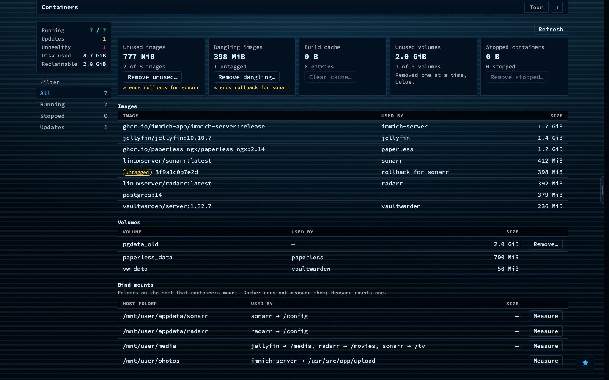</p>

</details>

<a id="148-the-logs-window"></a>

### 14.8 The logs window

**Show logs** in the row menu, `l` on the selected row, `:docker <name> logs`, or **Open logs window** in the side panel opens a window over most of the page (the whole screen on a phone) that follows the container's log as it is written.

- **Following** — scroll up and it pauses, counting what arrives meanwhile; **Jump to latest** catches up. `f` does the same.
- **Search** marks every match; `Enter` and `Shift + Enter` step through them. **Filter** keeps only the matching lines.
- **All / stdout / stderr**, how many lines to start with (100 to 1000), timestamps and wrapping — remembered in this browser. stderr lines are red.
- **Copy** takes the lines on screen; **Download** saves the loaded lines as a `.log` file.
- When the container stops the stream ends; **Resume** picks up after the last line.

`/` searches, `Esc` closes. Reading logs sits behind the write token, as the side panel's Logs does.

<details>
<summary>📷 Screenshot — the logs window</summary>

<p align="center">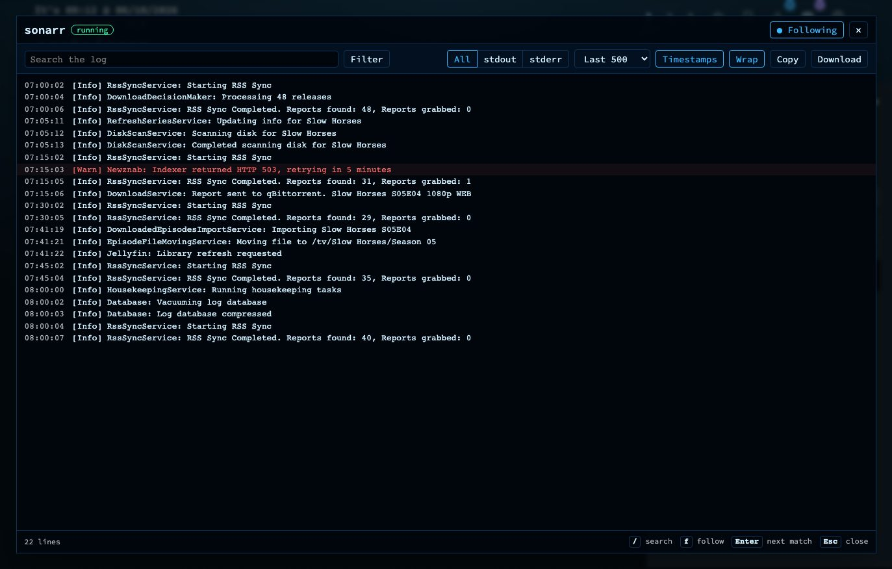</p>

</details>

<a id="149-notices"></a>

### 14.9 Notices

When a container **stops unexpectedly**, **keeps restarting** (three crashes in ten minutes) or **turns unhealthy**, nextDash sends a notice — and a second one when it recovers. A stop you or nextDash asked for is not a notice, and neither is a crash the restart policy fixes within 30 seconds. One notice per incident; four or more at once become one message.

They go where Health's downtime alerts go: the alert webhook under **Behavior → Status & alerts → Downtime alerts** (with its presets), and browser notifications with **Notify when a container stops, keeps restarting or turns unhealthy** switched on. **Config → Containers → Notifications** switches them off. Mute a single container from its row menu, its side panel's ⋯ menu, or `m`; **Muted containers** lists them and says where notices go. Hidden containers and nextDash's own raise nothing.

**Running hot.** **Also when one uses too much CPU or memory** (on by default) sends a notice when a container stays above a line for a while — **CPU above** 90 % of every core, **Memory above** 90 % of its limit (the host's memory when it has none), **For at least** 10 minutes, each adjustable — and one when it is back under both. It reads the stats history, so it needs **Keep the last hour of CPU and memory** on. One notice per spell; the same mutes apply.

**Automatic updates** send a notice when one went through, when one was rolled back and why, and when one could not be done.

<sub>[↑ Contents](#table-of-contents)</sub>

---

<a id="15-widgets"></a>

## 15. 🧩 Widgets

> [!NOTE]
> **In short:** widgets are blocks beside your categories that show something other than links: health, feeds, system figures, a to-do list. The Custom widget reads figures from any service that answers in JSON.

A page holds categories and, beside them, **widgets**: blocks that show something other than links. Categories and widgets share one order.

<p align="center">
  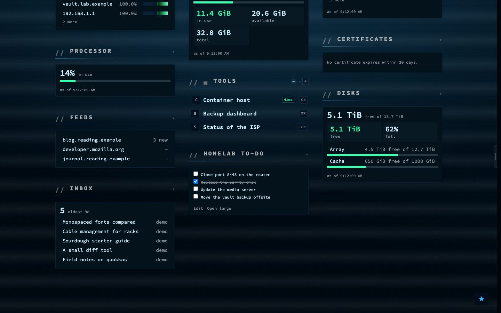
</p>
<p align="center"><sub>Widgets stand beside the categories: processor, feeds, inbox, certificates, disks and a to-do list.</sub></p>

<a id="151-the-kinds"></a>

### 15.1 The kinds

*Are the links still good?*

| Kind | Shows |
|---|---|
| **Health** | Broken, down, changed and fine; each figure opens its filter |
| **Uptime** | Monitored bookmarks, worst first, with a heartbeat |
| **Certificates** | Certificates close to expiry, per host |
| **Health trend** | How the collection's health has moved, drawn like the summary in Collection health |

*What is arriving?*

| Kind | Shows |
|---|---|
| **Inbox** | How much is waiting, and how old the oldest is |
| **Unsorted** | Links kept from the inbox without a page yet — newest first, at random, by one tag or grouped under every tag, with each address under its title. A row opens the Bookmarks view on Unsorted, with that bookmark's side panel; the overflow row reads **Open Unsorted**. |
| **Feeds** | Feeds with news, and feeds that stopped after repeated failures; a stopped feed has a **Retry** button that tries it again now instead of tomorrow |
| **Sources** | What each import source last did |

*What needs tidying?*

| Kind | Shows |
|---|---|
| **Neglected** | Bookmarks not opened in a long time |
| **Blind spots** | Never checked, checked long ago, or not watched |
| **Duplicates** | The same address stored more than once |
| **Archive** | How many bookmarks have a copy, and which broken ones have none |
| **Trash** | What is in the trash and when it goes |
| **Backups** | The age of the newest automatic backup, and whether the last run failed |

*How is this machine doing?*

| Kind | Shows |
|---|---|
| **Processor** | CPU use and the load average |
| **Memory** | What is really in use; the file cache counts as free |
| **Disks** | Used, free and reserved space on the disks you name |
| **Containers** | Running and total containers, failing healthchecks and recent restarts; opens the Containers view, and its update figure links to `#docker?filter=updates`. The figures you tick can add **updates waiting** (a skipped or held one does not count), **reclaimable** disk space — what the Disk tab last measured, measured again in the background once it is six hours old, a dash before the first — and **incidents** in the last 24 hours (crashes and turns unhealthy, from the timeline). **Name the three busiest by CPU** lists them under the figures. Nothing ticked means every figure. |
| **Container list** | The containers themselves, one row each: one column on a narrow tile, two on a wide one. Its settings choose **running only** or **all**, the order (**problems first**, name, longest or shortest uptime, CPU or memory — busiest first), what stands on the right of a row (uptime, the image tag, CPU and memory, or nothing) and where a click goes: the container in the Containers view, or its web UI. A problem — unhealthy, stopped, an update — replaces the uptime on its row. |

*How is the Unraid server doing?*

| Kind | Shows |
|---|---|
| **Unraid** | The server at a glance, a line each: array, used, parity, disks, alerts, VMs and the UPS, with the worst problem in colour; wide, it adds the newest alert |
| **Unraid array** | The array's disks by group (parity, array, cache), each with its fill and temperature or its problem; a sleeping disk is grey. A disk is hot at 45 °C when it spins and at 60 °C when it is an SSD or NVMe, and full at the usage warning set for it in Unraid, else at 90 %. Narrow, only the disks with a problem, or *N disks fine* |
| **Parity** | The last parity check, or the running one with progress, speed and time left; wide, its history |
| **Shares** | Where the shares live — the array, each cache pool, or both when a share overflows from one to the other — each place with its fill and free space, and the shares on it: their names when wide, how many when narrow. Unraid reports a share's space as that of its place, not its own, so this is the honest view. Its settings choose how many places |
| **VMs** | How many virtual machines run, and which are paused, stopped or crashed; its settings choose how many rows |
| **UPS** | Charge, runtime and load; amber when the server runs on battery |
| **Unraid notifications** | Unraid's unread notifications, newest first, the alerts in red; its settings choose how many rows |

These read one server, set once under Config → Containers ([§15.6](#156-unraid-widgets)).

*What is happening around you?*

| Kind | Shows |
|---|---|
| **Weather** | Current conditions and a forecast (3 days, 5 days or 24 hours), from the settings under Appearance → Date & weather; wide, it adds what it feels like, the wind, the humidity and the chance of rain |
| **Calendar** | What is coming up, from the **Calendar feed URL (.ics)** under Appearance → Date & weather |
| **RSS** | The newest articles from up to ten feed addresses set on the widget, merged newest first |
| **Notes** | A text of your own, read as Markdown, with checkboxes you tick on the tile; up to 6,000 characters |

And the **Custom** widget, which reads any service that answers with JSON ([§15.5](#155-the-custom-widget)).

A tile with a row limit shows what it left out (*5 of 12*). A figure on a tile is a link to the rows behind it.

<a id="152-adding-and-arranging"></a>

### 15.2 Adding and arranging

**Config → Widgets** lists your widgets. **Add a widget** opens the catalogue; the **Types** tab describes every kind with an *Add* button. The list has a search (title and type), a page picker (including **All pages**), a sort (grouped, page order, name, type) and a selection bar with **Show**, **Hide**, **Move to page…** and **Delete**.

Each widget has a title, a width (one or two columns), the page it counts, a row count and the settings of its kind. An **ℹ** explains the harder settings and **↺** resets them. The title and **Shown** save at once; the rest waits for **Save**.

Widgets are ordered with the categories under **Structure → Categories**, or dragged on the dashboard. On a one-column dashboard — and on a phone — a wide widget narrows itself and keeps the important half.

**Two columns say more, not the same thing larger.** A tile drawn wide adds the readings a narrow one leaves out: the load average behind the processor's percentage, the container that is failing by name, used and total beside free space, what the weather feels like, the date a certificate expires, when an import last ran. Lists of rows run in two files instead of one. This follows the width the tile actually got, so narrowing the dashboard takes it back at once.

<a id="153-on-the-dashboard"></a>

### 15.3 On the dashboard

- Click the title, or `Enter` on the header, to fold a widget. `.` folds everything. The state is kept per page.
- Right-click the title to rename, change the width, fold, open the settings, **move it to another page** (**Move to page…**, the same move as in Config → Widgets, keeping its sign-in and folded state) or **close** it. Closing hides it and keeps its settings; Config → Widgets switches it back on.
- The arrow keys walk through a widget's rows; `Enter` does what a click does. See [§7.4](#74-acting-on-a-category-or-widget).
- Widgets that read something outside refresh on their own interval, and not at all while the tab is hidden.

**Calendar** — your server fetches the feed (the private ICS address from your calendar app, not its web page), shares one copy between widgets and refreshes it every 15 minutes. A recurring event shows its first stated occurrence. Changing the address redraws the widgets at once.

**RSS** — your server fetches each feed and caches it for 15 minutes. A headline shows the feed's summary on hover or focus. Rows past the row count fold into a **more** row. A feed that fails does not empty the tile.

**Notes** — headings (`#` to `###`), bullet and numbered lists, quotes, tables, code blocks, **bold**, *italic*, `code` and links are drawn as such; a line that starts with `[ ]` is a checkbox, and ticking it on the tile saves at once. **Edit** opens a plain editor (`Ctrl/Cmd + Enter` saves, `Esc` cancels); typing `/` there offers commands: `/date`, `/time`, `/uuid`, `/upper`, `/lower`, `/title`, `/todo`, `/h1`, `/code` and `/table`. **Open large** shows the text beside a preview with a toolbar (heading, bold, italic, code, link, list, task, quote, table, and `/` for the commands). A tile drawn wide adds the length and how many tasks are done. **Config → Behavior → General → Notes widget → Notes are processed** chooses where the Markdown and the commands are worked out: **On the server** (the default) or **In the browser**, which needs no request while you type. If the server cannot be reached, the tile shows the plain text.

<a id="154-system-widgets-and-what-they-need"></a>

### 15.4 System widgets and what they need

Processor, Memory, Disks, Containers and Container list report on the machine nextDash runs on. The Containers view shares the same connection. Running the binary directly needs no setup. In a container:

**Processor and Memory** usually work as they are — `/proc` is not namespaced. Mount it only to be explicit:

```yaml
volumes:
  - /proc:/host/proc:ro
environment:
  - NEXTDASH_HOST_PROC=/host/proc
```

**Disks** need a mount. Mount the disks under a prefix, keeping their names, and point `NEXTDASH_HOST_ROOT` at the prefix:

```yaml
volumes:
  - /mnt:/host/root/mnt:ro,rslave        # Unraid, most Linux
  # - /volume1:/host/root/volume1:ro,rslave   # Synology, QNAP
  # - /:/host/root:ro,rslave                  # everything
environment:
  - NEXTDASH_HOST_ROOT=/host/root
```

Name the disks in the widget as the machine knows them — `/mnt/user`, `/volume1`. Mounted, readable disks are offered under the field.

**Containers** need the Docker socket, for the widget and the Containers view alike. Read-only still exposes the daemon's whole read API — every container, image, environment and mount. Use a socket proxy if that is too much.

```yaml
volumes:
  - /var/run/docker.sock:/var/run/docker.sock:ro
environment:
  - NEXTDASH_DOCKER_SOCKET=/var/run/docker.sock
```

A read-only mount is enough to look. Starting, stopping, updating and removing containers from the Containers view needs a writable socket and `NEXTDASH_DOCKER_CONTROL=1` — `:ro` on the mount does not stop the daemon's API from accepting writes on a socket that is otherwise reachable, so treat a writable socket as root on the host regardless of the mount flag. On Docker Desktop the socket is `root:root`, so the container may also need `NEXTDASH_RUN_AS_ROOT=1` to reach it.

| Variable | Needed for |
|---|---|
| `NEXTDASH_HOST_PROC` | Processor, Memory (optional; default `/proc`) |
| `NEXTDASH_HOST_ROOT` | Disks (required) |
| `NEXTDASH_DOCKER_SOCKET` | Containers widget and view (required; unset hides both) |
| `NEXTDASH_DOCKER_CONTROL` | Containers view: start, stop, pause, restart, update and remove (`1`; needs a writable socket) |

**On Unraid** these are rows in the container template (Docker → nextDash → Edit):

| Config Type | Name | Container Path / Key | Host Path / Value | Access Mode |
|---|---|---|---|---|
| Path | Host proc | `/host/proc` | `/proc` | Read Only |
| Path | Host disks | `/host/root/mnt` | `/mnt` | Read Only |
| Path | Docker socket | `/var/run/docker.sock` | `/var/run/docker.sock` | Read Only |
| Variable | Host proc | `NEXTDASH_HOST_PROC` | `/host/proc` | — |
| Variable | Host root | `NEXTDASH_HOST_ROOT` | `/host/root` | — |
| Variable | Docker socket | `NEXTDASH_DOCKER_SOCKET` | `/var/run/docker.sock` | — |

Then name `/mnt/user` and `/mnt/cache` in the Disks widget. A user share reports the pool total; `/mnt/diskN` reports one disk. Mount `/` instead of `/mnt` to reach disks outside the array.

**Good to know.** A source that is not mounted says so on the tile. The processor figure appears from the second reading on. Each widget has its own refresh interval with a sensible minimum. On Docker Desktop for Mac or Windows the figures describe Docker's Linux VM, not your computer.

<a id="155-the-custom-widget"></a>

### 15.5 The Custom widget

The Custom widget reads figures from any service that answers with JSON — the queue in Sonarr, blocked queries in Pi-hole, a sensor in Home Assistant, or something you run yourself. It only reads. Your server makes the request, so a key never reaches the browser, and a machine on your network is reachable as long as **Allow localhost & private-network bookmarks** is on ([§23.3](#233-local-addresses-and-outgoing-requests)), which it is by default.

Start from one of the 42 presets ([Presets](#custom-widget-presets)) or from an empty widget. The parts, in the order you meet them:

- [Step by step](#custom-widget-step-by-step) — from an empty widget to a working tile.
- [Sign-in](#custom-widget-sign-in) — the ways to prove who you are to a service.
- [Paths and shapes](#custom-widget-paths) — how a figure is found in the answer and how it is written.
- [Presets](#custom-widget-presets) — every service that comes filled in.
- [When it shows nothing](#custom-widget-troubleshooting) — what each message means.

<a id="custom-widget-step-by-step"></a>

#### 🪜 Step by step

1. Open **Config → Widgets** and press **Add a widget**. Choose **Custom**, under *And anything else: the Custom widget*. The widget lands at the end of the page with its settings open.
2. Under **Start from a service**, pick one in **Service** — or leave it empty for a service that is not in the list. A preset fills in the address, the figures, the sign-in type and the refresh interval, and a notice says what is still left to do. See [Presets](#custom-widget-presets).
3. Under **Where to read from**, type the **Address to read**. If a preset put a sample address there (`*.local`), replace the host and leave the path. A word such as `YOUR_NODE` in the address or the figures is a placeholder for something of your own; the panel says which. **How to ask** is `GET`, or `POST` for the few services that only answer that. Nothing is sent with either.
4. Still there, **Refresh every (seconds)** takes 30 seconds to 24 hours; empty means five minutes. **List from (path, optional)** points at an array to show as rows instead of figures, up to twenty.
5. **Sign in with** picks how nextDash proves itself: nothing, an API key, a username and password, or a sign-in nextDash keeps. Paste the key or type the password; a saved one shows as *Set*, and the eye button reveals it. See [Sign-in](#custom-widget-sign-in).
6. Under **Figures to read**, press **Add a figure** for each reading, up to eight. Each row has a **Path**, a **Label**, **Show as**, **Decimals** and a **Size**. A preset has already filled these in. See [Paths and shapes](#custom-widget-paths).
7. Under **Try it**, press **Ask now**. nextDash makes the request with what is in the panel right now — including a key you only just typed — and shows three things: **What came back** (with a **Find a key…** search box), **What the tile would show**, and the request's method, host, status, time, size and whether a sign-in was sent. Nothing is saved by asking.
8. Read the **Found** column. Each row shows what its path read, or *not found*. Fix a path, press **Ask now** again, and repeat until every row reads what you expect. **Keep watching** repeats the request every 5, 10, 30 or 60 seconds for up to five minutes, which helps when you are watching a figure move.
9. Under **On the dashboard**, choose the **Width** — one column or two. Press **Save changes**. Until you do, the tile does not change.

<p align="center">
  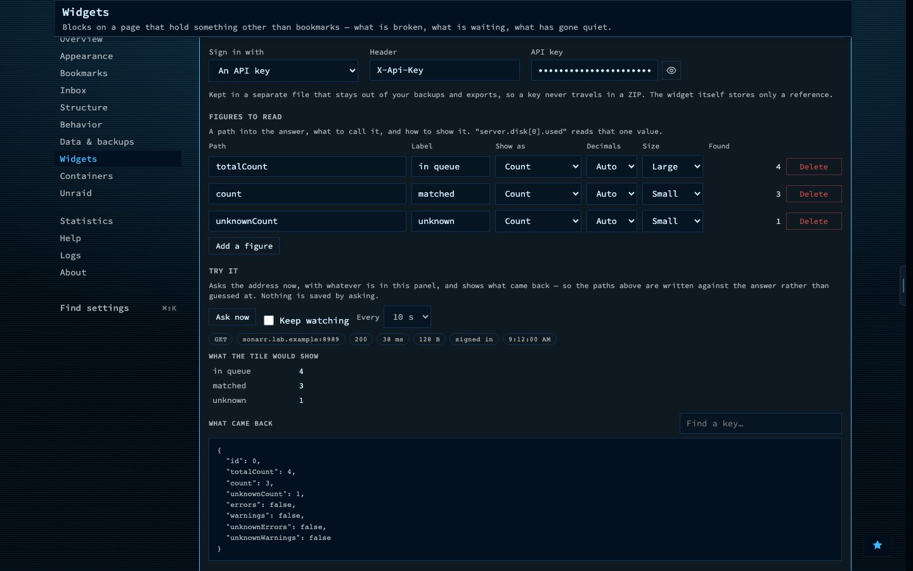
</p>
<p align="center"><sub>The Custom widget editor after <b>Ask now</b>: each figure shows what its path read, and the answer is below.</sub></p>

**Refresh now.** Right-click the tile's title to skip the cache. It needs the write token if the install has one.

**Shared by everyone.** One answer is kept for everyone looking at the dashboard, and the tile refreshes itself on its interval while the tab is visible. A failed request is remembered for 30 seconds, so a service that is down is not asked again by every open dashboard in between.

<a id="custom-widget-sign-in"></a>

#### 🔑 Sign-in

**Sign in with** offers up to six choices, depending on the widget:

- **Nothing — ask anonymously** — for a service that answers without a credential.
- **An API key** — a **Header** name and the **API key**. When the header is `Authorization`, most services want a word before the token (`Bearer `, `Token `); a preset starts the box with that word, and you paste the token after it.
- **A key in the address** — for services that take their key as a parameter (SABnzbd, Plex, LazyLibrarian, Mylar3). The stored address keeps a `YOUR_KEY` placeholder, and nextDash puts the key in on each request, so it stays out of the widget's file. It is offered once a preset has chosen it.
- **A sign-in that nextDash keeps** — you give the username and password (a service that signs in with a password alone, such as Pi-hole v6 or Duplicati, asks for no username) and nextDash signs in itself, keeps the session or token, and signs in again when it expires. This is how qBittorrent (login), Nginx Proxy Manager, Pi-hole v6, Duplicati and Beszel work. It is offered once a preset has chosen it.
- **A username and password** — plain basic sign-in, sent with every request.
- **A sign-in saved elsewhere** — appears once a sign-in is already stored, by another widget for instance, so you pick it instead of typing it again. Health checks can use the same stored sign-ins ([§12.1](#121-availability-modes)).

Secrets are stored in their own file, readable only by the account nextDash runs as, and left out of backups unless you include stored tokens ([§19.1](#191-backups-data)); the widget itself keeps only a reference. A sign-in is not sent along when the service redirects the request to a different host.

<a id="custom-widget-paths"></a>

#### 🧭 Paths and shapes

A **path** names one value in the answer. Dots walk into objects, `[0]` picks a list entry by position, and the figure is shown the way **Show as** says.

Take this answer, from a made-up service:

```json
{
  "server": {
    "name": "nas",
    "cpu": 0.43,
    "disk": [ { "used": 412000000000 }, { "used": 98000000000 } ]
  },
  "jobs": [
    { "name": "backup", "state": "ok" },
    { "name": "sync",   "state": "failed" },
    { "name": "scrub",  "state": "failed" }
  ]
}
```

| Path | Gives | What it does |
|---|---|---|
| `server.name` | `nas` | Walks into objects. |
| `server.disk[0].used` | `412000000000` | `[0]` is the first entry of a list. |
| `server.disk[-1].used` | `98000000000` | A negative position counts from the end: `[-1]` is the last. |
| `jobs[-1].name` | `scrub` | The last entry — where a growing list keeps the newest. |
| `jobs#` | `3` | A `#` at the end counts: the length of a list (or the number of keys of an object). |
| `jobs[state=failed]#` | `2` | A `[key=value]` filter followed by `#` counts the entries that match. |
| `jobs[state=failed].name` | `sync` | Without `#`, a filter picks the first entry that matches. |
| `jobs.sync.state` | `failed` | A name against a list finds the entry that calls itself that (by its `entity_id`, `id`, `name`, `key` or `slug`). |
| `server.gpu` | *not found* | Not in the answer: the **Found** column says so, and the tile shows a dash, not a zero. |

Some services answer with a list at the top, and Home Assistant answers with every sensor in one:

```json
[
  { "entity_id": "sensor.p1_meter", "state": "431", "attributes": { "friendly_name": "P1 meter" } },
  { "entity_id": "sensor.boiler",   "state": "58.2" }
]
```

| Path | Gives | What it does |
|---|---|---|
| `[entity_id=sensor.p1_meter].state` | `431` | The explicit form: the entry whose `entity_id` is that, then its `state`. |
| `sensor.p1_meter` | `431` | The short form. A dotted name is read as one entry, and on its own it gives its `state`. |
| `sensor.p1_meter.attributes.friendly_name` | `P1 meter` | Anything after the name is walked into the entry. |
| `[1].state` | `58.2` | A position at the top of the answer. It moves when a device is added, so a name is safer. |
| `#` | `2` | The number of entries in the answer. |

A path names exactly one value: the first match wins, nothing fans out, and there is no arithmetic — no adding, no dividing, no "free space as a share". A path is at most 200 characters, a label at most 60.

**Show as** chooses how the value is written:

| Show as | Reads | Looks like |
|---|---|---|
| Count | A number, rounded to whole, thousands apart | `1 049 808` |
| Size | Bytes | `130.8 MB` |
| Data size | A number counted in the unit you pick under **Counted in** (Bytes, KB, MB, GB, TB) — for services that already did the arithmetic | `3342.67` counted in GB shows `3.3 TB` |
| Speed | Bits per second | `1.046 Gbps` |
| Power | Watts | `4.5 kW`, `-1.1 kW` |
| Temperature | A number, with the weather unit's suffix; it is not converted | `21.5 °C` |
| Percentage (0–100) | A number already on a 0–100 scale | `43.7%` |
| Percentage from a share (0–1) | A number on a 0–1 scale | `0.43` shows `43%` |
| Duration | Seconds | `3h`, `5d` — the largest whole unit |
| Milliseconds | **Seconds**, written as milliseconds | `0.0052` shows `5` |
| Time ago | A date or a Unix time | `3h` |
| Text | Whatever is there, cut at 120 characters | `ok` |

Sizes step by 1024, speeds and power by 1000. A field saved before the two percentage choices existed may still say *Percentage (guessed)*, which reads 0 to 1 as a share; it stays until you change it. A value that is not a number is shown as text.

**Decimals** is *Auto* or 0 to 3, and works on every number — also on one a service sends as text, such as `"0.00"`. For *Data size* the box turns into **Counted in**; *Duration* and *Time ago* have no decimals.

**Size** is how the figure is drawn: *Normal*, *Large* (the one that matters), *Small* (context), or *Bar* — a filled bar, offered only for a percentage. Presets choose the sizes for you, including whether a full bar is good news or bad.

<a id="custom-widget-presets"></a>

#### 📚 Presets

**42 presets come filled in** — 41 services, because qBittorrent has two: one for its sign-in, one for the API key of version 5.2 and later. They are in five groups, in the order the **Service** list offers them. Every preset puts in:

- a sample address and the path the service answers on;
- the figures worth reading, with labels and sizes;
- the sign-in type, with the word before a token where the header wants one (`Bearer `, `Token `, `PVEAPIToken=`);
- the refresh interval, five minutes unless the service moves faster or slower;
- a notice that says where to find the key.

If the widget already has an address, the host you typed is kept and only the path is replaced, so moving a tile from Sonarr to Radarr on the same machine is one choice. Everything stays editable afterwards. A `YOUR_…` word in an address or a figure is a placeholder for something of your own.

Under **Reads** are the figures' labels, in order; **Sign-in** is what to choose under **Sign in with**.

<details>
<summary><b>Media &amp; downloads</b> — 21 presets</summary>

| Service | Sample address | Reads | Sign-in | Where the key is |
|---|---|---|---|---|
| Sonarr | `http://sonarr.local:8989` + `/api/v3/queue/status` | in queue · matched · unknown | API key, header `X-Api-Key` | Settings → General → API Key. |
| Radarr | `http://radarr.local:7878` + `/api/v3/queue/status` | in queue · matched · unknown | API key, header `X-Api-Key` | Settings → General → API Key. |
| Lidarr | `http://lidarr.local:8686` + `/api/v1/queue/status` | in queue · matched | API key, header `X-Api-Key` | Settings → General → API Key. |
| Prowlarr | `http://prowlarr.local:9696` + `/api/v1/system/status` | version · up since | API key, header `X-Api-Key` | Settings → General → API Key. |
| Bazarr | `http://bazarr.local:6767` + `/api/badges` | episodes wanted · movies wanted · throttled | API key, header `X-API-KEY` | Settings → General → API Key. |
| Seerr (Overseerr / Jellyseerr) | `http://seerr.local:5055` + `/api/v1/request/count` | pending · processing · available · requests | API key, header `X-Api-Key` | Settings → General → API Key. |
| Tautulli | `http://tautulli.local:8181` + `/api/v2?cmd=get_activity` | streams · transcoding · kbps · kbps remote | API key, header `X-Api-Key` | Settings → Web Interface → API key. |
| Jellyfin / Emby | `http://jellyfin.local:8096` + `/Items/Counts` | films · series · episodes | API key, header `X-Emby-Token` | Dashboard → API Keys. |
| Plex | `http://plex.local:32400` + `/status/sessions` | streams now | Key in the address (`X-Plex-Token`) | The `X-Plex-Token` from any Plex URL. Plex answers XML unless asked otherwise, so nextDash sends the `Accept` header for you. |
| Immich | `http://immich.local:2283` + `/api/server/statistics` | photos · videos · stored | API key, header `x-api-key` | Account Settings → API Keys. The statistics are an admin's: the key must belong to an admin and include the `server.statistics` permission. |
| qBittorrent (login) | `http://qbittorrent.local:8080` + `/api/v2/transfer/info` | down/s · up/s · downloaded | Session: username and password, signed in by nextDash | The username and password you sign in to the Web UI with. |
| qBittorrent (5.2+, API key) | `http://qbittorrent.local:8080` + `/api/v2/transfer/info` | down/s · up/s · connection | API key, header `Authorization` (`Bearer <key>`) | Tools → Options → Web UI → API key. On an older version, choose qBittorrent (login). |
| SABnzbd | `http://sabnzbd.local:8080` + `/api?mode=queue&output=json` | in queue · speed · MB left · time left | Key in the address (`apikey`) | Config → General → API Key. |
| NZBGet | `http://nzbget.local:6789` + `/jsonrpc/status` | down/s · MB left | Username and password | The control username and password. Works with the maintained nzbgetcom/nzbget as well as the original. |
| Whisparr | `http://whisparr.local:6969` + `/api/v3/queue/status` | in queue · matched | API key, header `X-Api-Key` | Settings → General → API Key. |
| LazyLibrarian | `http://lazylibrarian.local:5299` + `/api?cmd=showStats&json=1` | books · wanted · authors | Key in the address (`apikey`) | Config → Interface → API key (the read-only one is enough), with the API switched on. |
| NZBHydra2 | `http://nzbhydra.local:5076` + `/externalapi/v1/history/downloads?limit=1` | downloads · last grab | API key, header `X-Api-Key` | Config → Main → API key. A wrong key answers 404, not 401. |
| Komga | `http://komga.local:25600` + `/api/v1/series?size=1` | series | API key, header `X-API-Key` | Account settings → API keys. |
| PhotoPrism | `http://photoprism.local:2342` + `/api/v1/config` | photos · videos · to review | API key, header `Authorization` (`Bearer <key>`) | An app password (Settings → Account → Apps and Devices). If every figure reads 0, the password was not accepted: PhotoPrism then answers with its public settings. |
| Jellystat | `http://jellystat.local:3000` + `/stats/getPlaybackActivity?size=1` | plays logged · last played · played | API key, header `x-api-token` | Settings → API Keys. Counts the plays Jellystat has logged. |
| Mylar3 | `http://mylar.local:8090` + `/api?cmd=getIndex` | series | Key in the address (`apikey`) | Settings → Web Interface → API key, with the API switched on. |

</details>

<details>
<summary><b>Network</b> — 6 presets</summary>

| Service | Sample address | Reads | Sign-in | Where the key is |
|---|---|---|---|---|
| Pi-hole (v6) | `http://pi.hole` + `/api/stats/summary` | queries · blocked · blocked % · on the list | Session: password only, signed in by nextDash | The web interface password, or an app password from Settings → Web interface / API. |
| AdGuard Home | `http://adguard.local:3000` + `/control/stats` | queries · blocked · avg ms | Username and password | The web interface username and password. |
| Traefik | `http://traefik.local:8080` + `/api/overview` | routers · services · router errors · middlewares | None | No credential when the API is exposed on the internal network. |
| Speedtest Tracker | `http://speedtest.local:8080` + `/api/v1/results/latest` | down · up · ping ms · healthy · last test | API key, header `Authorization` (`Bearer <key>`) | An API token with the `results:read` ability. |
| Nginx Proxy Manager | `http://npm.local:81` + `/api/reports/hosts` | proxy hosts · redirects · 404 hosts | Session: email address and password, signed in by nextDash | The email address and password you sign in with. An account with two-factor sign-in cannot be used here. |
| Tailscale | `https://api.tailscale.com` + `/api/v2/tailnet/-/devices` | devices · need an update | API key, header `Authorization` (`Bearer <key>`) | An API access token from the admin console (Settings → Keys). These tokens expire after at most 90 days. |

</details>

<details>
<summary><b>System</b> — 4 presets</summary>

| Service | Sample address | Reads | Sign-in | Where the key is |
|---|---|---|---|---|
| Proxmox VE | `https://proxmox.local:8006` + `/api2/json/nodes/YOUR_NODE/status` | uptime · cpu · ram used | API key, header `Authorization` (`PVEAPIToken=<key>`) | An API token. Replace `YOUR_NODE` in the address with your node's name — it is in the left-hand tree of the Proxmox web interface. |
| Glances | `http://glances.local:61208` + `/api/4/quicklook` | cpu · memory · swap · load | None | No credential unless the web server was started with a password; then choose basic auth under Sign-in. |
| Syncthing | `http://syncthing.local:8384` + `/rest/db/completion` | in sync · to sync · to transfer | API key, header `X-API-Key` | Actions → Settings → API Key. |
| Duplicati | `http://duplicati.local:8200` + `/api/v1/serverstate` | state · status · error | Session: password only, signed in by nextDash | The password of the Duplicati web interface. |

</details>

<details>
<summary><b>Monitoring</b> — 6 presets</summary>

| Service | Sample address | Reads | Sign-in | Where the key is |
|---|---|---|---|---|
| Beszel | `http://beszel.local:8090` + `/api/collections/systems/records?perPage=200` | systems · down · paused | Session: email address and password, signed in by nextDash | The email address and password of a Beszel user (a read-only one is enough) that can see the systems. |
| Netdata | `http://netdata.local:19999` + `/api/v1/info` | critical · warning · version | None | No credential on a default agent. |
| Gatus | `http://gatus.local:8080` + `/api/v1/endpoints/statuses?pageSize=1` | down · endpoints | None | No credential unless Gatus is set up with basic security; then choose basic auth under Sign-in. |
| Uptime Kuma | `http://uptime-kuma.local:3001` + `/api/status-page/heartbeat/YOUR_SLUG` | monitors | None | Reads a published status page, without a credential. Replace `YOUR_SLUG` in the address with its slug. One monitor's latest ping is `heartbeatList.<id>[-1].ping`, with the id from the monitor's own address. |
| Scrutiny | `http://scrutiny.local:8080` + `/api/summary` | drives · status · temp | None | No credential on a default install. Replace `YOUR_WWN` in the figures with a drive's WWN, shown on its detail page (0x…). |
| Healthchecks | `https://healthchecks.io` + `/badge/YOUR_BADGE` | status · down · late · checks | None | Paste the JSON badge address (the `json3` one, from Settings → Badges) into the address in place of the sample. The address itself is the key. |

</details>

<details>
<summary><b>Apps</b> — 5 presets</summary>

| Service | Sample address | Reads | Sign-in | Where the key is |
|---|---|---|---|---|
| Nextcloud | `https://nextcloud.local` + `/ocs/v2.php/apps/serverinfo/api/v1/info?format=json` | files · users · active today · free | API key, header `NC-Token`, plus `OCS-APIRequest` that nextDash adds | The token from Administration settings → System (Monitoring). |
| Paperless-ngx | `http://paperless.local:8000` + `/api/statistics/` | documents · in the inbox · characters · tags | API key, header `Authorization` (`Token <key>`) | An API token. |
| Home Assistant | `http://homeassistant.local:8123` + `/api/states` | now · sensor · updated | API key, header `Authorization` (`Bearer <key>`) | A long-lived access token from your profile page. Then replace `YOUR_SENSOR` in each figure with an entity of your own — Developer tools → States lists them. |
| Grafana | `http://grafana.local:3000` + `/api/health` | database · version | None | The health route answers without a credential. |
| ntfy | `http://ntfy.local:8080` + `/v1/stats` | messages · per second | None | The stats route answers without a credential. |

</details>

**Retired.** Three presets are no longer offered because the service or its API is gone: Readarr, Pi-hole v5 and TrueNAS. A widget that was started from one keeps working and still shows its choice, but a new widget cannot pick it, and they are not part of the 42.

Every preset above is tested against a recorded answer of its service, through the same request, sign-in, path and formatting that **Ask now** uses: a figure that reads nothing fails the test. A service that changes its API is one line in the preset, so a figure that suddenly reads a dash is worth a look at **What came back** before anything else.

<details>
<summary>📷 Screenshot — Start from a service, after choosing Sonarr</summary>

<p align="center">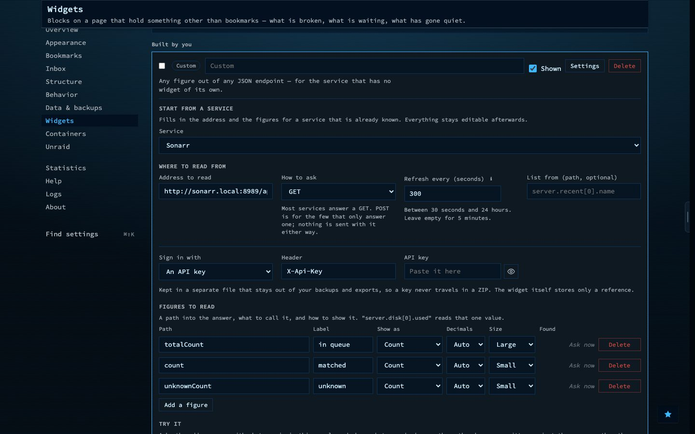</p>

</details>

<a id="custom-widget-troubleshooting"></a>

#### 🩺 When it shows nothing

Press **Ask now** first. It shows the status and the answer, which is usually the whole explanation.

- **The figure reads a dash and *Found* says *not found*.** The path does not match the answer. Paths are case-sensitive. Search **What came back** for the value you want and copy its path; a service that renamed a field after an update shows up this way. A path that stops matching is marked, never shown as zero.
- **The status is 401 or 403, or the tile says the service answered with an error.** The sign-in was refused. Check the key, the header name and the word before the token (`Bearer `, `Token `). **Ask now** says whether a sign-in was sent at all; if it did not, nothing is chosen under **Sign in with**. A few services answer a wrong key differently: NZBHydra2 with 404, PhotoPrism with its public settings, so every figure reads 0.
- **"That address is not allowed."** The address is private and **Allow localhost & private-network bookmarks** is off, or it is not an `http`/`https` address. See [§23.3](#233-local-addresses-and-outgoing-requests).
- **"No answer from that address."** Nothing answered within eight seconds, or the host could not be reached. Remember it is your server that asks, not your browser: in Docker, `localhost` is the container itself, so use the machine's address.
- **"That address answered with a web page, not JSON."** The address names a web interface, often the host with no path. Add the path of the service's API; a preset does this for you.
- **"That answer is not JSON."** or **"…answered with … not JSON."** The service sent XML, plain text or something else. An answer is also read only up to one megabyte; a bigger one is cut off and no longer parses, so point at a smaller endpoint, as several presets do with `?limit=1`.
- **"Could not sign in to that service."** The username and password were refused. A two-factor account cannot be used (Nginx Proxy Manager says so in its notice).
- **"Nothing to show yet" or "no address yet".** The widget has no figure and no list, or no address. Add one and save.
- **The tile did not change.** Changes wait for **Save changes**.

**Limits.** Eight figures, or one list of up to twenty rows. An answer has eight seconds to arrive and is read up to one megabyte. Refresh every 30 seconds to 24 hours. There is no arithmetic, and a tile cannot change anything on the service.

<a id="156-unraid-widgets"></a>

### 15.6 Unraid widgets

Seven widgets read an Unraid server through its API: **Unraid**, **Unraid array**, **Parity**, **Shares**, **VMs**, **UPS** and **Unraid notifications**. They are read-only — nextDash never starts or stops anything on the server.

**What they need.** Unraid 7.2, or an older Unraid with the Unraid Connect plugin, and an API key with the role **Viewer** (in Unraid: Settings → Management Access → API Keys). A key that can do more than read is accepted, but Config says Viewer is enough.

**One connection for all seven.** Config → Unraid holds it: the **Address**, the **API key** (a saved key shows as *Set*; the eye button reveals what you type), **Accept a self-signed certificate**, **Read this server** and **Send Unraid alerts through the alert channels**. When nextDash runs in a container, the Docker bridge gateway is suggested as the address. The address starts with `http://` or `https://`; one without is refused. **Test connection** names the server, its Unraid and API versions and what the key may read — *yes*, *not allowed* or *not in this version* per area. When the server answers but the key may not read its info, or its Unraid lacks what nextDash reads, the test says that rather than *The server did not answer*. A new address needs the key again: change the address without typing a key and the saved key is dropped. The key is stored apart in `data/unraid-secrets.json`, is never sent back to the browser, and travels in a backup only with **Tokens and passwords**.

**On the tile.** A widget has only how it draws: **Refresh every (seconds)** (30 at the least; one answer per area is shared by everyone viewing the dashboard), **Rows to show** where it lists (Shares, VMs, Unraid notifications), and **A click** — *Opens the page in Unraid* or *Does nothing*. An area the key may not read, or an Unraid version that lacks it, is named on the tile instead of showing zero; a server that stops answering keeps the last reading, with its age. Nothing is shown until the connection is saved.

**Alerts.** With **Send Unraid alerts through the alert channels** ticked, four things go through the channels that carry downtime and container alerts ([§12.4](#124-alerts)): Unraid's own ALERT notifications, the array stopping, a parity check that finished with errors, and a disk whose error count went up. The first look after a start only remembers what is there, and so does the first look after the address changes or **Read this server** or the alert switch is turned off and on again. Four or more at once become one message, *N Unraid alerts*.

**Local addresses.** The server is asked from nextDash, so a LAN address needs **Allow localhost & private-network bookmarks** (Behavior → General, on by default) — the same rule as other outgoing requests ([§23.3](#233-local-addresses-and-outgoing-requests)). Unraid usually answers with a certificate of its own; tick **Accept a self-signed certificate** for that, or use an address with a certificate nextDash trusts.

<details>
<summary>📷 Screenshot — the Unraid widgets</summary>

<p align="center">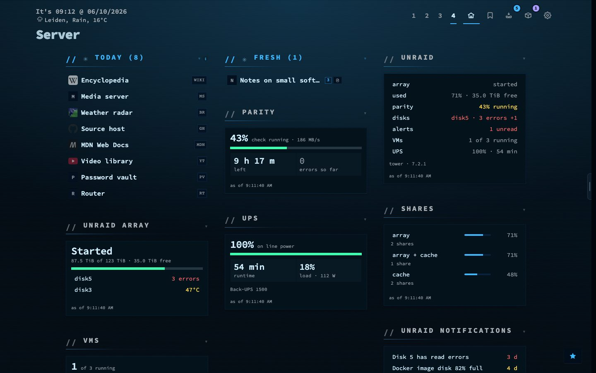</p>

</details>

<sub>[↑ Contents](#table-of-contents)</sub>

---
<a id="16-appearance"></a>

## 16. 🎨 Appearance

> [!NOTE]
> **In short:** Appearance changes how the dashboard looks: themes, background, surfaces, type, grid, rows, header and action bar. Pick, preview and apply, or build a theme of your own.

**Config → Appearance** opens straight on its settings, on the tab you used last. Eight tabs: **Look**, **Background**, **Surface**, **Grid**, **Rows**, **Header**, **Action bar** and **Date & weather**. Every setting of a tab is on it, with a short line under each saying what it does.

**The preview.** Beside the settings stands a small drawing of your dashboard — header, grid, a few rows and the action dock. It follows every change as you make it, in your own theme and font, and marks the part the open tab is about: the grid on Grid, the rows on Rows, the header on Header, the clock on Date & weather, the buttons on Action bar. On a narrow window it moves above the settings.

<a id="161-themes"></a>

### 16.1 Themes

nextDash ships **164 theme families**, each with a light and a dark half — 328 themes in all. A fresh install starts on **Matrix Bluepill**, cyan code on deep blue, with depth, glow and effects on **Follow the theme**, so the theme draws itself the way it was made.

**Theme** on the Look tab lists every theme by name. Beside it:

- **The theme browser** — **Browse…**, or **`Shift + A`** on the dashboard. It opens as a panel beside the dashboard, with tabs of its own ([see below](#the-theme-browser)); the first, **Themes**, has one card per family, with a light/dark switch and the line that says what the theme is like to sit in front of. At the top: a search box, the segments *All*, *Favourites*, *Light* and *Dark*, a row of **character chips** ([§16.2](#162-character)) and a **collection** chip. *Light* and *Dark* turn every card to that half; a card can still be switched by hand. Search matches a family's name, its character and the words of its line. The 38 newest families wear a **new** badge, and searching `new` finds them. Themes of your own come first, under **Your themes**, with a **yours** badge (and **look** when they bring one along); a segment **Yours** shows only them, and searching `yours` finds them. A packaged theme you recoloured wears **recoloured**. A star keeps up to 24 families under *Favourites*. Pointing at a card previews that theme on the real dashboard; clicking one puts it on the page. A line above the grid names the theme in use — or, once you have picked another, which one is chosen and which stays until **Apply** — and **Show** brings its card into view.
- **Collections** — the **Neutrals** collection holds five calm grey palettes — Slate, Zinc, Gray, Stone and Neutral — drawn under glass, each with a backdrop of its own.
- **For Unraid users** — four themes after the Unraid webGUI, each in light and dark: **Unraid Black** (flat black panels, small uppercase labels, the orange of the logo), **Unraid Azure** (cool grey panels, steel-blue accent), **Unraid Ember** (that orange glowing out of black glass) and **Unraid Blaze** (the red end, hard-edged lacquer on deep crimson).
- **Quick mode** — switches between the light and dark half of the family you are on.
- **Follow system dark mode** — shows the light half by day and the dark half by night, following the operating system, also in a background tab.
- **Random theme** — **Off**, **On page refresh**, or **On view change** (switching between the dashboard grid, config, the inbox, the Bookmarks view, Containers or pages). Your saved theme stays underneath and comes back when you turn it off. With follow-system on, only halves that match the current mode are picked.
- **Theme editor** — **Open the theme editor…** recolours any theme, or builds one of your own ([§16.5](#165-custom-themes)).
- **`:theme <name>`** and **`:dark`** switch from the command palette.

<a id="the-theme-browser"></a>

#### 🪟 The theme browser

The theme browser lies over the right of the dashboard, so every change shows on the real page while you make it. Nothing is stored until **Apply**; **Cancel**, the **×** at the top right, **Esc** or a click on the dashboard beside the panel puts everything back, in every tab. On a narrow window it becomes a sheet along the bottom.

<p align="center">
  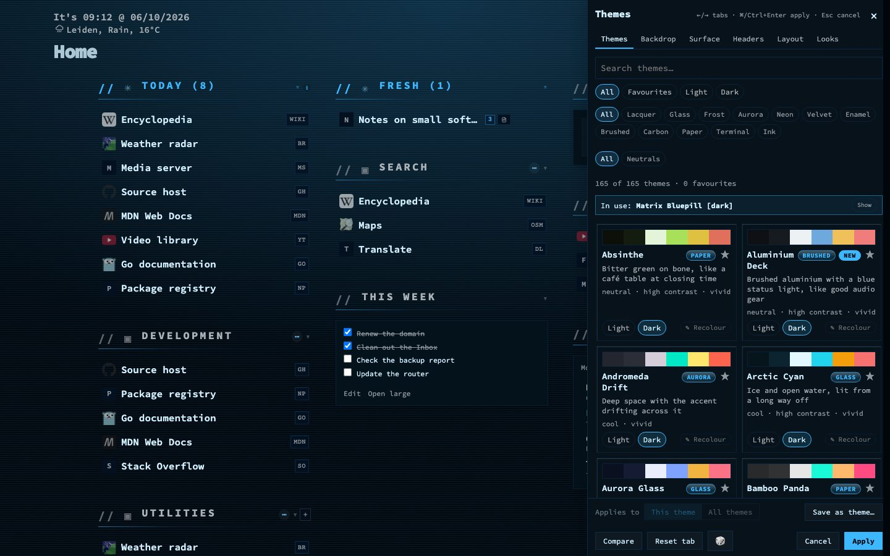
</p>
<p align="center"><sub>The theme browser opens beside the dashboard (<kbd>Shift</kbd> + <kbd>A</kbd>), so every change shows on the real page until you press Apply.</sub></p>

**Wider.** Drag the panel's left edge to widen it, or focus the edge and use **`←`** / **`→`** (with **`Shift`** for bigger steps); a double-click gives the default width back. It never goes narrower than the default, where the six tabs fit, and always leaves 240 px of the page beside it. The width is kept per browser.

| Tab | What it changes |
|---|---|
| **Themes** | The theme itself ([above](#161-themes)) |
| **Backdrop** | Which backdrop is drawn and its settings ([§16.4](#164-type-and-background)) |
| **Surface** | Depth, glow, effects and card glass ([§16.3](#163-surfaces)), and the layout preset |
| **Headers** | How category names read above their bookmarks ([§16.6](#166-grid-and-rows)) |
| **Layout** | Type, text contrast and favicon harmonization |
| **Looks** | Ready-made combinations of the tabs above |

- A **dot** on a tab marks what you changed there since opening.
- **Applies to** — *This theme* or *All themes*: whether the backdrop and the surface belong to the theme on screen or hold for every theme (the same switch as **Use these for every theme**).
- **Compare** shows the look from before you opened the browser until you press it again; holding **`\`** does the same for as long as you hold it.
- **Reset tab** undoes the open tab; **🎲** tries something at random in it.
- **`←` / `→`** move between tabs, **`⌘/Ctrl + Enter`** applies, and **Enter** on a theme card picks it.
- **✎ Edit** on a card of your own, **✎ Recolour** on a packaged one, or **`e`** on a focused card opens the theme editor ([§16.5](#165-custom-themes)) in place of the grid; **← Themes** goes back. The other tabs have a link **✎ Edit ‹theme›** at the top. Colour changes show on the page and are kept on **Apply** like everything else; **Cancel** and **Compare** include them, and **Reset tab** in the editor puts the colours back.
- **Use this theme's look**, above the grid, appears once a theme of your own carries a look. Off, picking such a theme leaves the look on screen as it is.
- **Save as theme…** turns what is on screen into a new theme of your own: a name (it suggests "‹theme› — mine"), **Bring this look along**, and **Make the light/dark half too** when the theme has two. It is saved at once and opens in the editor; picking it still waits for **Apply**, so **Cancel** keeps the new theme and puts the old one back on screen.

<details>
<summary>📷 Screenshot — the theme browser, Themes tab</summary>

<p align="center">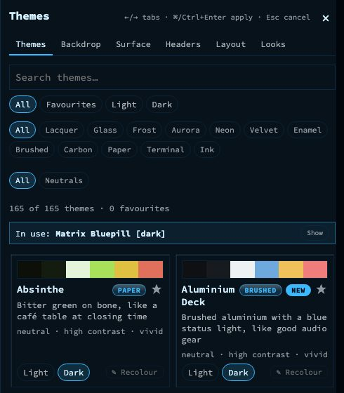</p>

</details>

<a id="looks"></a>

**Looks** set backdrop, surface, headers and type in one go, and leave the theme's colours alone. After using one, every part can still be tuned in its own tab.

| Look | What it draws |
|---|---|
| **Glass** | A photo-like sunset backdrop, glass cards, clean headers |
| **Glass boxed** | Mountains, boxed headers, a little more blur |
| **Frosted** | Bokeh, lots of blur, see-through cards |
| **Aurora** | Northern light behind clear glass |
| **Night sky** | Stars on a darkened page, quiet labels |
| **Soft** | A blurred wash of colour, calm cards |
| **Desert** | Warm dunes tinted by the theme, with counts |
| **Paper** | Contour lines and near-solid cards, accent underline |
| **Blueprint** | A drafting grid, edged cards, boxed headers |
| **Terminal** | Scanlines, solid cards, bare labels |
| **Neon** | Bright prisms, see-through cards, group cards |
| **Plain** | No backdrop, solid cards, label headers |

<a id="themes-that-catch-the-light"></a>

#### ✨ Themes that catch the light

How a theme catches the light is part of its character, not a group of themes of its own. The shine — a lit band across each surface and a brighter top edge — belongs to the **Lacquer** character; **Enamel** is glazed and rounder, and **Neon** lets the accent leave the surface as a halo. The **Lacquer** chip in the theme browser shows every family that shines.

Ten families still carry *Gloss* in their name, from when they were the only ones that shone: **Gloss Obsidian**, **Chrome**, **Candy**, **Amber**, **Sapphire** and **Rose Gold** are Lacquer; **Gloss Emerald** and **Pearl** are Enamel; **Gloss Neon Tide** and **Ultraviolet** are Neon. Searching `gloss` finds them by name.

The shine is drawn with the glow. When you pick a theme that shines while **Glow** is off, nextDash offers once to turn Glow to *Soft*; with Glow off, it looks matte. **Effects** set to *Off* also leaves the shine out ([§16.3](#163-surfaces)).

**Any theme can shine.** The **Gloss** slider in the theme editor sets how much light a raised surface catches, for a theme of your own or a recoloured packaged one ([§16.5](#165-custom-themes)).

<a id="162-character"></a>

### 16.2 Character

Every packaged theme names one of twelve archetypes. The archetype decides what
kind of surface a theme draws, which is the part a palette cannot say.

| Archetype | What it draws |
|---|---|
| **Lacquer** | A band of light across a polished surface |
| **Glass** · **Frost** | You look through it; frost has stopped being clear |
| **Aurora** | About the page behind everything, rather than the surfaces on it |
| **Neon** | The accent leaves the surface as a halo |
| **Velvet** | Deep and unlit; the light goes into the shadow beneath |
| **Enamel** | Round and glazed at once |
| **Brushed** · **Carbon** | A grain, in one direction or woven |
| **Paper** · **Terminal** · **Ink** | Matte, square-ish, and carried by the type |

The chips in the theme browser filter on it, and searching finds an archetype
by name — or a word from the line each family carries.

A theme's character is editable in the theme editor, for packaged themes as
well as your own: the archetype, the grain's angle and strength, the shine, the
roundness, and the surfaces the theme asks to be drawn at.

<a id="163-surfaces"></a>

### 16.3 Surfaces

These change how any theme is drawn. Depth, Glow, Effects and Card glass are on
the **Surface** tab; Text contrast, animations and favicon harmonization on
**Look**. The first three start on **Follow the theme**: each theme states what
it was drawn for, and picking a theme brings its answer with it.

| Setting | Choices |
|---|---|
| **Depth** | **Follow the theme** (default) · Flat · Soft · Rich · Vivid · Glass — the steps add a tint in the greys, raised surfaces and a faint wash of light behind the page; Glass blurs what is behind a surface and sits beside the ladder rather than on it. Menus are never blurred. |
| **Glow** | **Follow the theme** (default) · Off · Soft · Full — how far the theme's colour carries around a surface. Flat has no glow. |
| **Effects** | **Follow the theme** (default) · Off · Held back · Full — how loudly the character is drawn: the shine, the glow, the grain, and how round the corners are. Off leaves the palette and nothing else. |
| **Enable animations** | On · Off — off stills the motion across the app |
| **Card glass** | **Follow the theme** (default) · Own — at depth Glass, how solid the panes are (**Opacity**) and how far the page blurs behind them (**Blur**), with **A thin edge round the panes** if you like. **Text on a pane** shows the contrast that is left, and warns when it gets low. With a layout that draws no cards (Default, Compact, Masonry, List), *Own* gives every category a pane of its own; the **Layout preset** is repeated here for that reason. When the theme on screen is not at depth Glass, a button offers to switch to it. |
| **Use these for every theme** | Off (default), depth, glow, effects, the backdrop and the card glass belong to the theme you are on and each theme keeps its own; on, they hold across the whole install and a theme brings nothing of its own. |
| **This theme** | **Back to the theme's own** puts them back to what the theme asks for. |
| **Text contrast** | Soft · Normal · High · Maximum — how far the fainter text sits from its surface |
| **Favicon harmonization** | Off · On, with **Muted**, **Tinted** or **Overlay** and an intensity. Stored per theme, so the light and dark halves are set separately. |

While Depth, Glow and Effects say *Follow the theme*, changing one belongs to
the theme on screen: switch away and back and it is still there, and every
other theme keeps its own. The backdrop and the card glass work the same way.

`:depth`, `:glow`, `:contrast`, `:backdrop`, `:pattern` and `:harmonize` change these from the command palette.

<a id="164-type-and-background"></a>

### 16.4 Type and background

- **Typeface** — Source Code Pro, JetBrains Mono, IBM Plex Mono, Inter, IBM Plex Sans, DM Sans or System UI — or **upload a font file**.
- **Weight** — Normal, Semi-bold or Bold. **Size** — seven steps from XS to XL; pointing at a size previews it.

Type is on the **Look** tab; everything behind the bookmarks is on the **Background** tab, drawn in three layers from the bottom up: the theme's backdrop, a pattern over it, and a background of your own on top.

- **Source** — **Auto** (follows the theme), **None**, **Gradient** or **Image**. **Opacity** (65–100%) fades it so the bookmarks stay readable. A background of your own is drawn over the theme backdrop.
- **Theme backdrop** — **Follow the theme** (default), **Choose one** or **Off**. Every theme draws a backdrop of its own, in its own colours; each light and dark half share one. *Follow the theme* names the one it draws, and *Choose one* opens a grid of all 26, previewed in your theme's colours:

  | Group | Backdrops |
  |---|---|
  | Soft | blooms, glow, sweep, mesh, aurora, bokeh, nebula, stars |
  | Landscape | horizon, band, sunset, dunes, mountains, waves |
  | Lines | wireframe, scanlines, crosshatch, topo, perspective, blueprint, pinstripe |
  | Geometric | rings, hexagons, halftone, prism, chevron |

  Like depth and glow, the choice belongs to the theme you are on unless **Use these for every theme** is on ([§16.3](#163-surfaces)). `:backdrop` turns it on or off from the command palette.
- **Backdrop settings** — **Intensity**, **Scale** and **Variant** (with **🎲** for a new one) change the theme's backdrop; **Blur**, **Brightness**, **Saturation** and **Theme tint** soften it and your own background image alike. Only the backdrop blurs, never the bookmarks. **Back to the defaults** resets all seven.
- **Pattern over it** — **Follow the theme**, **Dots**, **Grid**, **Lines**, **Hatch** or **None**: a texture drawn over the backdrop. Left to the theme, there is none while a backdrop is shown; with the backdrop off, most themes ask for dots.

<a id="165-custom-themes"></a>

### 16.5 Custom themes

**Open the theme editor…** on the Look tab opens the editor as a page of its own; **← Look** above it goes back. A link to `/#config/appearance/custom-themes` opens it directly.

- **Your themes** — **Add custom theme**, edit, reorder (↑ ↓), delete, **⤓** export to a JSON file, and **Import theme…**. A theme you make appears in the theme list beside the packaged ones.
- A custom theme can set everything a packaged theme can: its colours, and under **Shape & character** its character, corner roundness, surface opacity, blur, glow, the **Gloss** slider (how much light a surface catches), the grain's direction and strength, the category titles, the backdrop — **Automatic** or any of the 26 patterns, shown as tiles in the theme's own colours — and the depth and effects it asks to be drawn at. It has a light and a dark half, like the built-in themes.
- **This theme's look** (in the theme browser's editor) — a theme of your own can bring a look along: backdrop and its sliders, card glass, depth, headers, type and spacing. **Take the look on screen** stores what you see, **Clear** removes it, and both halves of a pair share it. Picking the theme — a card, the Theme picker or `:theme` — applies the look; switching halves with Quick mode or the system's dark mode does not, and neither does Random theme. A theme file carries its look.
- In the **Theme** picker your themes come first, in a group of their own, and the closed picker says **· yours**; a recoloured packaged theme says **· recoloured**.
- A contrast check warns when text is too faint against its background.
- **Packaged themes** — recolour any theme that ships, or the base light and dark palettes. **Reset defaults** puts a theme back.
- Changes preview live on the dashboard behind config; leaving the tab drops an unsaved preview. On a phone the editor is read-only.

<details>
<summary>📷 Screenshot — the theme editor</summary>

<p align="center">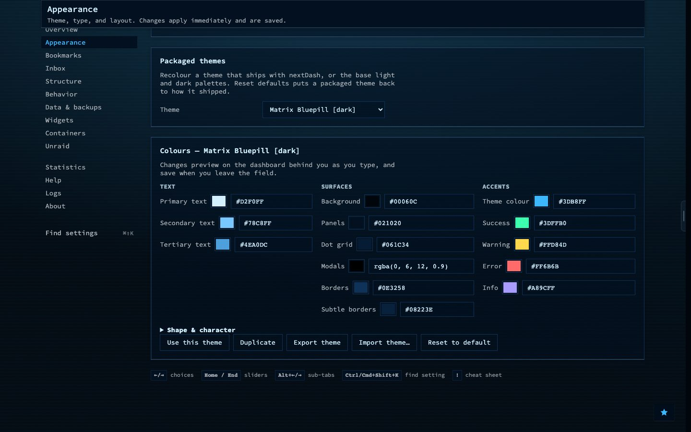</p>

</details>

<a id="166-grid-and-rows"></a>

### 16.6 Grid and rows

**Grid**

| Setting | What it does |
|---|---|
| **Columns per row** | 1–6 — the most the grid uses. A narrower window takes as many as fit, and one only when two no longer fit; a phone held upright always shows one |
| **Layout preset** | Default, Compact, Cards, Terminal-ish, Masonry, List, Widgets and Launcher (large icon tiles) |
| **Density** | Comfortable, Compact, Dense or Auto — one setting for the dashboard, the Bookmarks view, the inbox and the Containers view |
| **Category spacing** | Snug · Balanced (default) · Airy — the gap between rows of categories |
| **Page margins** | Snug · Balanced (default) · Airy — the empty band left and right |
| **Pack columns tightly** | Categories fill the columns without waiting for a full row |
| **Hide empty categories** | |
| **Launcher icon size** | Small, Normal or Large, for the Launcher preset |
| **Start with categories collapsed** | Every category starts folded |
| **Items per category** | 10–50 or Unlimited: how many bookmarks show before *+ N more*. Unlimited is not available while a category spreads |
| **New categories spread across columns** | Only for categories made from now on ([§9.5](#95-spreading-a-category-across-columns)) |
| **Turning spreading off covers** | The current page or every page — what **Turn off** acts on; it puts every category back to one column |

Small drawings beside the shape settings show what a value looks like.

**Rows**

| Setting | What it does |
|---|---|
| **Show favicons** | Bookmark icons on or off. With icons on, a video's **▶** sits on the corner of its icon; with them off, beside the name |
| **Change bookmark color when offline** | A broken row takes the status colour |
| **Shortcut letters on rows** | **Always** (default; a column down the right of each category) · **Only on the row you are on** · **Never** — the shortcuts keep working in every mode |
| **How a row lights up** | **Subtle** (default) or **Strong** — how far the accent carries across the row you are on |
| **Show online/offline status** | Status colours on the rows; with it, **Show a loading state while checking** and **Show ping times** |
| **Show tags on bookmark rows** | And **Tags shown before "+N"** |
| **Category header** | How a category's name reads above its bookmarks. **Style**: Follow the theme (default), Clean, Underlined (optionally in the accent colour), Boxed, Label or Group card, which wraps the category and its bookmarks in one pane. **Size**: Small, Medium or Large. **Show the category icon** — the icon is chosen per category, from its menu. **Show how many bookmarks it holds** puts the count on the right |
| **Link preview cards** | Off · On hover (default) · Keyboard only, a hover delay (Fast, Balanced, Calm) and **What the card shows**: image, site, author & date, video player, description, your note, tags, status & uptime, opens, Fresh count, shortcut & location ([§4](#4-the-dashboard)) |

<a id="167-header-and-action-buttons"></a>

### 16.7 Header and action buttons

See [§4](#4-the-dashboard) for what each part does. The settings:

- **Header** tab — button style (plain or boxed), page tabs on/off, page names in tabs, page switcher style, page tabs before *+N*, the dashboard title, and toggles for the dashboard, inbox and config buttons (the Bookmarks and Containers icons are switched under Config → Bookmarks → View and Config → Containers). Also **Clock & weather** — where they stand: beside the view name, in a column of their own, or on their own line — and **Browser tab**: the page name in the browser title, and **Branding**, the page title and favicon, also used when nextDash is installed as an app.
- **Action bar** tab — where the fixed buttons stand (a column on the right by default), action buttons before *+N*, show the action buttons, show the key on each button, slide a docked bar away (2 seconds by default), and one switch per button. See [§4](#4-the-dashboard) for what sliding away looks like and how the bar comes back.

Each group has **Show all / Hide all**.

<a id="168-date-and-weather"></a>

### 16.8 Date and weather

- **Date & time** — show date, show time, date format, 12- or 24-hour clock. Where the clock and weather stand in the header is set on the Header tab ([§16.7](#167-header-and-action-buttons)).
- **Weather** — on or off, **Location source** (a city you type, or *Automatic (by IP)*), Celsius or Fahrenheit, refresh interval. The Weather widget reads the same settings.
- **Calendar** — **Calendar URL** (the link in the date popover) and **Calendar feed URL (.ics)** (what the Calendar widget reads).

<a id="169-finding-and-resetting"></a>

### 16.9 Finding and resetting

Each tab has a filter beside **Only changed**. When the filter — or **Only changed** — finds something on another tab too, the line under the list names that tab with a count (*Also found on: Header 2*); a click opens it and keeps the filter. **↺** resets one setting, **Reset panel** a whole group. `Ctrl/Cmd + Shift + K` finds any setting ([§17](#17-config)).

<sub>[↑ Contents](#table-of-contents)</sub>

---

<a id="17-config"></a>

## 17. ⚙️ Config

> [!NOTE]
> **In short:** Config is a view inside the dashboard, with a section for each part of nextDash. Open it with `Shift + S`, find any setting with `Ctrl/Cmd + Shift + K`, and every change saves the moment you make it.

Config is a **view inside the dashboard**: same tab, no page load.

<p align="center">
  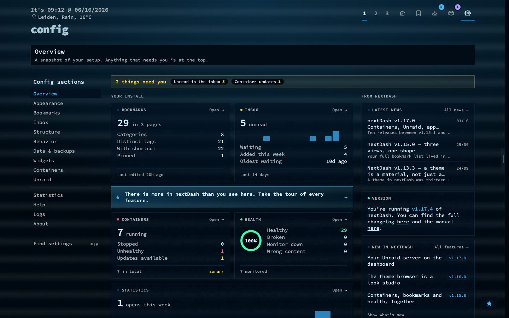
</p>
<p align="center"><sub>Config opens on its Overview, with the sections down the left.</sub></p>

| To open | To leave |
|---------|----------|
| **`Shift + S`**, **`<`**, the gear, or `/#config` | **`Escape`** (when nothing is open on top and you are not typing), **`Shift + S`**, **`<`**, `0`–`9`, or the browser's Back button |

Config reopens on the section and tab you left, for five minutes after you leave; after that, Appearance and Behavior still open on the tab you used last. A link like `/#config/appearance/layout` opens a section and tab directly and wins over the remembered place; `/#config/bookmarks/<pageId>` opens Bookmarks for one page. Moving between sections is not a browser history step.

<a id="171-the-sections"></a>

### 17.1 The sections

| Section | What lives there |
|---------|------------------|
| **Overview** | One line of what needs you, then **Your install** — panels for bookmarks, the inbox, containers, health and statistics — beside **From nextDash**: the newest posts, the newest features with the running version, and a tip of the day ([§17.8](#178-overview-help-and-about)). |
| **Appearance** | Look · Background · Surface · Grid · Rows · Header · Action bar · Date & weather ([§16](#16-appearance)) |
| **Bookmarks** | View · Tags · Tag suggestions · Your rules · Settings · Local copies ([§17.4](#174-config-bookmarks)) |
| **Inbox** | Collecting · List · Panel & clicks · Header icon ([§17.6](#176-config-inbox)) |
| **Structure** | Categories · Pages · Finders · Collections ([§9](#9-pages-categories-and-collections)) |
| **Behavior** | General · Keyboard & search · Fresh · Status & alerts · Privacy & sync ([§17.5](#175-behavior)) |
| **Data & backups** | Backups & data · Sources · Webhooks · Icons & previews · Trash · Reset ([§19](#19-data-backups-and-import)) |
| **Widgets** | Widgets · Types ([§15](#15-widgets)) |
| **Containers** | Connection · View · Updates · Alerts ([§17.7](#177-config-containers)) |
| **Unraid** | The one Unraid server the Unraid widgets read ([§15.6](#156-unraid-widgets)) |
| **Statistics** | Overview · Activity · Content · Inbox · Health ([§18](#18-statistics)) |
| **Help** | The in-app guide |
| **Logs** | Server logs · Activity trail ([§20](#20-logs)) |
| **About** | About nextDash · News & features |

Old addresses still land in the right place — for example `/#config/pages-tags` opens Structure, `/#config/data-backups/logs` opens Logs, and `/#config/behavior/fresh` opens Behavior → Fresh. The tab ids in addresses did not always change when tabs were renamed: Look is `general`, Grid `layout`, Rows `display`, Action bar `buttonbar`.

<a id="172-tabs-and-saving"></a>

### 17.2 Tabs and saving

**Appearance** and **Behavior** open straight on their settings, in tabs, on the tab you used last. Every setting of a tab is on it — the ones that change most first — with a short line under each saying what it does. Appearance keeps a live preview of the dashboard beside its tabs ([§16](#16-appearance)).

**Every change saves the moment you make it**, confirmed by a short message. The exceptions are forms with their own **Save** button — the bookmark form and a widget's settings. Config only writes what changed.

- **ℹ** beside a setting explains it.
- **↺** puts one setting back to its default; **Reset panel** puts a whole group back (it asks first).
- **Only changed** hides settings that are still on their default; the filter beside it narrows the tab by label, hint or option. Both name the other tabs of the section where they find something, and a click goes there.

<a id="173-finding-a-setting"></a>

### 17.3 Finding a setting

**`Ctrl/Cmd + Shift + K`** — or **Find settings** below the section rail — searches every section, tab, setting and help topic. It also finds settings by related words (*uptime*, *wallpaper*, *hotkey*) and by their current value (*8099*, *Monitor*), and shows that value beside the result.

**Settings per device.** Settings live on the server, so every browser shows the same dashboard. **Keep settings on this device only** (Behavior → Privacy & sync) keeps appearance and layout in this browser instead. The few settings that stay shared — such as the custom favicon and font, collections, the action bar position, web search and container icons — carry an **all devices** mark.

<a id="174-config-bookmarks"></a>

### 17.4 Config → Bookmarks

**View** is the Bookmarks view's own settings, with a live preview (a fixed GitHub example):

| Group | Settings |
|---|---|
| **The list** | Group by (as last chosen, or fixed), open sorted by, rows per load, address in the row (full, domain, hidden), colour rows by health |
| **Columns** | Which columns show — tags, shortcut, pinned, opens, last opened, added, usage, score — and how many days *usage* covers |
| **Rail** | Open or folded to start; which blocks show — Views, Health, Pages, Tags |
| **Side panel** | Opens on the last tab, Details, Health or Usage; close on a click beside it; width (normal or wide) |
| **Clicking** | A click opens the panel or only selects; a double click opens the bookmark or edits it |
| **Health** | Health in large opens on today, 7, 14, 30 or 90 days; a count on the Bookmarks icon, and whether it shows the most urgent kind or every problem added up |
| **Keys** | The key legend below the list, above it, or hidden |

There is no row-height setting here any more — the Bookmarks view follows the app-wide density ([§16.6](#166-grid-and-rows)).

The other tabs:

- **Tags** — rename or delete a tag everywhere ([§10.3](#103-managing-tags)).
- **Tag suggestions** and **Your rules** — [§10.4](#104-tag-suggestions).
- **Settings** — what a new bookmark starts with (checking mode, monitor interval), when bulk actions ask first, the stale threshold, and the archive used for *See an old copy*.
- **Local copies** — [§12.7](#127-keeping-a-copy-of-a-page).

<a id="175-behavior"></a>

### 17.5 Behavior

| Tab | Settings |
|---|---|
| **General** | Language; remember where you were on a page; **Lock layout**; open links in a new tab; allow localhost and private-network bookmarks; **Hypr mode** |
| **Keyboard & search** | Typing a bookmark shortcut, switch search mode, include finders, search unsorted bookmarks, fuzzy suggestions, prefer matches that start with the query, keep search open when empty, the search hint; **Web search** (engine, SearXNG address, Brave key, Test connection); and the keys: global shortcuts, shortcut hints on header links, the key legend under the grid |
| **Fresh** | Show what is new since you last looked, mark rows that publish, find feeds now ([§12.6](#126-fresh)) |
| **Status & alerts** | [§12.1](#121-availability-modes) |
| **Privacy & sync** | Analytics, the daily release check, posts from nextdash.cc; **Keep settings on this device only**; onboarding (keyboard tips, review cards, tours, *Show quick-start card again*) |

Paste-to-quick-add, the inbox and how a kept link is filed moved to **Config → Inbox** ([§17.6](#176-config-inbox)).

<a id="176-config-inbox"></a>

### 17.6 Config → Inbox

| Tab | Settings |
|---|---|
| **Collecting** | Enable the inbox, show it in the header, quick-add a pasted URL, keep links without filing them, file a kept link where its neighbours are, paste destination (ask each time, always add bookmark, always save to inbox), remove from the inbox once promoted |
| **List** | Opens on a filter, sorted by, address in the row, mark unread rows, the key legend — with a live preview |
| **Panel & clicks** | The rail open or folded, side panel width, close on a click beside it, a click opens the panel or only selects, a double click opens the link or edits the note — with a live preview |
| **Header icon** | A count on the Inbox icon, and whether it shows what is unread or everything awake |

<a id="177-config-containers"></a>

### 17.7 Config → Containers

Four tabs, with the same strip, keys and memory as Config → Inbox. It opens on the one you looked at last, `#config/containers/<tab>` opens a tab by address, and a setting found with search opens the tab it is on.

| Tab | Panels |
|---|---|
| **Connection** | **Connection**: the Docker socket, actions, the write token and whether this is the container nextDash itself runs in, as the environment set them — nothing here is editable. **Safety**: also confirm stop and restart (update and remove always ask first) |
| **View** | **View**: show the Containers view, refresh the list every 2, 5, 10 or 30 seconds, log lines to show (100, 200, 500 or 1000), keep the last hour of CPU and memory for the CPU and RAM columns and the charts, close the side panel on a click beside it, and the key legend: above the list, below it, or hidden. **Links**: the Docker host address that port and web UI links point at. **Hidden containers**: kept out of the view, search and the widget count — they keep running |
| **Updates** | **Updates**: check for image updates: off, every 6, 12 or 24 hours; the window automatic updates run in, **from** and **until** a full hour (03:00 to 05:00 at first) ([§14.5](#145-actions-and-updates)). **GitHub**: a token that raises the rate limit for release notes and for images hosted on GHCR |
| **Alerts** | **Notifications**: notify about containers — on by default; also when one uses too much CPU or memory, with the CPU line (50–95 %), the memory line (70–95 %) and how long (5–30 minutes) ([§14.9](#149-notices)). **Muted containers**: where notices go, or that nothing receives them yet, and the containers you muted — × lets one back in |

The Unraid server has a section of its own, **Config → Unraid**: the Containers view does not use it, only the Unraid widgets do ([§15.6](#156-unraid-widgets)). Their *Set up Unraid* row opens it. It opens with **How it works** — nextDash and the server drawn as two boxes with data running between them, and three steps (a Viewer key, the address and key tested and saved, a widget on a page) that are ticked off as they are done — and **What you get**: the seven widgets in miniature with example figures, each with an **Add…** that opens Widgets → Types on that kind.

<a id="178-overview-help-and-about"></a>

### 17.8 Overview, Help and About

**Overview** is the page config opens on. A slim banner at the top links to the feature overview on nextdash.cc. At the top, one line says what needs you — broken links, monitors that are down, unread inbox items, duplicates, shortcut conflicts, links never checked, containers with an update — as chips that each go where the problem is fixed; with nothing to do it says so. Below it, two columns:

- **Your install** — a panel per part of the app, each with a way in (**Open →**) and its own warning in the foot. **Bookmarks**: the count, pages, categories, tags, shortcuts, pins and when you last edited one. **Inbox**: unread, the links added per day over two weeks, how many wait and how long the oldest has. **Containers**: running, stopped, unhealthy and updates available, and which ones — shown only when nextDash can see Docker. **Health**: the healthy share as a ring and the four states (healthy, broken, monitor down, wrong content). **Statistics**: opens this week with two weeks of bars, the most-opened link, the busiest page and the **cleanup score** with what lowers it most. A panel for something switched off — the inbox, Containers — is left out.
- **From nextDash** — the three newest posts on nextdash.cc (off with **Behavior → Privacy**), the three newest features with the release you run and **Show what's new**, and a **tip of the day** from Help → Tips, with ‹ › to step through the others.

**Help** covers Getting started, Tips, Configuring, Appearance, Structure & bookmarks, the **Bookmarks view**, Widgets, Search & keyboard, **Checks & health**, Monitoring, Inbox, **Containers**, Statistics, Data & hosting and Logs. The search above the tabs covers every tab and About. Each topic has a 🔗 button that copies a link to it. A topic about something that can be switched off says whether it is on for you, with a button to the setting. **Tips** lists every keyboard tip, grouped, with its own filter. **Saving a link from anywhere** (Inbox tab) builds a bookmarklet for this install.

**Guided tours.** Six walkthroughs run over the real page rather than a picture of it: *What has changed*, *First steps*, *Inbox*, *Fresh*, *Widgets* and *Spreading a category*. Replay any of them from **Behavior → Privacy & sync → Onboarding**, or by name from the command palette — `:changes` opens the first. *What has changed* is the one offered by a card in the corner after an upgrade that moved things: its steps say where things now are, and where a default changed the step hands the old arrangement back in one click. The release notes stay separate — see *What's new* below.

**The dashboard tour.** Twenty steps with moving drawings, offered once after the quick-start card: it opens on what is new — web search, app icons, the theme editor and the Unraid widgets — then the theme browser, the backdrops and the looks, then walks pages and categories, search, shortcuts, the cursor, adding, link checks, the Bookmarks view, the inbox, Containers, widgets, the first keys to learn, Config and the cheat sheet. After an update to a version that changed it, every reader is offered it once more, after the release notes have been read. Replay it from the same Onboarding list or with `:tour`.

**About** has two tabs: **About nextDash** (what the project is, and links to nextdash.cc, GitHub, jordibrw.nl and Ko-fi) and **News & features** (every post from nextdash.cc, every release and every setting worth switching on, with source filters, and a button that bookmarks nextdash.cc so Fresh counts its posts).

<a id="whats-new"></a>

**What's new.** After an upgrade the release notes open once. After that, the **★** button, `:whatsnew`, or *See what's new* under Help open them, newest first, with up to 50 earlier releases. A small release can count towards the version number without appearing in this window; the [changelog](CHANGELOG.md) always has everything. With **Check GitHub for new releases** on (Behavior → Privacy & sync), a newer release adds a dot to ★ and a toast.

<a id="179-config-keys"></a>

### 17.9 Config keys

| Keys | Action |
|------|--------|
| `Shift + S` or `<` | Toggle config |
| `0`–`9` | Leave for the inbox or a page |
| `j` / `k` | Previous / next section |
| `g` / `G` | First / last section |
| Arrows, `Home` / `End` (section rail focused) | Move between sections |
| `Alt + ←/→` or `[` / `]` | Previous / next tab |
| `←` / `→` (tab strip focused) | Move between tabs |
| `↑` / `↓`, `Enter`, `g` / `G` (Structure lists, Bookmarks → Tags) | Move, edit, first / last |
| `/` | Search in Bookmarks; tag filter in Bookmarks → Tags |
| `←` / `→`, `Space` (choice row) | Choose |
| `Home` / `End` (slider) | Minimum / maximum |
| `Ctrl/Cmd + Shift + K` | Find a setting |
| `Escape` | Close a dialog → clear the selection → leave config |

Keys do not fire while you type in a field, except where a list says so. A legend under each tab shows the keys that apply there.

<sub>[↑ Contents](#table-of-contents)</sub>

---

<a id="18-statistics"></a>

## 18. 📊 Statistics

> [!NOTE]
> **In short:** Statistics counts what you have and what you use, worked out from the data on your server.

**Config → Statistics** counts what you have and what you use. Everything is worked out from the data on your server.

<p align="center">
  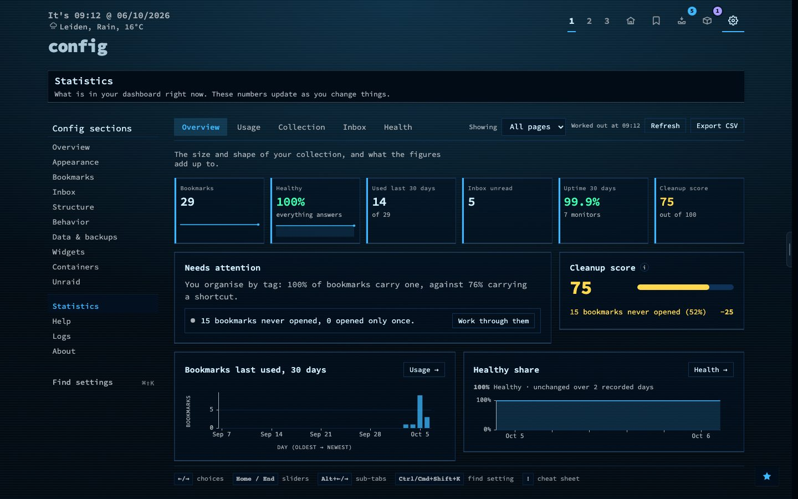
</p>
<p align="center"><sub>Statistics: six figures on every tab, then what needs attention and charts.</sub></p>

Every tab opens with a line on what it is about and a row of **six figures**. Below them the panels stand in two columns, and in one on a narrow window. An **i** beside a panel title explains what it counts.

| Tab | Six figures | Panels |
|---|---|---|
| **Overview** | Bookmarks, healthy share, used in the last 30 days, inbox unread, uptime over 30 days, cleanup score | **Needs attention** — only what is above zero, each line with its button: links not answering (the longest-broken named), a certificate close to expiry or expired, unread inbox items older than 30 days, bookmarks never opened or opened once. **Cleanup score** and what lowers it. **Bookmarks last used, 30 days** and **Healthy share**, each with a link to its own tab |
| **Usage** | Opens all time, used in 30 days, last 48 hours, top 10 share, never opened, opened once | **Bookmarks used over time** (7 days, 30 days, 90 days or 1 year; opens or last used), **When you open bookmarks** (shows from 20 opens), **How concentrated your use is**, **Last opened**, **Times opened**, **Most opened**, **Most used tags**, **Shortcuts**, **Opens by page**, **Finders** |
| **Collection** | Bookmarks, pages, categories, distinct tags, unique hosts (and how many are self-hosted), without a preview | **Coverage** (with a shortcut, an icon, checking, tags, a note), **Categories: size and use**, **How the collection grew**, **Age of the collection**, **Top domains**, **Tags per bookmark**, **Bookmarks per page**, **Beyond bookmarks** (widgets, feeds switched off, import sources, trash, backups), **Cleanup candidates** (untagged, opened once, without an icon, never opened, still on http — *Show* opens them in the Bookmarks view) |
| **Inbox** | Inbox items, unread older than 30 days, oldest unread, backlog over 30 days, converted, time to triage | **Inbox flow per day** (7, 30 or 90 days: added, dealt with, the running backlog), **Where everything went**, **How long unread items have waited**, **Inbox by source**, **How complete the items are**. Lifetime counts live in `data/inbox-stats.json` |
| **Health** | Healthy share, broken, uptime over 30 days, average response, certificates expiring within 30 days, health score | **Status now and over time** (with **Open Health**), **Certificates**, **Issues by type**, **Archive coverage** |

- **Showing** narrows every figure to one page. It appears only when there is more than one page. The inbox and the health report cannot be narrowed, and say so. The choice is not remembered.
- Tiles show the direction since last week. A tag or a table row leads to the bookmarks behind it.
- **Stale** follows **count as neglected after** under Config → Bookmarks, the same threshold the Bookmarks view uses.
- Each tab has a 🔗 to copy a link to it.
- At the top: when the figures were worked out, **Refresh**, and **Export CSV** for every tab. The export fetches the inbox and health figures itself.
- A category is counted per page: the same name on two pages is two categories.

<sub>[↑ Contents](#table-of-contents)</sub>

---

<a id="19-data-backups-and-import"></a>

## 19. 📦 Data, backups and import

> [!NOTE]
> **In short:** back up everything or restore a backup, import and export bookmarks, feed in links from other services, set up webhooks, and keep or empty the trash. Reset is here too.

**Config → Data & backups** has six tabs.

<a id="191-backups-data"></a>

### 19.1 Backups & data

**Last backup**, **Next** and **Stored backups** tiles sit at the top. The last-backup tile turns red when a scheduled run failed.

- **Download backup** — a ZIP of everything, to your computer.
- **Make a backup now** — stores one on the server.
- **Create a backup automatically** and **How often** — every day, week (default), two weeks or month. A run happens whenever the newest backup is older than that, so frequent restarts do not skip it. The newest **three** are kept; `NEXTDASH_AUTO_BACKUP_KEEP` (1–50) changes that and `NEXTDASH_AUTO_BACKUP_DIR` (an absolute path) stores them elsewhere. The default place is `data/auto-backups/`, which is left out of backups. **The panel names the directory it is actually using**, and warns when that is inside the data directory — backups kept there are lost with the thing they back up.
- **What a backup carries** — a backup holds the whole data directory: bookmarks, pages, categories, finders, the inbox, settings, custom themes, check history, icons and uploads, and the images held or skipped in the Containers view. Two switches decide the rest:
  - **Local copies of pages** — the largest part of a backup.
  - **Tokens and passwords** — source tokens, stored sign-ins, webhook keys, the Containers view's GitHub token, the Unraid and Brave keys, and the secrets in the alert settings (the alert address with its bot token, Pushover's keys, the archive keys and the iCal address). Without them, those settings go into the backup blanked, and restoring it keeps the ones in use. With them in, a restore needs nothing typed again, and the ZIP itself becomes a secret. They are written back with owner-only permissions.
- Left out on purpose: cached previews and pictures, the health cache, and browser push subscriptions — all rebuilt or re-registered after a restore. The Containers view's timeline, update history, disk sizes and logs stay out too: they belong to the Docker host, not to the data.
- **Stored backups** — each with its age, size and contents (*1.7 MB · 412 bookmarks on 5 pages*), and **Download**, **Restore** and **Delete**. **Download all** saves them all.
- **Full backup (zip)** → **Import backup…** — restores a ZIP.

**Restoring** replaces all current data. First, nextDash checks the archive and writes a backup of the current data, so a restore can be undone. An archive without any bookmark page is refused. The import is atomic. A ZIP without `finders.json` or `health-history.json` leaves your current ones in place. Bookmarks with an invalid address are skipped and counted; the imported `settings.json` decides whether local addresses are allowed.

> In Docker, keep `data/` on a mounted volume, or automatic backups are lost with the container.

<a id="import-and-export-bookmarks"></a>

**Import & export bookmarks:**

| Button | What it does |
|---|---|
| **Import browser bookmarks…** | Reads the HTML file every browser exports — and Pocket, Pinboard, Raindrop, linkding, Shiori, Linkwarden and Karakeep. Shows a preview (*12 new, 3 conflicts*), asks for a page, and imports. Folders become categories; tags, notes and dates come along; duplicates are skipped; missing icons are fetched afterwards. |
| **Export bookmarks (HTML)** | The same format, for a browser or another tool |
| **Export bookmarks (CSV)** | Name, URL, category, page, shortcut, tags and notes, with translated headers |
| **Import bookmarks (CSV)** | Reads that file back onto the current page. Columns are matched by name; rows without a URL and existing URLs are skipped. |

**Settings** exports or imports `settings.json` alone. The Unraid server is left out of an import: it is set only under Config → Unraid, so an imported file can never point the saved key at another address.

| Situation | Use |
|---|---|
| Disaster recovery, moving servers | ZIP backup |
| Leaving a browser or read-later tool | Import browser bookmarks |
| Moving your collection elsewhere | Export bookmarks (HTML) |
| Tidying in a spreadsheet | CSV export and import |
| Links that keep arriving | Sources |

<details>
<summary>📷 Screenshot — Backups &amp; data</summary>

<p align="center">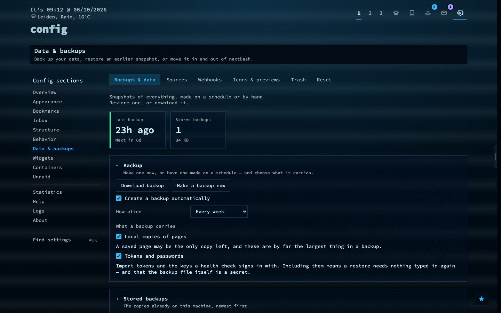</p>

</details>

<a id="192-sources"></a>

### 19.2 Sources

A **source** is a service bookmarks keep arriving from. Each panel asks for its token, where the bookmarks go, and offers **import now** and the last result. Every run **previews** before it writes, and remembers where it got to.

| Source | Needs |
|---|---|
| **GitHub stars** | A personal access token |
| **Raindrop.io** | A test token |
| **Hacker News favorites** | Your username |
| **YouTube channel** | A handle or channel id |
| **Mastodon bookmarks** | An access token from your instance |

nextDash only reads from these services. Tokens are stored in `sources.json` with owner-only permissions and left out of backups unless you include tokens. The **Sources** widget shows the last result of each.

The **Web Archive** and **Local copies** panels live on this tab too ([§12.7](#127-keeping-a-copy-of-a-page)).

<a id="193-webhooks"></a>

### 19.3 Webhooks

Webhooks tell another program the moment something happens here. Add a receiver with a name and an address and tick its events; nothing ticked means all.

| Event | When |
|---|---|
| `bookmark.added` | A bookmark is added, from any route |
| `bookmark.updated` | Name, URL, tags, note, category or pin changes |
| `bookmark.deleted` | A bookmark is removed |
| `health.down` | A monitored bookmark stops answering |
| `health.up` | It comes back |
| `health.cert-expiring` | A TLS certificate is about to run out ([§12.4](#124-alerts)) |

Every delivery is signed with the [Standard Webhooks](https://www.standardwebhooks.com/) scheme:

```
webhook-id: msg_2b7f…
webhook-timestamp: 1756253400
webhook-signature: v1,K5s0…
```

The signature is HMAC-SHA256 over `{id}.{timestamp}.{payload}`, base64. The signing key is shown once, when you save; afterwards the panel only says a key is set. A key starts with `whsec_` and can be given as it is to the official Standard Webhooks libraries, which sign with its base64-decoded bytes. A key from before that (64 hex characters) keeps working, signed with its text as it is. Keys live in `webhooks.json` with owner-only permissions.

A failed delivery is retried twice and then dropped; a `4xx` is not retried; redirects are not followed. **Send a test** posts one delivery and shows the status. Addresses follow the same rules as bookmark checks, checked when saved and again at delivery. Reading the list of receivers needs the write token.

The MCP endpoint is switched on from this tab as well — see [§23.6](#236-the-mcp-endpoint).

<a id="194-icons-previews"></a>

### 19.4 Icons & previews

- **Refresh favicons** — never, monthly, weekly or on every load; **Refresh all favicons** now. `:favicons fetch` does the same from the dashboard.
- **Image cache size** — 50, 200 or 500 MB, with the current use. **Remove cached images** empties it.
- **Refresh all link previews** / **Clear all link previews** — the stored titles, descriptions and images. Refreshing is one request per bookmark, shows progress, waits out a rate limit and can be stopped.
- **Forget the scanned keywords** — what *Read their pages* kept for tag suggestions.

**App icons.** Containers and bookmarks to self-hosted apps get the app's own icon from two open icon sets, [dashboard-icons](https://github.com/homarr-labs/dashboard-icons) and [selfh.st/icons](https://selfh.st/icons/). A container is matched by its image and name, a bookmark by its host — a private name such as `sonarr.lan` or `plex.local` included; the icon follows the theme between its light and dark variant. When the sets know an app, its icon is used instead of the site's favicon — an icon you chose or uploaded is never replaced. When the sets know the app but cannot deliver its file, the favicon is fetched after all.

- **Choosing one** — the pencil on a bookmark's icon in the form offers **Choose app icon…** (and up to three suggestions appear under the address); the pencil on the icon in a container's drawer and in the Bookmarks view's side panel offers **Choose app icon…**, **Use letter** and **Automatic**. A chosen icon is copied into `data/icons/` and is then an ordinary icon of yours.
- **Where they come from** — the server fetches the sets' indexes from jsDelivr once a week and each icon on first use, asks for an icon again after a week, keeps at most 3000 per set in `data/icon-sets/` (left out of backups, like cached previews) and serves them itself; the browser never contacts the icon sets. `DISABLE_ICON_SETS=1` switches all of it off. The sets are credited under About.

<a id="195-trash"></a>

### 19.5 Trash

Deleted **bookmarks, pages and categories** stay in the trash for **30 days** (at most 500 entries). `:trash` opens it. Every route into the trash — the dashboard, the Bookmarks view, `:remove`, single or bulk — lands here.

- **Search** by name, URL, tag, category or page.
- **Restore** puts a bookmark back on its page, at its old position.
- A deleted **page** is one entry (*Page · 12 bookmarks*) and comes back with its categories and bookmarks, in its old place.
- A deleted **category** comes back at its old position; its bookmarks were never removed.
- **Restore selected** restores each ticked entry on its own.
- **Delete forever** and **Empty trash** ask first.

A restore that cannot go ahead is refused and the entry stays: a bookmark or category whose page is gone needs that page first, and a page whose place was taken by another page cannot replace it.

<a id="196-reset"></a>

### 19.6 Reset

- **Delete all bookmarks** — keeps pages, categories and settings. Asks once.
- **Reset all data** — deletes pages, categories, bookmarks, finders, settings, custom themes, uploads, icons and caches, and brings back the example bookmarks and default settings. Asks twice; you type **RESET** (or the word in your language).

> [!WARNING]
> Neither can be undone. Make a backup first.

<sub>[↑ Contents](#table-of-contents)</sub>

---

<a id="20-logs"></a>

## 20. 📜 Logs

> [!NOTE]
> **In short:** Logs shows what the server has been doing, without shell access, and keeps an activity trail, a machine-readable record of the events you choose.

**Config → Logs** has two tabs.

<a id="201-server-logs"></a>

### 20.1 Server logs

What the server has been doing — background jobs, imports, checks and every request — without shell access. Tiles show the number of lines, warnings and errors, and how long lines are kept.

```
INFO   health   checked 110 bookmarks, 2 failed, 1.4s
WARN   archive  dash.example could not be saved: the page is behind a login
ERROR  store    bookmarks.json could not be written: no space left on device
```

| Control | What it does |
|---|---|
| **Record server log** (toolbar) | Off by default. While off, nothing is captured and nothing is written. Turning it off keeps what was collected. |
| **Detail level** | **Quiet** (problems only), **Normal** (default) or **Verbose** (every step). Applies to the next line, here and in `docker logs`, without a restart. |
| **Show** | Everything, warnings & errors, errors only, or activity only. Only changes what you see; a note says which level is recording. |
| **Search** | On the message and the component, across the whole log |
| **Keep the log** | By age (1 hour to 30 days, or until cleared) or by number of lines (100–5000) — one or the other |
| **Refresh** | Off, or every 2, 5, 15 or 30 seconds while the tab is open |
| **Follow** | Keeps the newest line in view until you scroll up |
| **Copy** / **Download** | The lines to the clipboard, or the log as a `.log` file |
| **Clear** | Empties the log and deletes `server.log` and its rotated copies. Asks first. |

Every line carries its own sequence number from the server. With **Refresh** off, a note says the view does not update by itself; press ↻ for the newest lines.

Lines are kept in memory and in `server.log` in the data directory (2 MB, two rotated copies). The same lines go to stderr.

> Anyone who can open config can read this log, including full webhook addresses where they were logged.

<a id="202-activity-trail"></a>

### 20.2 Activity trail

The **activity trail** is a machine-readable record — one JSON line per event — kept apart from the readable log. **Logs → Activity trail** chooses what goes in.

| Group | Channels |
|---|---|
| **Changes** | Changes, Check results, Refused access, Health rounds, Imports, Feed polls, Saved copies, Backups, Failed writes, Widget requests, Alerts sent |
| **Usage** | Bookmarks opened, Searches, Keyboard shortcuts, Navigation, Dashboard loads |
| **Client** | Browser errors |

**Changes** and **Check results** are on by default; the rest are off. **Open detail** sets what a *bookmark opened* record holds: *Off* (just the open), *Basic* (how it was opened, the default) or *Full* (also its rank in the results and the wait). **Reset panel** restores the defaults.

```text
{"ts":"2026-07-03T12:00:00Z","event":"bookmark.add","pageId":1,"name":"GitHub","url":"https://github.com","source":"dashboard"}
```

The trail goes to the server log buffer (visible with **Show → Activity only** while collecting) and, with `NEXTDASH_ACTIVITY_LOG_PERSIST=1`, to `activity.log`. The container log gets a readable sentence for the same event. Verbose lines never enter the trail.

Environment variables set the same things for the whole server; a choice made in the app wins over them:

```bash
NEXTDASH_ACTIVITY_LOG=mutate,status,security      # channels, or off
NEXTDASH_ACTIVITY_LOG_PERSIST=1                    # write data/activity.log
NEXTDASH_ACTIVITY_LOG_FILE=/path/to/activity.log
NEXTDASH_ACTIVITY_LOG_FORMAT=json                  # text (default) or json on stdout
NEXTDASH_ACTIVITY_LOG_URLS=host                    # full (default), host or off
NEXTDASH_ACTIVITY_LOG_SAMPLE=open=0.1,keys=0.25    # sampling per channel
NEXTDASH_ACTIVITY_LOG_MAX_AGE_DAYS=30              # delete old rotated files
NEXTDASH_ACTIVITY_OPEN_DETAIL=basic                # off, basic or full
NEXTDASH_LOG_LEVEL=info                            # error, warn, info or debug
```

Channel names: `mutate`, `status`, `security`, `health`, `sources`, `feeds`, `archive`, `backup`, `store`, `widgets`, `notify`, `open`, `search`, `keys`, `nav`, `session`, `clienterror`. Status checks for the same URL and result are logged once per ten minutes. URLs and searches can appear in the trail; treat the files as private.

<details>
<summary>📷 Screenshot — the activity trail channels</summary>

<p align="center">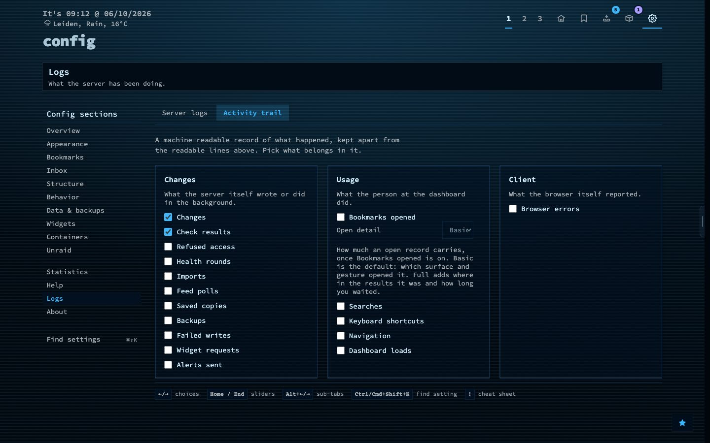</p>

</details>

<sub>[↑ Contents](#table-of-contents)</sub>

---

<a id="21-browser-extension-and-capture"></a>

## 21. 🔌 Browser extension and capture

> [!NOTE]
> **In short:** the extension saves the current tab to a page or the inbox. Without it, the share sheet, a bookmarklet and a `/add` address do the same.

<a id="211-the-extension"></a>

### 21.1 The extension

The **nextDash Bookmark Saver** in `extension/` saves the current tab to a page or to the inbox (Chrome and Chromium).

**Install:** open `chrome://extensions/`, switch on **Developer mode**, click **Load unpacked** and choose the `extension/` folder.

**Set up:** extension icon → **Settings** → your nextDash address, the write token if the server has one, and a default page.

**Save:**

- The title and URL are filled in. Add a shortcut (empty = a suggested free letter), a page and category, tags and a note, and save — or press **Save to Inbox**.
- An address you already have is reported, with **Save anyway**.
- After saving: **Open in nextDash** or **Open Inbox in nextDash**. An open dashboard tab refreshes itself.
- **Right-click** a page or link → *Save to nextDash* or *Save to nextDash Inbox*.
- **Keyboard** — `Ctrl/Cmd + Shift + Y` saves as a bookmark, `Ctrl/Cmd + Shift + U` to the inbox. The icon badge reports **+** saved, **D** already there, **?** no server set, **!** failed.

The extension needs no CORS setting: its origin is always allowed. Errors: **401** wrong or missing write token, **403** origin not allowed, **409** shortcut already used on that page.

<a id="212-capture-without-the-extension"></a>

### 21.2 Capture without the extension

**From a phone.** Install nextDash as an app and it appears in the share sheet. Sharing a link saves it to the inbox and opens nextDash. Android sometimes sends the address inside the text; it is found either way. On iPhone, use the Apple Shortcut in `integrations/`, because Safari does not support the app's share target.

**From any browser.** **Config → Help → Inbox → Saving a link from anywhere** builds a bookmarklet with this install's address (and capture token). Drag it to the bookmarks bar.

**From a script or launcher.** One route does it:

```
GET /add?url=<address>&title=<optional title>[&token=<capture token>]
```

It saves to the inbox with the usual duplicate check and answers with a readable page.

```sh
curl -s --get --data-urlencode "url=https://example.com/article" \
     --data-urlencode "title=An article" \
     https://nextdash.example.com/add >/dev/null
```

Use `--data-urlencode`: an address with its own `?a=1&b=2` breaks a hand-built query.

[`integrations/`](integrations/) holds a shell script (`nextdash-add <url> [title]`), two Raycast commands, a Dropzone action, a Ulauncher extension, and recipes for Alfred and Apple Shortcuts. They read `NEXTDASH_URL` (default `http://localhost:8080`) and `NEXTDASH_TOKEN`. See [`integrations/README.md`](integrations/README.md).

**Tokens.** With no write token set, capture is open like everything else. With one set, `/add` and the share route need a token in the address: the write token, or better `NEXTDASH_CAPTURE_TOKEN`, which opens capture and nothing else.

<sub>[↑ Contents](#table-of-contents)</sub>

---

<a id="22-phones-tablets-and-the-installed-app"></a>

## 22. 📱 Phones, tablets and the installed app

> [!NOTE]
> **In short:** nextDash adapts to touch screens, with its own layout, gestures and long-press editing. Add it to the home screen to install it as an app and share links to it.

nextDash adapts to touch screens (a touch device without a hover pointer) rather than to window width alone.

<p align="center">
  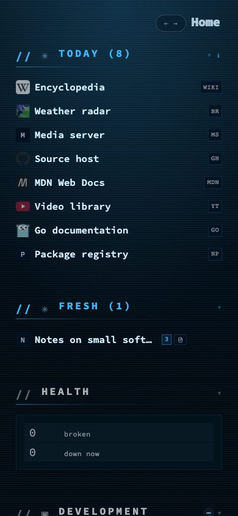
</p>
<p align="center"><sub>The dashboard on a phone, in one column.</sub></p>

| | Phone | Tablet and desktop |
|---|---|---|
| **Header** | Page switcher and destinations, folded to fit | Full header |
| **Action buttons** | Search | As configured |
| **Commands and finders** | The `:` and `?` tabs in the search panel | Buttons or keys |
| **Tag filter** | `tag:` in search, or `:tag` | The tag cloud (`/`) |
| **Preview cards** | Off | As configured |
| **Categories** | One column each | Can spread |
| **Config** | All sections; the section list scrolls sideways | Rail and content side by side |
| **Bookmarks view** | Rail as a drawer, side panel as a sheet | Rail, list and panel |
| **Theme editor** | Read-only | Full |
| **Quick-start card** | Skipped | Shown on first visit |

A dismissible banner explains the limits once.

**Touch gestures:**

| Gesture | Action |
|---|---|
| Long-press a bookmark | Edit in place |
| Long-press a category header | Rename |
| Swipe sideways | Change page |
| Tap search | The search panel, with its mode tabs |

<a id="install-as-an-app"></a>

**Install as an app.** *Add to Home Screen* (or the install button in your browser) uses `/manifest.webmanifest`; the custom title and favicon from Branding are used for the app. Behavior → General shows install steps for your platform. **Hypr mode** makes a click open the bookmark in a browser tab and then close the app window.

<sub>[↑ Contents](#table-of-contents)</sub>

---
<a id="23-security-and-self-hosting"></a>

## 23. 🔐 Security and self-hosting

> [!NOTE]
> **In short:** nextDash has no user accounts: put it behind a private network or an authenticating proxy. The write token, local-address rules and a short list of what it contacts are covered here.

nextDash has **no user accounts**. Anyone who can reach the address can read your bookmarks and change them, unless you put something in front of it.

| Setup | When |
|-------|------|
| **Tailscale or another private network** | Access from your own devices only |
| **Reverse proxy with authentication** | Caddy, Traefik or nginx with basic auth, OAuth2 Proxy or SSO |
| **localhost and an SSH tunnel** | A single machine |

**Do not** expose plain HTTP to the internet without authentication.

<a id="231-production-docker"></a>

### 23.1 Production Docker

`docker-compose.prod.yml` mounts only `./data`; CSS and JavaScript are built into the binary. The container starts as root so host Docker hooks can run, then switches to the `nextdash` user (`NEXTDASH_RUN_AS_ROOT=1` keeps root — also needed when the Docker socket is `root:root`, as on Docker Desktop). The compose file sets a 256 MB memory limit. For TLS and long-lived static caching in front of the app, use `docker-compose.proxy.yml` with `deploy/Caddyfile`.

A reasonable environment for a LAN or VPS:

```yaml
environment:
  - PORT=8080
  - NEXTDASH_WRITE_TOKEN=change-me-to-a-long-random-string
  - NEXTDASH_CORS_ORIGINS=https://dash.example.com
  - NEXTDASH_ACTIVITY_LOG=mutate,status,security
  - NEXTDASH_ACTIVITY_LOG_PERSIST=1
  # Optional:
  # - NEXTDASH_OUTBOUND_REQUESTS_PER_MIN=120
  # - NEXTDASH_SSRF_API_RATE_PER_MIN=60
  # - NEXTDASH_STATUS_PING_RATE_PER_MIN=300
  # - NEXTDASH_TRUSTED_PROXIES=10.0.0.0/8
  # - NEXTDASH_CSP=off
  # - NEXTDASH_DISABLE_PREFETCH=1
  # Containers view — add these only once you also mount the Docker socket:
  # - NEXTDASH_DOCKER_CONTROL=1
```

Before it listens, the server checks that `PORT` is valid and that the data directory can be created and written; otherwise it stops with a clear error. The full list of environment variables is in the [README](README.md#environment-variables-reference).

<a id="232-the-write-token"></a>

### 23.2 The write token

Set `NEXTDASH_WRITE_TOKEN` and every write or destructive API call — saves, imports, deletes, uploads, resets, backups, retests, preview fetches, container actions — needs the header `X-NextDash-Token`. The dashboard supplies it automatically for pages served by the same install. Unset, nothing needs a token.

> [!WARNING]
> The token is not a login. Every browser that opens nextDash receives it, so anyone who can reach the address can still read and change everything. Keep nextDash behind a private network or a proxy that asks who you are.

**What it stops, and what it does not.** The dashboard gets the token from the page it loads, so every browser that opens nextDash has it. The token keeps out requests that do not come from that page: another website firing requests at your network from a tab you have open, and scripts or scanners that only know the address. It does not keep out a person who can open the dashboard — that is what Tailscale or a reverse proxy with authentication is for. With container actions on, put one in front.

**Choosing one.** Use a long random string, such as the output of `openssl rand -hex 32`. At startup the server logs a warning when `NEXTDASH_WRITE_TOKEN` or `NEXTDASH_CAPTURE_TOKEN` is shorter than 16 characters or still one of the example values from these docs. It still starts.

Read-only routes (bookmarks, settings, the health list, ping) stay open, with two exceptions: without the token, settings come back without the stored keys and tokens (the archive keys, the Pushover token and user key, the alert URL), and the server log needs it. The dashboard reads both with the token. The extension stores the token under **Settings → Write token**. `GET /api/backup` and the automatic-backup routes need the token, because a backup is the whole library.

**The data directory is not served.** Only `data/icons/` and an uploaded favicon or font are published, with a long cache lifetime. Settings, bookmark files, the inbox, the trash and stored backups are reachable only through the API.

`NEXTDASH_CAPTURE_TOKEN` opens only the two capture routes ([§21.2](#212-capture-without-the-extension)).

<a id="233-local-addresses-and-outgoing-requests"></a>

### 23.3 Local addresses and outgoing requests

**Allow localhost & private-network bookmarks** (Behavior → General) is on by default. Turn it off when nextDash is reachable on a shared network.

With it off, the server's pings, previews, icon downloads, redirect detection, alerts and webhooks only reach public hosts. Redirects are only followed to hosts that pass the same rule. Addresses are checked again when the connection is made, and a resolved public address is pinned for about two minutes, so a host name cannot switch to a private address in between (DNS rebinding).

**Rate limits** apply per client to the requests the server makes for you:

```bash
NEXTDASH_OUTBOUND_REQUESTS_PER_MIN=120   # previews, pings, favicons, redirect detection
NEXTDASH_SSRF_API_RATE_PER_MIN=60        # /api/bookmark-preview, icon uploads, archives, /api/health/check-url, alert tests
NEXTDASH_STATUS_PING_RATE_PER_MIN=300    # /api/ping, the browser's own status checks
```

Above the limit the API answers **429**, and the `security` channel records it.

**Who a request is counted against.** By default, the address the connection comes from. Behind a reverse proxy that is the proxy for everyone, so the limits are shared by every reader — which is deliberate: `X-Forwarded-For` can be set by anyone, and believing it would let a client hand itself a fresh allowance simply by inventing a new value. Name your proxy to have the header believed:

```bash
NEXTDASH_TRUSTED_PROXIES=10.0.0.0/8, 192.168.1.5   # addresses and ranges, comma-separated
```

Only a request arriving from one of these is taken at its word, and only its first `X-Forwarded-For` entry — the client the proxy saw — is used.

<a id="234-cors"></a>

### 23.4 CORS

By default only a browser extension's origin (`chrome-extension://…`, `moz-extension://…`, `safari-web-extension://…`) receives `Access-Control-Allow-Origin`. Any other web page cannot read the API.

`NEXTDASH_CORS_ORIGINS` is a comma-separated allowlist for pages of your own. Extension origins never need an entry. `*` answers every origin.

```bash
NEXTDASH_CORS_ORIGINS=https://dash.example.com
```

<a id="235-content-security-policy"></a>

### 23.5 Content-Security-Policy

HTML pages send a strict Content-Security-Policy. `NEXTDASH_CSP=off` switches it off when a proxy or integration requires that.

<a id="236-the-mcp-endpoint"></a>

### 23.6 The MCP endpoint

nextDash can answer MCP clients (the Model Context Protocol) at `/mcp`, for example `http://your-host:8080/mcp`. It is **off** until you tick **Answer assistants at this address** under **Data & backups → Webhooks**, which then shows the address.

| Tool | What it does |
|---|---|
| `search_bookmarks` | Search by name, URL, tag or note; each result names its page and category |
| `get_bookmark` | Everything stored about one bookmark |
| `list_tags` | Every tag with its count |
| `add_bookmark` | Add a bookmark, with the usual duplicate check |

It starts closed because it answers questions about every bookmark. The `Origin` of every request is checked against the host it arrived on, and with `NEXTDASH_WRITE_TOKEN` set, adding needs the token.

<a id="237-what-nextdash-contacts"></a>

### 23.7 What nextDash contacts

| What | When | Switch |
|---|---|---|
| Your bookmarks' sites | Checks, previews, icons, Fresh, archives | Per feature |
| GitHub Releases API | Once a day, to see whether a newer release exists | Behavior → Privacy & sync → *Check GitHub for new releases*; `DISABLE_UPDATE_CHECK=true` for the whole server |
| nextdash.cc feed | Every 90 minutes, by the server, for News & features | Behavior → Privacy & sync → *Show posts from nextdash.cc*; `DISABLE_NEWS_FEED=true` |
| Weather and calendar providers | For the header and widgets | Appearance → Date & weather |
| Container image registries and GitHub | Image update checks, when switched on | Config → Containers → Updates |
| Your own services | Custom widgets, webhooks, alerts | Per widget or receiver |
| Install count | Once a day: a random install id and the version (on Unraid, also the word Unraid) | Behavior → Privacy & sync → *Count this install*; `DISABLE_TELEMETRY=true` |
| Analytics | Only when switched on | See below |

<a id="238-analytics"></a>

### 23.8 Analytics

nextDash can send **anonymous usage statistics** to a self-hosted [Umami](https://umami.is) instance at `stats.nextdash.cc`. It is **off until you turn it on**. The aim is to learn which features are used and what can be improved.

**Install count** — separate from the analytics below, and **on by default**. Once a day the server sends one request to `stats.nextdash.cc` with a random install id and the release you run, so the project can say how many installs exist. On Unraid, which sets `HOST_OS=Unraid` in every container, it also says Unraid. Nothing else: no address, no settings, no bookmarks, no counts. The id lives in the file `install-id` in the data folder; delete it for a new one. Turn it off under **Behavior → Privacy & sync → Count this install**, or for the whole server with `DISABLE_TELEMETRY=true`, which also stops the analytics below.

- **Turning it on or off** — the card on the dashboard (*Turn on*, *What is recorded?*, *No thanks*), **Config → Behavior → Privacy & sync → Privacy-friendly analytics**, or `:telemetry on` / `:telemetry off`. The page reloads, because the tracker script is only added to the page when analytics is on. Closing the card without answering asks again later; an answer is final.
- **For the whole server** — `DISABLE_TELEMETRY=true` (also `1`, `yes`, `on`) turns it off for everyone and greys out the switch.
- **When off** — the tracker is not in the page and nothing is downloaded. The install count above is the only request that remains, until you switch that off too.

**What is recorded** — event names from a fixed list, with a few properties:

| Area | Recorded |
|---|---|
| Views and navigation | Opening views and config sections and tabs, switching pages by position |
| Panels | Opening search, commands, finders, the cheat sheet, the tag cloud, what's new and the bookmark form |
| Actions | Which command ran (by name), which menu entry was picked, bookmark opens and where from, edits, moves, deletes, checking changes, inbox, health and container actions |
| Outcomes | Whether adding or editing succeeded, or hit a duplicate, conflict or error |
| First-run help | Tours and tips shown and finished |
| Settings | The **name** of a setting you change, and on/off for toggles; once per load, which features are on and the release you run |
| Size | Once per load, bucketed counts (for example `500+` bookmarks) |
| Widgets | Once per load, how many widgets of each type, bucketed |
| Containers | Once per load, how the Containers view is set up: which options are on, whether a socket and control are configured, and bucketed counts of hidden containers, custom addresses and waiting updates. Docker itself is not asked. Per action (start, stop, restart, update, mute and the like): which one, whether it worked, where it came from (row, side panel, menu, key, command, selection bar) and, for a selection, a bucketed count |
| Health, Inbox, Bookmarks view | Once per load, bucketed counts (checked, down, certificates due, unread, snoozed) and the layout options chosen in their Config tabs |

Every count is rounded into a band. **Never recorded:** bookmark names, URLs, search text, page or category names, notes or tag names, container, image or widget names, or any address. No cookies, no profile, no cross-site tracking. This is separate from the open counts in [§6](#6-opening-and-editing-bookmarks), which never leave your server.

<a id="239-operations"></a>

### 23.9 Operations

- `GET /version` — version and commit.
- `GET /api/data-revision` — a hash of the bookmark data; open dashboard tabs poll it and refresh when something changes elsewhere.
- Preview data is kept in memory and written to disk every 30 seconds and on shutdown.
- `NEXTDASH_DATA_DIR` sets the data directory; `NEXTDASH_DISABLE_PREFETCH=1` skips the icon prefetch at start-up.
- For the test suite only: `NEXTDASH_ICON_SETS_FIXTURE` and `NEXTDASH_UNRAID_FIXTURE` name a directory the app icon sets and the Unraid API answer from instead of the network. A real install leaves them unset.

<sub>[↑ Contents](#table-of-contents)</sub>

---

<a id="24-troubleshooting"></a>

## 24. 🛠️ Troubleshooting

> [!NOTE]
> **In short:** find the symptom, read the cause and the fix. The list runs from an empty dashboard to widgets that show nothing.

<a id="the-dashboard-is-empty-after-install"></a>

### The dashboard is empty after install

The example bookmarks may have been removed. Add bookmarks with **&** or **+**, or import a browser file under Config → Data & backups.

<a id="the-dashboard-does-not-load"></a>

### The dashboard does not load

A toast offers **Reload**. Check that the server runs and that `/api/pages`, `/api/settings` and `/api/bookmarks` answer. Broken device settings in the browser fall back to the server's settings.

<a id="a-change-in-another-tab-does-not-show"></a>

### A change in another tab does not show

Open dashboard tabs poll `GET /api/data-revision` and refresh when bookmarks change. If a sync fails, use **Retry** on the toast.

<a id="a-shortcut-does-not-open-its-bookmark"></a>

### A shortcut does not open its bookmark

- Another bookmark may use the same shortcut — the Bookmarks view's Health filters list shortcut conflicts.
- With the cursor on the grid, `g`, `j`, `k`, `t` and `x` keep their grid meaning; use search for those shortcuts.
- Check **Typing a bookmark shortcut** under Behavior → Keyboard & search — it may be set to wait for a pause or for Enter.
- Focus must not be in a text field.

<a id="bookmarks-seem-to-be-missing"></a>

### Bookmarks seem to be missing

Usually a filter: a tag filter on the dashboard (`Escape` clears it), `Shift + F`, a filter in the Bookmarks view's rail, or a limit on items per category. Deleted bookmarks are in the trash for 30 days.

<a id="an-import-says-0-new"></a>

### An import says "0 new"

Every address already exists on the chosen page, or the file has no http(s) links.

<a id="a-bookmark-with-a-private-address-is-refused"></a>

### A bookmark with a private address is refused

The address is `localhost`, `192.168.x.x` or another private host while **Allow localhost & private-network bookmarks** is off (Behavior → General).

<a id="a-self-hosted-service-shows-as-broken"></a>

### A self-hosted service shows as broken

It probably needs a sign-in, or answers 401. On the bookmark's Health tab in the Bookmarks view, choose **Expected response**: add `401` to the healthy status codes, or pick a stored sign-in ([§12.1](#121-availability-modes)).

<a id="the-colours-look-wrong-after-the-system-switched-to-dark"></a>

### The colours look wrong after the system switched to dark

Hard-refresh once (`Ctrl + Shift + R` / `Cmd + Shift + R`) to drop JavaScript from an older release.

<a id="a-new-release-does-not-seem-to-have-arrived"></a>

### A new release does not seem to have arrived

An open tab keeps the files it loaded. Reload once.

<a id="the-quick-start-card-does-not-appear"></a>

### The quick-start card does not appear

It shows once per install, and not on phones. After finishing or dismissing it, **Show quick-start card again** (Behavior → Privacy & sync → Onboarding) brings it back.

<a id="the-weather-does-not-show"></a>

### The weather does not show

Set a city, or choose *Automatic (by IP)*, under Appearance → Date & weather, and check that weather is switched on. The Weather widget says so when no location is set.

<a id="the-calendar-widget-shows-nothing"></a>

### The Calendar widget shows nothing

- Set **Calendar feed URL (.ics)** under Appearance → Date & weather. Use the private ICS address from your calendar app, not the calendar's web page.
- The server fetches the feed, so it must be reachable from the machine nextDash runs on.
- The feed is cached for 15 minutes; changing the address redraws at once.

<a id="the-rss-widget-shows-nothing"></a>

### The RSS widget shows nothing

- Give the widget at least one feed address (RSS or Atom), one per line.
- A web page instead of a feed is reported as such.
- The server fetches the feeds; each is cached for 15 minutes.

<a id="a-system-widget-shows-no-figures"></a>

### A system widget shows no figures

The tile names the missing step — usually a mount or an environment variable ([§15.4](#154-system-widgets-and-what-they-need)).

<a id="browser-notifications-do-not-arrive"></a>

### Browser notifications do not arrive

They need HTTPS in Safari and on iPhone and iPad, and nextDash on the home screen on iPhone and iPad. Permission is per browser.

<a id="the-extension-cannot-save"></a>

### The extension cannot save

- Check the server address and that nextDash runs.
- **401** — set the write token in the extension's settings.
- **409** — the shortcut is already used on that page.
- Refused writes and rate limits are logged when the **Refused access** channel is on (Logs → Activity trail, or `NEXTDASH_ACTIVITY_LOG=security`).

<a id="the-containers-view-is-missing-or-read-only"></a>

### The Containers view is missing or read-only

- **Missing entirely** — `NEXTDASH_DOCKER_SOCKET` is not set, or the socket is not mounted; the Containers widget will say so too.
- **Visible but nothing can be started, stopped, updated or removed** — `NEXTDASH_DOCKER_CONTROL=1` is not set, or there is no write token in a build that expects one.
- **Socket present but every action fails** — the socket may be owned by `root:root` (common on Docker Desktop); add `NEXTDASH_RUN_AS_ROOT=1`. Remember that `:ro` on the socket mount does not stop the daemon accepting writes on a writable socket — the protection is the control flag and the token, not the mount flag.

<sub>[↑ Contents](#table-of-contents)</sub>

---

<a id="25-quick-reference"></a>

## 25. 📌 Quick reference

<a id="most-used-keys"></a>

### Most-used keys

| Keys | What they do |
|---|---|
| Just type | Search |
| <kbd>Enter</kbd> | Open the top result |
| <kbd>&gt;</kbd> · <kbd>:</kbd> · <kbd>?</kbd> | Search · commands · finders |
| <kbd>@</kbd> | Search all pages |
| <kbd>+</kbd> · <kbd>&amp;</kbd> | Add · quick add |
| <kbd>Ctrl</kbd> + <kbd>V</kbd> | Paste a URL |
| <kbd>1</kbd>–<kbd>9</kbd> · <kbd>,</kbd> | Pages · pages panel |
| <kbd>&#42;</kbd> · <kbd>/</kbd> · <kbd>!</kbd> | Recent · tags · cheat sheet |
| <kbd>←</kbd> <kbd>↑</kbd> <kbd>↓</kbd> <kbd>→</kbd> · <kbd>j</kbd> <kbd>k</kbd> | Move |
| <kbd>Esc</kbd> | Back, or home |
| <kbd>Shift</kbd> + <kbd>E</kbd> | Edit |
| <kbd>Shift</kbd> + <kbd>M</kbd> | Move |
| <kbd>Shift</kbd> + <kbd>T</kbd> | Tags |
| <kbd>Shift</kbd> + <kbd>D</kbd> | Delete |
| <kbd>Shift</kbd> + <kbd>C</kbd> | Availability checking |
| <kbd>Shift</kbd> + <kbd>H</kbd> | Bookmarks view (broken) |
| <kbd>Shift</kbd> + <kbd>U</kbd> | Bookmarks view (Unsorted) |
| <kbd>Shift</kbd> + <kbd>I</kbd> | Inbox |
| <kbd>Shift</kbd> + <kbd>Y</kbd> | Containers |
| <kbd>Shift</kbd> + <kbd>S</kbd> | Config |
| <kbd>Shift</kbd> + <kbd>A</kbd> | Themes |

<a id="config"></a>

### Config

| Keys | What they do |
|---|---|
| <kbd>Shift</kbd> + <kbd>S</kbd> or <kbd>&lt;</kbd> | Open or close config |
| <kbd>Ctrl</kbd>/<kbd>Cmd</kbd> + <kbd>Shift</kbd> + <kbd>K</kbd> | Find a setting |
| <kbd>j</kbd> / <kbd>k</kbd> | Previous / next section |
| <kbd>Alt</kbd> + <kbd>←</kbd> / <kbd>→</kbd> or <kbd>[</kbd> <kbd>]</kbd> | Previous / next tab |
| <kbd>Esc</kbd> | Close, then leave |

<a id="addresses"></a>

### Addresses

| Address | Opens |
|-----|------|
| `/` | The dashboard |
| `/#config`, `/#config/<section>/<tab>` | Config |
| `/#config/help/<tab>/<topic>` | A help topic |
| `/#bookmarks[/<page>]?q=&cat=&filter=&health=&tag=&sort=&rev=&group=` | The Bookmarks view |
| `/#unsorted` | The Bookmarks view, on Unsorted |
| `/#health` | Redirects into the Bookmarks view, on Broken |
| `/#inbox` | The inbox |
| `/#docker`, `/#docker/<name>`, `/#docker?filter=updates` | The Containers view |
| `/#search?q=…` | A search |
| `/#search?web=…` | A web search ([§8.3](#83-beyond-the-current-page)) |
| `/add?url=…` | Save to the inbox |
| `/opensearch.xml` | The browser search engine description |
| `/opensearch-web.xml` | The same for web search, while an engine is on |
| `/manifest.webmanifest` | The installed app |

<a id="data-location"></a>

### Data location

Docker: the mounted volume (for example `./data`, mounted at `/app/data`). Binary: `./data` next to it, or `NEXTDASH_DATA_DIR`.

<sub>[↑ Contents](#table-of-contents)</sub>

---

<a id="glossary"></a>

## 26. 🔤 Glossary

100 key terms, each in one line with a link to where the manual explains it.

[A](#glossary-a) · [B](#glossary-b) · [C](#glossary-c) · [D](#glossary-d) · [E](#glossary-e) · [F](#glossary-f) · [H](#glossary-h) · [I](#glossary-i) · [L](#glossary-l) · [M](#glossary-m) · [N](#glossary-n) · [P](#glossary-p) · [Q](#glossary-q) · [R](#glossary-r) · [S](#glossary-s) · [T](#glossary-t) · [U](#glossary-u) · [V](#glossary-v) · [W](#glossary-w)

<a id="glossary-a"></a>

**A**

| Term | Meaning | Explained in |
|---|---|---|
| Action buttons | The fixed buttons beside the grid: add, search, commands, finders and the rest, each with its key. | [§4](#the-action-buttons) |
| Activity trail | A machine-readable record, one JSON line per event, kept apart from the readable log. | [§20.2](#202-activity-trail) |
| Alert | A message posted when a monitored bookmark goes down and again when it recovers, with how long it was down; when a host takes many bookmarks down at once, the alerts become one message. | [§12.4](#124-alerts) |
| Analytics | Anonymous usage statistics sent to a self-hosted Umami instance, off until you turn them on. | [§23.8](#238-analytics) |
| Automatic backups | A backup made on its own every day, week (default), two weeks or month; the newest three are kept. | [§19.1](#191-backups-data) |
| Availability mode | Off, Periodic or Monitor: how often, and by whom, a bookmark is checked. | [§12.1](#121-availability-modes) |

<a id="glossary-b"></a>

**B**

| Term | Meaning | Explained in |
|---|---|---|
| Backdrop | What is drawn behind the bookmarks; every theme has one of its own, and you can pick any of 26. | [§16.4](#164-type-and-background) |
| Backup | A ZIP of the whole data directory, downloaded or stored on the server, by hand or on a schedule. | [§19.1](#191-backups-data) |
| Bookmark | A saved link with a name, address, page and category, tags, an optional shortcut, a note and a pin. | [§3.3](#33-bookmarks) |
| Bookmarklet | A button for your browser's bookmarks bar that saves the page you are on to nextDash, from any browser. | [§21.2](#212-capture-without-the-extension) |
| Bookmarks view | The library: every bookmark on every page in one workbench, with a rail of filters, a list and a side panel. | [§11](#11-the-bookmarks-view) |
| Browser notifications | Push messages that reach a device even with nextDash closed; switched on per device with Enable on this device. | [§12.4](#browser-notifications) |

<a id="glossary-c"></a>

**C**

| Term | Meaning | Explained in |
|---|---|---|
| Category | A named section on a page, with its own sort order and, if you like, an icon and several columns. | [§9.2](#92-categories) |
| Certificate | A monitored site's certificate: warnings go out 30, 7 and 3 days before it expires, and the Certificates widget lists those expiring soon. | [§12.4](#124-alerts) |
| Character | One of twelve archetypes a theme names; it decides what kind of surface the theme draws, such as lacquer, glass or neon. | [§16.2](#162-character) |
| Cheat sheet | A searchable list of keys and commands, opened with `!` or `F1`. | [§7.6](#76-the-cheat-sheet) |
| Collection health | A modal with Overview, Monitors and Trend tabs for the whole library, opened with `h` in the Bookmarks view. | [§11.8](#118-collection-health) |
| Command (`:`) | A line typed after `:` in the command palette to change or open something. | [§8.5](#85-commands) |
| Config | A view inside the dashboard, in the same tab, where every setting lives in sections. | [§17](#17-config) |
| Container | A Docker container on the machine nextDash runs on, listed and managed in the Containers view. | [§14](#14-containers) |
| Containers view | The view for those containers, opened with `Shift + Y` or `:docker`, with a Containers and a Disk tab. | [§14.1](#141-opening-it) |
| Corner card | A card in the corner that offers something once, such as a review round or browser notifications; one at a time, and each can be dismissed. | [§4](#corner-cards) |
| Custom theme | A theme of your own, made or recoloured in the theme editor and listed beside the packaged ones. | [§16.5](#165-custom-themes) |
| Custom widget | A widget that reads figures from any service that answers with JSON. | [§15.5](#155-the-custom-widget) |

<a id="glossary-d"></a>

**D**

| Term | Meaning | Explained in |
|---|---|---|
| Dashboard grid | The page of categories and widgets, as distinct from the Bookmarks view. | [§3.5](#35-views) |
| Data directory | Where nextDash keeps all its data: `./data` by default, `NEXTDASH_DATA_DIR` to put it elsewhere. | [§25](#data-location) |
| Density | Comfortable, Compact, Dense or Auto: how tight rows sit, for the dashboard, Bookmarks view, inbox and Containers view alike. | [§16.6](#166-grid-and-rows) |
| Disk tab | Shows what images, volumes and the build cache take up, with clean-ups that ask first. | [§14.7](#147-disk) |
| Docker control | `NEXTDASH_DOCKER_CONTROL=1`: lets nextDash start, stop, pause, restart, update and remove containers; off by default, so a mounted socket only reads. | [§14.5](#145-actions-and-updates) |
| Docker socket | How nextDash talks to Docker; without it the Containers view shows a setup card. | [§14.6](#146-what-it-needs) |
| Drift | A page that still answers but is no longer the page you saved: it redirects, has been retitled or was rewritten. | [§12.3](#123-drift) |

<a id="glossary-e"></a>

**E**

| Term | Meaning | Explained in |
|---|---|---|
| Environment variables | Settings the server reads from `NEXTDASH_…` variables before it starts, such as the data directory, the write token and Docker access; the full list is in the README. | [§23.1](#231-production-docker) |
| Expected response | What a monitored page must say or return to count as healthy: a phrase, or status codes. | [§12.2](#122-expected-response) |
| Extension | The nextDash Bookmark Saver for Chrome and Chromium, which saves the current tab to a page or the inbox. | [§21.1](#211-the-extension) |

<a id="glossary-f"></a>

**F**

| Term | Meaning | Explained in |
|---|---|---|
| Filter | A way to narrow what is shown: `tag:`, `category:`, `status:` and more in search, and the rail's groups in the Bookmarks view. | [§8.2](#82-filters) |
| Finder (`?`) | A shortcut that sends a query to another site, as in `?g nextdash`. | [§8.6](#86-finders) |
| Fresh | Shows whether a bookmarked site has published something since you last opened it, through its RSS or Atom feed. | [§12.6](#126-fresh) |

<a id="glossary-h"></a>

**H**

| Term | Meaning | Explained in |
|---|---|---|
| Header | The top of the dashboard: clock, weather and view name on the left, the page switcher in the middle, the destinations on the right. | [§4](#the-header) |
| Hypr mode | A click opens the bookmark in a new browser tab and then closes the installed app's window. | [§6](#hypr-mode) |

<a id="glossary-i"></a>

**I**

| Term | Meaning | Explained in |
|---|---|---|
| Image update | A newer tag of a container's image, found by checks on request and on an interval; it can be skipped, held or applied automatically. | [§14.5](#145-actions-and-updates) |
| Import | Reads a browser's bookmark file, other bookmark tools' exports or a CSV, showing a preview first and skipping duplicates; export goes the other way, as HTML or CSV. | [§19.1](#import-and-export-bookmarks) |
| Inbox | Where links wait until you decide where they go; a list of its own, not a page. | [§13](#13-inbox) |
| Installed app | nextDash added to the home screen or installed from the browser, with the custom title and favicon; it also receives shared links. | [§22](#install-as-an-app) |

<a id="glossary-l"></a>

**L**

| Term | Meaning | Explained in |
|---|---|---|
| Link preview card | The card that opens when you hover a bookmark or press `Shift + V`: what the page is, what it says, your note and tags. | [§4](#the-link-preview-card) |
| Logs window | A window that follows a container's log as it is written, with search and filter. | [§14.8](#148-the-logs-window) |
| Look | A ready-made combination of backdrop, surface, headers and type that leaves the theme's colours alone. | [§16.1](#looks) |

<a id="glossary-m"></a>

**M**

| Term | Meaning | Explained in |
|---|---|---|
| Maintenance window | A recurring period when downtime is expected: failures in it send no alert and do not count against uptime. | [§12.5](#125-maintenance-windows) |
| MCP endpoint | An address at `/mcp` where MCP clients can search, read and add bookmarks; off until you switch it on. | [§23.6](#236-the-mcp-endpoint) |
| Monitor | The availability mode where the server checks a bookmark on its own interval and keeps 30 days of history, uptime, outages and alerts. | [§12.1](#121-availability-modes) |
| Mute | Holds back the alerts for one bookmark, which is still checked and shows as down with a Muted badge; a container's notices can be muted too. | [§12.4](#muting-one-bookmark), [§14.9](#149-notices) |

<a id="glossary-n"></a>

**N**

| Term | Meaning | Explained in |
|---|---|---|
| Note | Plain text on a bookmark; search matches it and the preview card shows it. | [§10.5](#105-notes) |
| Notice | A message sent when a container stops unexpectedly, keeps restarting or turns unhealthy, and again when it recovers. | [§14.9](#149-notices) |

<a id="glossary-p"></a>

**P**

| Term | Meaning | Explained in |
|---|---|---|
| Page | A separate set of categories and bookmarks, such as Work or Home. | [§9.1](#91-pages) |
| Page switcher | The control in the header that moves between pages; its look is a setting. | [§4](#the-page-switcher) |
| Page template | A page saved as a file, with its layout, categories, widgets and links, to import on another install. | [§9.8](#98-page-templates) |
| Path | The route to one value in a service's answer, such as `server.disk[0].used`; a Custom widget reads one figure per path. | [§15.5](#custom-widget-paths) |
| Pin | Keeps a bookmark at the top of its category, whatever the sort. | [§3.3](#33-bookmarks) |
| Preset | A Custom widget filled in for one service: its address, figures, sign-in type and refresh interval. 42 are included. | [§15.5](#custom-widget-presets) |
| Promote | Move an Unsorted bookmark onto a real page, with a page and category, through the bookmark form. | [§11.11](#1111-unsorted-and-promote) |

<a id="glossary-q"></a>

**Q**

| Term | Meaning | Explained in |
|---|---|---|
| QR code | A bookmark's address drawn as a code to scan with a phone, from `Shift + J` or the row menu; drawn in the browser, so the address goes nowhere. | [§6](#qr-code) |
| Quick add (`&`) | Press `&`, type a name, address and optional shortcut on one line, and press Enter. | [§5.1](#51-quick-add) |
| Quick-start card | The small card on first launch that asks for language, dark mode, column layout and weather location, then becomes a short checklist. | [§2](#first-launch) |
| Quiet hours | A window in which alerts are held and then summed up in one message when it ends; the downtime still counts. | [§12.5](#quiet-hours) |

<a id="glossary-r"></a>

**R**

| Term | Meaning | Explained in |
|---|---|---|
| Rail | The column beside the Bookmarks view's list: a summary and filter groups for views, health, pages, categories and tags. | [§11.1](#111-the-rail) |
| Recent bookmarks (`*`) | A narrow panel with what you opened recently on this page. | [§6](#recent-bookmarks) |
| Reminders | Another message for a monitor or container that is still down, after 15 minutes up to 4 hours, up to a number of times you choose. | [§12.5](#reminders) |
| Rollback | Puts a container back on the image its last update replaced, while that image is still on the host. | [§14.5](#145-actions-and-updates) |
| Rot report | A list of what has gone, moved, failed for over a month or broke this week. | [§11.10](#1110-rot-report) |
| Row menu | The menu on a Bookmarks view row, from a right-click, `Shift + F10` or `m`: open, copy, share, edit, checking, health details and more. | [§11.5](#115-the-row-menu) |

<a id="glossary-s"></a>

**S**

| Term | Meaning | Explained in |
|---|---|---|
| Selecting several | Tick several bookmarks with `x` or `X` and act on them together: move, tag, pin, check, open, copy or delete. | [§7.5](#75-selecting-several) |
| Server logs | What the server has been doing — background jobs, imports, checks and requests — readable without shell access; recording is off until you switch it on. | [§20.1](#201-server-logs) |
| Shortcut | One or two letters on a bookmark that open it from the dashboard. | [§3.3](#33-bookmarks) |
| Side panel | Opens beside a focused row: Details, Health and Usage in the Bookmarks view; Overview, Resources, Logs and What's new in the Containers view. | [§11.3](#113-the-side-panel), [§14.3](#143-the-side-panel) |
| Smart collection | A group nextDash fills for you from how you use your bookmarks, such as Today, Most used or Stale; switched on under Structure. | [§9.6](#96-smart-collections) |
| Source | A service bookmarks keep arriving from, with its own token and an import that previews before it writes. | [§19.2](#192-sources) |
| Spread across columns | Lets one category run across several columns, from its header's right-click menu or `Shift + W`. | [§9.5](#95-spreading-a-category-across-columns) |
| Stale | A bookmark not opened within the stale threshold (*count as neglected after* in Config → Bookmarks). | [§9.6](#96-smart-collections) |
| Statistics | Config → Statistics: counts of what you have and what you use, worked out from the data on your server. | [§18](#18-statistics) |
| Surface | How a theme is drawn: depth, glow, effects and card glass, each starting on Follow the theme. | [§16.3](#163-surfaces) |

<a id="glossary-t"></a>

**T**

| Term | Meaning | Explained in |
|---|---|---|
| Tag | A free label on a bookmark, stored in lower case. | [§10.1](#101-tags-on-a-bookmark) |
| Tag cloud | Every tag sized by use; pick several to show bookmarks with any of them. | [§10.2](#102-filtering-by-tag) |
| Tag collection | A group nextDash makes of every tag that enough bookmarks use. | [§9.7](#97-custom-and-tag-collections) |
| Tag suggestions | Proposals for one tag for a whole group of bookmarks, from your own rules and other sources. | [§10.4](#104-tag-suggestions) |
| Theme | A colour scheme; 164 families each come in a light and a dark half, picked on the Look tab or in the theme browser. | [§16.1](#161-themes) |
| Theme browser | The panel beside the dashboard, opened with `Shift + A`, for themes, backdrops, surfaces, headers, type and looks. | [§16.1](#the-theme-browser) |
| Theme editor | The page for recolouring a packaged theme or building a theme of your own, opened from the Look tab; not the theme browser. | [§16.5](#165-custom-themes) |
| Timeline | A container's history in its side panel: crashes with exit code, out-of-memory kills, health changes, updates and rollbacks. | [§14.3](#143-the-side-panel) |
| Trash | Deleted bookmarks, pages and categories stay here for 30 days. | [§19.5](#195-trash) |
| Triage | Takes you through unread inbox links one at a time, in the same shape as Work through. | [§13.4](#134-triage) |

<a id="glossary-u"></a>

**U**

| Term | Meaning | Explained in |
|---|---|---|
| Unraid | The server nextDash can read through its API: seven read-only widgets and alerts, set up once in Config. | [Guide](#sh-unraid), [§15.6](#156-unraid-widgets) |
| Unsorted | A hidden page for bookmarks kept from the inbox with no page yet; they stay off the dashboard. | [§11.11](#1111-unsorted-and-promote) |
| Uptime | How much of the time a monitored bookmark answered, over 24 hours or 30 days; shown in the rail, Statistics, the Uptime widget and, if switched on, as a badge. | [§12.5](#uptime-badges) |
| Usage | Every open adds one to a bookmark's open count and records the time; it feeds Recently opened, Most used, Stale and statistics. | [§6](#usage) |

<a id="glossary-v"></a>

**V**

| Term | Meaning | Explained in |
|---|---|---|
| View | One of five parts of the page: the dashboard grid, Bookmarks view, inbox, Containers view and config. | [§3.5](#35-views) |

<a id="glossary-w"></a>

**W**

| Term | Meaning | Explained in |
|---|---|---|
| Web search | Optional search of the web from nextDash's search, off by default, through your own SearXNG or the Brave Search API; the engine sees your server, never your browser. | [§8.3](#searching-the-web) |
| Webhook | A receiver that another program is told about the moment something happens here. | [§19.3](#193-webhooks) |
| What's new | The release notes, opened once after an upgrade and later from the ★ button, `:whatsnew` or Help. | [§17.8](#whats-new) |
| Widget | A block beside the categories that shows something other than links. | [§15](#15-widgets) |
| Work through | Takes you through the bookmarks that need a decision, one pile at a time; `f` in the Bookmarks view. | [§11.7](#117-work-through-and-the-header-band) |
| Write token | A secret in `NEXTDASH_WRITE_TOKEN` that every write or destructive API call must then carry. | [§23.2](#232-the-write-token) |

<sub>[↑ Contents](#table-of-contents)</sub>

---

<a id="further-reading"></a>

## 📖 Further reading

| | Document | Contents |
|---|----------|----------|
| 🚀 | [README.md](README.md) | Install, security, environment variables, features |
| 📋 | [CHANGELOG.md](CHANGELOG.md) | Every release, new and fix |
| 🧩 | [integrations/README.md](integrations/README.md) | Scripts and launchers that save to nextDash |
| 🔌 | [extension/README.md](extension/README.md) | Developing the browser extension |
| 💬 | **Config → Help** | The same topics in the app, in six languages |
| ★ | **What's new** | The latest release notes, with earlier releases below |
