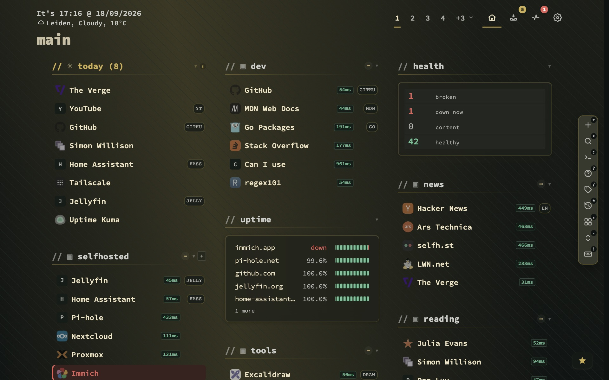
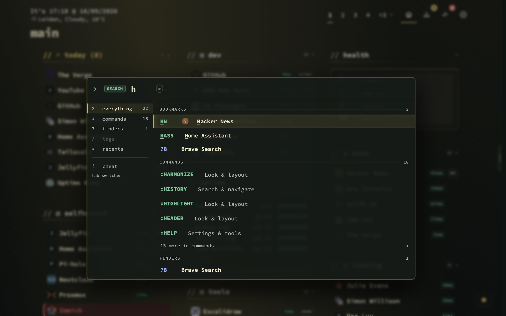
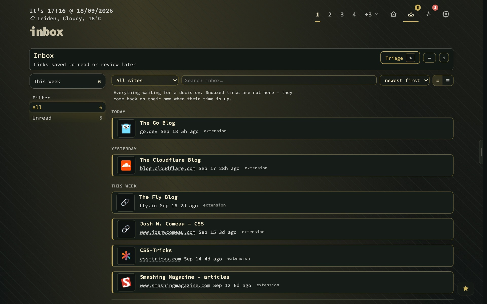
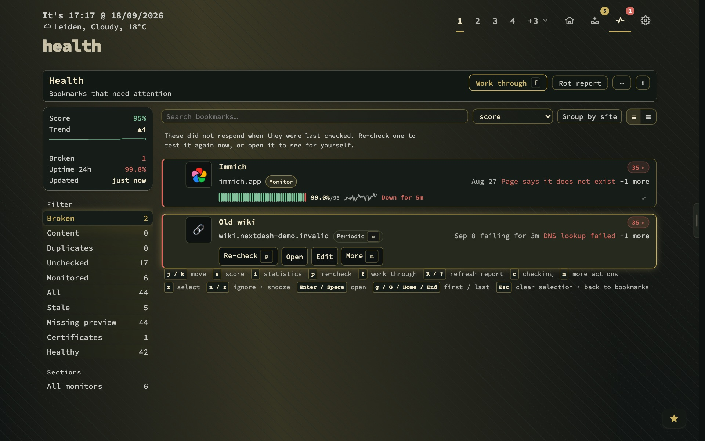
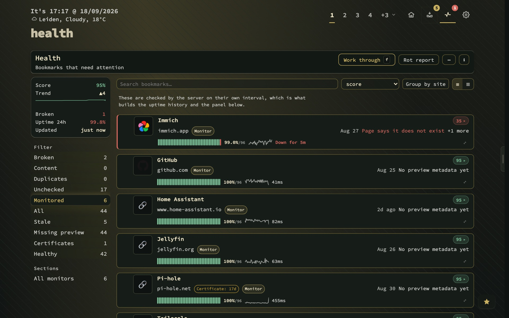
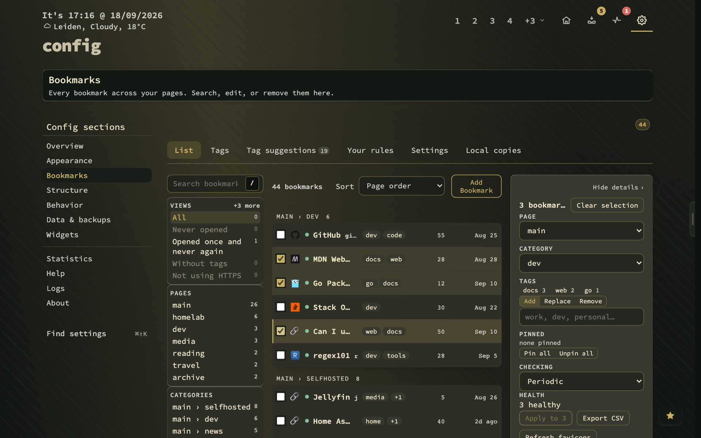
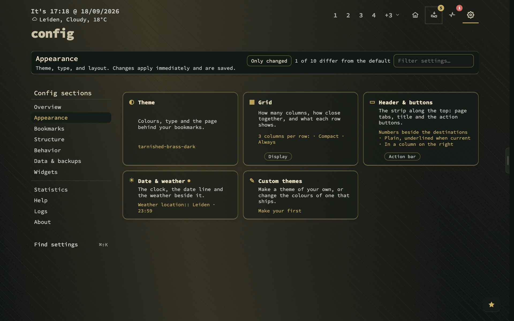
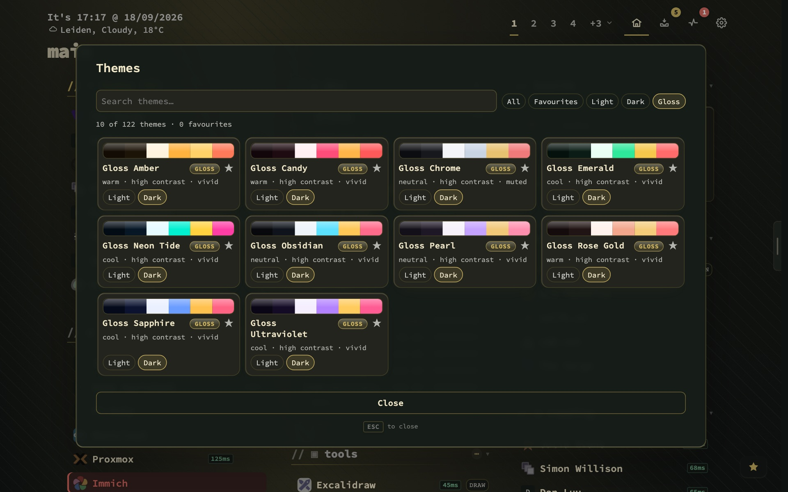

<p align="center">
  
</p>

# nextDash

> 🇨🇳 **本应用支持简体中文。** nextDash 的界面提供中文语言选项 — 在设置中将语言切换为「中文」即可。

**A keyboard-first, self-hosted bookmark dashboard. No accounts, no cloud, no noise.**

My bookmark bar had become a graveyard, so I built a self-hosted dashboard that tells me which links are already dead.

**Read more about the latest release, v1.11.0**, on the [nextDash blog](https://nextdash.cc/2026/09/18/nextdash-1-11-x-we-moved-your-furniture-and-left-a-note/).

Run it on any machine or container, open it in your browser, organise bookmarks across pages, and reach everything from the keyboard. Beside your bookmarks, **widgets** show what is going on: uptime of the services you watch, what waits in the inbox, which certificate runs out, the weather, your calendar, your feeds, your machine — and any self-hosted service that answers with JSON.

Based on [ThinkDashboard](https://github.com/MatiasDesuu/ThinkDashboard) by MatiasDesuu.

📖 **[User manual (MANUAL.md)](MANUAL.md)** — how everything works, from the first launch to self-hosting.

📋 **[Changelog (CHANGELOG.md)](CHANGELOG.md)** — every release, new and fix.

🗂️ **[Cheat sheet](nextDash-cheatsheet.pdf?raw=true)** — every keyboard shortcut, printable ([HTML](nextDash-cheatsheet.html?raw=true)). Press **!** or **F1** on the dashboard for the live list. Regenerate with `npm run generate:cheatsheet`.

🌐 **Website:** [nextdash.cc](https://nextdash.cc)

📰 **Developer blog & updates:** [jordibrw.nl](https://jordibrw.nl)

🧩 **Save a link from anywhere:** a browser extension, a share sheet, a bookmarklet, a shell one-liner, Raycast, Dropzone 5, Alfred, Apple Shortcuts and Ulauncher — see [What nextDash talks to](#what-nextdash-talks-to).

---

## Screenshots
<table border="0" width="100%">
  <tr>
    <td width="50%" align="center" valign="top">
      
      <br />
      <sub><b>Dashboard</b> — Categories in columns with a live response time on every monitored link, and widgets for health and uptime between them. The header is one row — clock and weather, page tabs, destinations — and the action buttons stand in a column on the right edge.</sub>
    </td>
    <td width="50%" align="center" valign="top">
      
      <br />
      <sub><b>Search</b> — One panel for bookmarks, commands and finders. Type a letter and it answers from all three at once; the modes on the left narrow it down, and <kbd>Tab</kbd> switches between them.</sub>
    </td>
  </tr>
  <tr>
    <td width="50%" align="center" valign="top">
      
      <br />
      <sub><b>Inbox</b> — Links you saved before you knew where they belong, grouped by when they arrived. Filter by site or unread, search, and clear the lot one link at a time with Triage.</sub>
    </td>
    <td width="50%" align="center" valign="top">
      
      <br />
      <sub><b>Health</b> — Everything that needs attention, across all pages: a link whose domain no longer exists, a monitored service that is down right now. Each row says why, and can be re-checked, opened or edited where it stands.</sub>
    </td>
  </tr>
  <tr>
    <td width="50%" align="center" valign="top">
      
      <br />
      <sub><b>Monitoring</b> — The services you watch, checked by the server on their own interval. Every row carries its uptime, a response-time sparkline and a warning when its certificate is about to expire.</sub>
    </td>
    <td width="50%" align="center" valign="top">
      
      <br />
      <sub><b>Bookmarks</b> — Every bookmark in one list, as a workbench: filters on the left, rows in the middle, and an edit panel on the right. Tick three rows and the same panel edits all three — page, category, tags, pinning and checking.</sub>
    </td>
  </tr>
  <tr>
    <td width="50%" align="center" valign="top">
      
      <br />
      <sub><b>Config</b> — Appearance and Behavior open on tiles, one subject each, and every tile shows what it is set to before you open it. A tile opens its group; <kbd>Esc</kbd> goes back.</sub>
    </td>
    <td width="50%" align="center" valign="top">
      
      <br />
      <sub><b>Themes</b> — 122 theme families, each with a light and a dark half, searchable and filtered by mood. The Gloss filter shows the ten families that catch the light; press <kbd>Shift</kbd>+<kbd>A</kbd> to open the browser from anywhere.</sub>
    </td>
  </tr>
</table>

---

## Quick Start

### Docker Compose (recommended)

```yaml
services:
  nextDash:
    image: ghcr.io/jordibrouwer/nextdash:latest
    container_name: nextDash
    ports:
      - "8080:8080"
    volumes:
      - ./data:/app/data
    environment:
      - PORT=8080
      # On a LAN or VPS, require a token for every write (see Security):
      # - NEXTDASH_WRITE_TOKEN=change-me-to-a-long-random-string
    restart: unless-stopped
```

```sh
docker compose up -d
```

Open `http://localhost:8080`.

**From a git checkout:** `docker-compose.prod.yml` is for production (only `./data` is mounted; CSS and JavaScript are built into the image). `docker-compose.yml` is for development (it mounts `./static` and `./templates`).

```sh
docker compose -f docker-compose.prod.yml up -d --build
```

### Build from source

```sh
go build -o nextDash && ./nextDash
```

Data is stored in `./data`. `NEXTDASH_DATA_DIR` moves it.

### System widgets

The **Processor**, **Memory**, **Disks** and **Containers** widgets report on the machine nextDash runs on. The binary needs no setup; a container needs read-only mounts:

```yaml
    volumes:
      - ./data:/app/data
      - /mnt:/host/root/mnt:ro,rslave                     # Disks: required
      # - /proc:/host/proc:ro                             # Processor, Memory: optional
      # - /var/run/docker.sock:/var/run/docker.sock:ro    # Containers: a real grant
    environment:
      - NEXTDASH_HOST_ROOT=/host/root
      # - NEXTDASH_HOST_PROC=/host/proc
      # - NEXTDASH_DOCKER_SOCKET=/var/run/docker.sock
```

Read-only access to the Docker socket still exposes every container, image, environment and mount. The [manual](MANUAL.md#114-system-widgets-and-what-they-need) explains each mount, Synology and QNAP paths, and the Unraid template rows.

---

## Security

nextDash is built for **personal or small-team use on a trusted network**. There are no user accounts: anyone who can reach the address can read and change the data unless you put something in front of it.

**Do not expose nextDash directly to the internet.** Use one of these:

- **A private network** — [Tailscale](https://tailscale.com/) or another mesh VPN.
- **A reverse proxy with authentication** — Traefik, Caddy or nginx with basic auth, OAuth2 Proxy or SSO.
- **Local only** — bind to `127.0.0.1` and use an SSH tunnel.

The short version is below; [MANUAL § 21](MANUAL.md#21-security-and-self-hosting) has the details.

- **Write token.** Set `NEXTDASH_WRITE_TOKEN` and every write or destructive API call needs the header `X-NextDash-Token`. The dashboard supplies it for you. The capture routes (`/add` and the share target) cannot send a header; give them `NEXTDASH_CAPTURE_TOKEN`, which opens capture and nothing else.
- **CORS.** Only browser extensions receive CORS headers. `NEXTDASH_CORS_ORIGINS` allows pages of your own; `*` allows every origin.
- **Outgoing requests.** With local bookmarks disallowed, the server only reaches public hosts, re-checks addresses when it connects, and is rate-limited per client.
- **The data directory is not served.** Only icons and an uploaded favicon or font are public.
- **Activity trail.** A machine-readable JSON record, with seventeen channels. Changes and check results are on by default; choose the rest under **Config → Logs → Activity trail** or with `NEXTDASH_ACTIVITY_LOG`. URLs and searches can appear in it, so treat the files as private.

### Production Docker

`docker-compose.prod.yml` serves CSS and JavaScript from the binary, mounts only `./data`, and sets a 256 MB memory limit. The entrypoint starts as root so host Docker hooks can run, then switches to the `nextdash` user (`NEXTDASH_RUN_AS_ROOT=1` keeps root). For TLS and long-cache static serving, run `docker compose -f docker-compose.proxy.yml up -d` with `deploy/Caddyfile`.

Recommended LAN/VPS environment:

```yaml
environment:
  - PORT=8080
  - NEXTDASH_WRITE_TOKEN=change-me-to-a-long-random-string
  - NEXTDASH_CORS_ORIGINS=https://dash.example.com
  - NEXTDASH_ACTIVITY_LOG=mutate,status,security
  - NEXTDASH_ACTIVITY_LOG_PERSIST=1
  # Capture from a bookmarklet, share sheet or script without the write token:
  # - NEXTDASH_CAPTURE_TOKEN=a-second-long-random-string
  # Automatic backups:
  # - NEXTDASH_AUTO_BACKUP_KEEP=7
  # - NEXTDASH_AUTO_BACKUP_DIR=/backups            # mount a volume there
  # Logging:
  # - NEXTDASH_LOG_LEVEL=warn
  # - NEXTDASH_ACTIVITY_LOG_FORMAT=json            # for Loki or Vector
  # - NEXTDASH_ACTIVITY_LOG_URLS=host
  # - NEXTDASH_ACTIVITY_LOG_MAX_AGE_DAYS=30
  # System widgets (see Quick Start):
  # - NEXTDASH_HOST_ROOT=/host/root
  # - NEXTDASH_DOCKER_SOCKET=/var/run/docker.sock
  # Rate limits and headers:
  # - NEXTDASH_OUTBOUND_REQUESTS_PER_MIN=120
  # - NEXTDASH_SSRF_API_RATE_PER_MIN=60
  # - NEXTDASH_STATUS_PING_RATE_PER_MIN=300
  # - NEXTDASH_CSP=off
  # For everyone on this server:
  # - DISABLE_TELEMETRY=true
  # - DISABLE_UPDATE_CHECK=true
  # - DISABLE_NEWS_FEED=true
```

Every variable is listed in the reference table below.

`GET /version` returns the version and commit. `GET /api/data-revision` returns a hash, so open dashboard tabs notice changes made elsewhere.

### Environment variables (reference)

| Variable | Default | Purpose |
|----------|---------|---------|
| `PORT` | `8080` | HTTP port (1–65535) |
| `NEXTDASH_DATA_DIR` | `./data` | Where pages, bookmarks, settings and uploads live |
| `NEXTDASH_WRITE_TOKEN` | *(unset)* | Require `X-NextDash-Token` on writes |
| `NEXTDASH_CAPTURE_TOKEN` | *(unset)* | A token that opens only `/add` and the share target |
| `NEXTDASH_CORS_ORIGINS` | *(unset)* | Extra origins allowed to use the API, comma-separated; `*` for all. Extensions are always allowed. |
| `NEXTDASH_CSP` | on | `off` disables the Content-Security-Policy header |
| `NEXTDASH_OUTBOUND_REQUESTS_PER_MIN` | `120` | Rate limit for requests the server makes for you |
| `NEXTDASH_SSRF_API_RATE_PER_MIN` | `60` | Rate limit for the preview, icon, archive, check-URL and alert-test APIs |
| `NEXTDASH_STATUS_PING_RATE_PER_MIN` | `300` | Rate limit for `/api/ping`, the status checks the dashboard runs in your browser |
| `NEXTDASH_AUTO_BACKUP_KEEP` | `3` | How many automatic backups are kept (1–50) |
| `NEXTDASH_AUTO_BACKUP_DIR` | `data/auto-backups` | Where automatic backups are stored (absolute path) |
| `NEXTDASH_LOG_LEVEL` | `info` | `error`, `warn`, `info` or `debug`. **Detail level** in the app wins. |
| `NEXTDASH_ACTIVITY_LOG` | `mutate,status` | `off`, or channels: `mutate`, `status`, `open`, `security`, `health`, `sources`, `feeds`, `archive`, `backup`, `store`, `widgets`, `notify`, `search`, `keys`, `nav`, `session`, `clienterror`. **Activity trail** in the app wins. |
| `NEXTDASH_ACTIVITY_LOG_PERSIST` | off | `1` writes a rotating `activity.log` in the data directory |
| `NEXTDASH_ACTIVITY_LOG_FILE` | `data/activity.log` | Another path for that file |
| `NEXTDASH_ACTIVITY_LOG_FORMAT` | `text` | `text` (a readable sentence) or `json` on stdout, for Loki or Vector |
| `NEXTDASH_ACTIVITY_LOG_URLS` | `full` | `full`, `host` or `off` — how URLs and search text appear in the trail |
| `NEXTDASH_ACTIVITY_LOG_SAMPLE` | *(unset)* | Sampling per channel, e.g. `open=0.1,keys=0.25` |
| `NEXTDASH_ACTIVITY_LOG_MAX_AGE_DAYS` | `0` (off) | Delete rotated `activity.log.N` files older than this |
| `NEXTDASH_ACTIVITY_OPEN_DETAIL` | `basic` | `off`, `basic` or `full` — what a bookmark-open record holds. **Open detail** in the app wins. |
| `NEXTDASH_HOST_ROOT` | *(unset)* | Prefix the host's disks are mounted under, for the **Disks** widget |
| `NEXTDASH_HOST_PROC` | `/proc` | The host's `/proc`, for **Processor** and **Memory** |
| `NEXTDASH_DOCKER_SOCKET` | *(unset)* | The Docker socket, for **Containers**; unset hides the widget |
| `NEXTDASH_DISABLE_PREFETCH` | off | `1` skips the icon prefetch at start-up |
| `NEXTDASH_RUN_AS_ROOT` | off | `1` keeps the container running as root |
| `NEXTDASH_BUNDLE` | on | `off` serves scripts and stylesheets one by one, for debugging |
| `NEXTDASH_STATIC_MUTABLE` | off | `1` re-hashes assets on every request, for a bind-mounted `./static` |
| `DISABLE_TELEMETRY` | off | `true` turns analytics off for everyone |
| `DISABLE_UPDATE_CHECK` | off | `true` turns the daily GitHub release check off for everyone |
| `DISABLE_NEWS_FEED` | off | `true` stops fetching posts from nextdash.cc |

---

## Features

Each line links to the part of the [manual](MANUAL.md) that explains it.

**Bookmarks and pages**

- Pages and categories, each with an icon, a colour and a sort; drag to reorder, spread a category across columns. *[Manual §9](MANUAL.md#9-pages-categories-and-collections)*
- Add a link with one key, the full form, a paste, the extension, the share sheet or a bookmarklet. *[Manual §5](MANUAL.md#5-adding-bookmarks)*
- Tags, notes, shortcuts and pins, and a preview card that says what a page is without opening it. *[Manual §6](MANUAL.md#6-opening-and-editing-bookmarks), [§10](MANUAL.md#10-tags)*
- **Tag suggestions** tag whole groups at once — from your own tags, a shipped list of 463 subjects, and rules you write. Nothing is tagged until you accept. *[Manual §10.4](MANUAL.md#104-tag-suggestions)*
- A **bookmarks workbench** in config: filter in a rail, edit one bookmark or a whole selection in a side panel. *[Manual §15.4](MANUAL.md#154-bookmarks)*
- An **inbox** for links you have not filed yet — snooze, triage, promote, or keep them on a **Kept** tab until they have a place, then file a whole pile at once. *[Manual §14](MANUAL.md#14-inbox)*
- **Smart collections** fill themselves; custom collections follow your rules. *[Manual §9.6](MANUAL.md#96-smart-collections)*

**Search and keyboard**

- Everything is reachable from the keyboard: one rule for the shortcuts and a searchable cheat sheet on `!`. *[Manual §7](MANUAL.md#7-keyboard)*
- One panel for search, commands and finders, plus search from the browser's address bar. *[Manual §8](MANUAL.md#8-search-commands-and-finders)*
- Filters for tag, category, page, status, added and opened — each also in the negative. *[Manual §8.2](MANUAL.md#82-filters)*

**Health and monitoring**

- A **health view** that finds what is broken, stale, duplicated, unchecked or changed, and helps you work through it. *[Manual §13](MANUAL.md#13-health-and-monitoring)*
- **Uptime monitoring** with 30 days of history, response times, outages, certificate expiry, expected-response checks and drift detection. *[Manual §13.4](MANUAL.md#134-monitoring-over-time)*
- Alerts to Slack, Discord, Telegram, Gotify, ntfy, Pushover, a JSON receiver or your browser, with maintenance windows and per-bookmark muting. *[Manual §13.7](MANUAL.md#137-alerts)*
- **Fresh** shows which bookmarked sites published something new. *[Manual §13.9](MANUAL.md#139-fresh)*
- Keep a copy of a page on your own disk or in the Web Archive. *[Manual §13.10](MANUAL.md#1310-keeping-a-copy-of-a-page)*

**Widgets**

- Twenty-one kinds: health, uptime, certificates, trend, inbox, kept, feeds, sources, neglected, blind spots, duplicates, archive, trash, backups, processor, memory, disks, containers, weather, calendar and RSS. *[Manual §11](MANUAL.md#11-widgets)*
- A widget set to two columns says more rather than the same thing larger: the load behind the processor's percentage, the container failing by name, the expiry date of a certificate, what the weather feels like. One column keeps the important half. *[Manual §11.2](MANUAL.md#112-adding-and-arranging)*
- A **Custom widget** reads any service that answers with JSON, with 28 self-hosted services filled in — Sonarr, Plex, Pi-hole, Proxmox, Home Assistant and more. *[Manual §11.5](MANUAL.md#115-the-custom-widget)*

**Appearance**

- 121 theme families in light and dark — including ten glossy **Gloss** themes — in a browser with live preview, plus an editor for your own. *[Manual §12](MANUAL.md#12-appearance)*
- Depth, glow, glass and contrast for any theme; layout presets, columns, density, fonts and backdrops. *[Manual §12.2](MANUAL.md#122-surfaces)*
- A header you arrange yourself: four page-switcher styles, and action buttons in a dock, a side column, the header or one menu. *[Manual §4](MANUAL.md#4-the-dashboard)*
- Six languages: English, Dutch, German, French, Spanish and Chinese. *[Manual §15](MANUAL.md#15-config)*

**Data**

- Import the bookmark file every browser exports — and Pocket, Pinboard, Raindrop, linkding, Shiori, Linkwarden and Karakeep — plus CSV. Export to HTML and CSV. *[Manual §17.1](MANUAL.md#171-backups-data)*
- **Sources** keep bookmarks arriving from GitHub stars, Raindrop.io, Hacker News, YouTube and Mastodon. *[Manual §17.2](MANUAL.md#172-sources)*
- Automatic backups of the whole data directory, and a 30-day trash. *[Manual §17](MANUAL.md#17-data-backups-and-import)*
- A server log and an activity trail in the app. *[Manual §18](MANUAL.md#18-logs)*

**Self-hosting**

- One Go binary and a directory of plain JSON. No database, no accounts, and analytics only if you switch them on. *[Manual §21](MANUAL.md#21-security-and-self-hosting)*
- A write token, a CORS allowlist, rate limits, SSRF protection and an activity trail for when it faces a network. *[Security](#security)*

---

## What nextDash talks to

- **Browser extension** (`extension/`) — saves the current tab to a page or to the inbox. Open `chrome://extensions/`, switch on **Developer mode**, click **Load unpacked** and choose the `extension/` folder. *[Manual §19](MANUAL.md#19-browser-extension-and-capture)*
- **A capture route** — `GET /add?url=…&title=…` saves to the inbox and answers with a readable page, so anything that can open a URL or run `curl` can save to nextDash. *[Manual §19.2](MANUAL.md#192-capture-without-the-extension)*
- **[`integrations/`](integrations/)** — a shell one-liner, two Raycast commands, a **Dropzone 5** action, a Ulauncher extension, and recipes for Alfred and Apple Shortcuts, all built on that route. The [Dropzone 5 action](https://github.com/jordibrouwer/dropzone-script-for-nextdash-on-macos) also has its own repository. *[`integrations/README.md`](integrations/README.md)*
- **A bookmarklet and the phone share sheet** — **Config → Help → Inbox** builds a bookmarklet for your install; installed as an app, nextDash joins the share sheet. *[Manual §20](MANUAL.md#20-phones-tablets-and-the-installed-app)*
- **Outgoing webhooks** — five events, signed with the [Standard Webhooks](https://www.standardwebhooks.com/) scheme. *[Manual §17.3](MANUAL.md#173-webhooks)*
- **An MCP endpoint** — four tools for MCP clients to search and add bookmarks, off until you switch it on. *[Manual §21.6](MANUAL.md#216-the-mcp-endpoint)*
- **The machine it runs on** — the system widgets read `/proc`, the disks you name and optionally the Docker socket, all read-only. *[Manual §11.4](MANUAL.md#114-system-widgets-and-what-they-need)*

---

## Contributing

Issues and pull requests are welcome — bugs, features and translations alike.

### Branch workflow

| Branch | Purpose |
|--------|---------|
| **`dev`** | Day-to-day development (tests, CI, scripts) |
| **`main`** | The published release, for Docker and the public repository page |

1. Branch from **`dev`** and open pull requests **into `dev`**.
2. CI runs on pushes and pull requests to **`dev`**.
3. When a release is ready, merge **`dev` → `main`** with:

   ```bash
   git checkout dev
   ./scripts/release-to-main.sh v1.11.0
   ```

   The script merges, removes development-only files from `main` (tests, Playwright, internal scripts), tags the release, pushes, and publishes a **GitHub Release** with [`gh`](https://cli.github.com/). One-time setup: `brew install gh` and `gh auth login`.

Do **not** merge `dev` into `main` by hand on GitHub.

**Clone for development:** `git clone`, then `git checkout dev`.
**Clone for Docker or stable use:** stay on the default **`main`** branch.

## License

MIT
