<p align="center">
  
</p>

# nextDash

> 🇨🇳 **本应用支持简体中文。** nextDash 的界面提供中文语言选项 — 在设置中将语言切换为「中文」即可。

**A keyboard-first, self-hosted bookmark dashboard. No accounts, no cloud, no noise.**

My bookmark bar had become a graveyard, so I built a self-hosted dashboard that tells me which links are already dead.

Run it on any machine or container, open it in your browser, organise bookmarks across pages, and reach everything from the keyboard. Beside your bookmarks, **widgets** show what is going on: uptime of the services you watch, what waits in the inbox, which certificate runs out, the weather, your calendar, your feeds, your machine — and any self-hosted service that answers with JSON.

Based on [ThinkDashboard](https://github.com/MatiasDesuu/ThinkDashboard) by MatiasDesuu.

📖 **[User manual (MANUAL.md)](MANUAL.md)** — how everything works, from the first launch to self-hosting.

📋 **[Changelog (CHANGELOG.md)](CHANGELOG.md)** — every release, new and fix.

🗂️ **[Cheat sheet](nextDash-cheatsheet.pdf?raw=true)** — every keyboard shortcut, printable ([HTML](nextDash-cheatsheet.html?raw=true)). Press **!** or **F1** on the dashboard for the live list. Regenerate with `npm run generate:cheatsheet`.

🌐 **Website:** [nextdash.cc](https://nextdash.cc)

📰 **Developer blog & updates:** [jordibrw.nl](https://jordibrw.nl)

🧩 **Save a link from anywhere:** a browser extension, a share sheet, a bookmarklet, a shell one-liner, Raycast, Dropzone 5, Alfred, Apple Shortcuts and Ulauncher — see [What nextDash talks to](#what-nextdash-talks-to).

---

## 🏠 Run your self-hosted setup from one screen

nextDash is a bookmark dashboard that also knows your Docker host. The link to Sonarr, the Sonarr container and the check that watches it are one thing, not three tabs in three different tools.

**How it fits together**

1. **Containers** — the Containers view (`Shift + Y`, `#docker`) lists every container on the host: a status glow, CPU, RAM, size on disk, ports, its web UI, healthcheck results and a timeline of what happened to it. Start, stop, restart, update, roll back or follow its logs from the keyboard, one container, a compose stack or a whole selection at a time.
2. **Bookmarks** — each container's web UI is matched to the bookmark you already have for it: by port, by subdomain behind a reverse proxy, or by name — or by hand. The container row carries that bookmark's health mark; the bookmark's side panel says which container it **runs in**. Open the service from the dashboard, from search, or with `:docker sonarr open`.
3. **Health** — set that bookmark to **Monitor** and the server checks it on its own, as often as every five minutes: 30 days of uptime and response times, outages, certificate expiry, a phrase the page must contain, the status codes that count as healthy, and drift when a page turns into something else. A service behind a sign-in can be checked on a status address, with a stored key.
4. **Alerts and push** — a site that goes down and a container that crashes, keeps restarting, turns unhealthy or runs hot reach you the same way: ntfy, Pushover, Gotify, Telegram, Slack, Discord, your own JSON receiver, or a push notification on your phone, even with the dashboard closed. Recovery is announced too, and a host that takes ten services down sends one message, not ten.

**Keeping it current and tidy.** Image update checks run on an interval and show the release notes behind an update. Skip a version, hold a container, or let nextDash update it in a nightly window: each update is watched for five minutes and rolled back when the container stops, loops or turns unhealthy. The **Disk** tab shows what images, volumes, build cache and bind mounts take up, and clears it after naming what goes.

**On the dashboard.** A homelab page can carry the **Containers** and **Container list** widgets, **Uptime**, **Certificates**, **Health**, **Processor**, **Memory** and **Disks**, seven **Unraid** widgets (array, parity, shares, VMs, UPS and notifications) that read the server through its API, and a **Custom widget** that reads Sonarr, Plex, Pi-hole, Proxmox, Home Assistant and 36 more services — next to the bookmarks for all of them.

<table border="0" width="100%">
  <tr>
    <td width="50%" align="center" valign="top">
      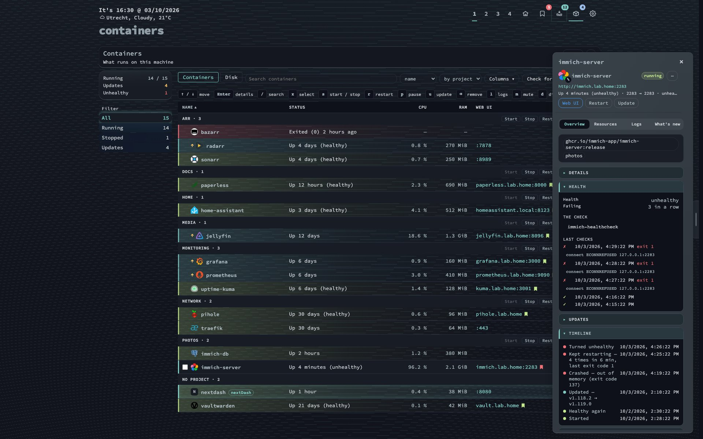
      <br />
      <sub><b>Containers and health</b> <i>(Gloss Chrome)</i> — Grouped by compose project, each web UI with its bookmark's mark: green where the monitor finds it up, red for Immich. Its side panel shows why — three failed healthchecks, out of memory, a restart loop since the update two hours ago.</sub>
    </td>
    <td width="50%" align="center" valign="top">
      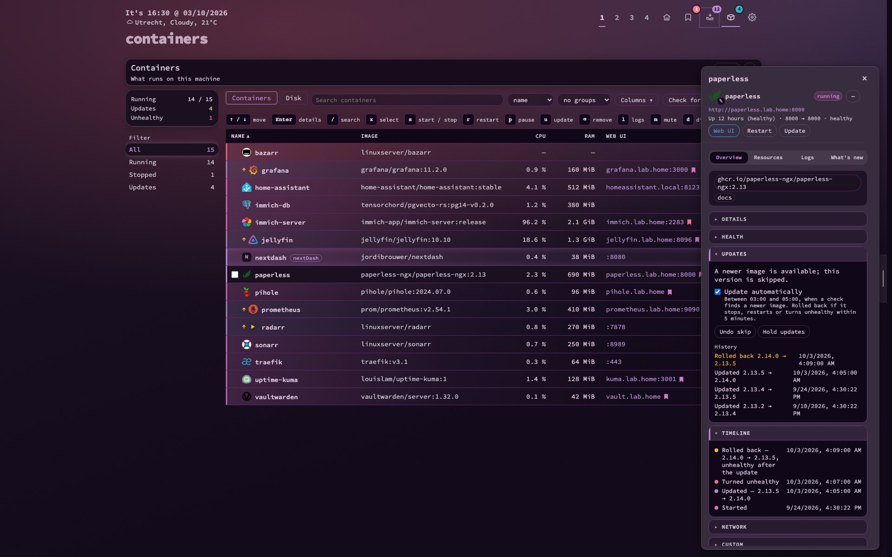
      <br />
      <sub><b>Updates with a way back</b> <i>(Cosmic Editor)</i> — Paperless updates itself between 03:00 and 05:00. Last night's version turned unhealthy within two minutes, so it was rolled back and skipped; History and Timeline say what happened, and a notice said so on your phone.</sub>
    </td>
  </tr>
</table>

📖 **[Self-hosted guide in the manual](MANUAL.md#self-hosted-guide)** — the set-up in four steps, how the pieces link up, and a morning routine. Setting up the Docker socket is under [Containers view](#containers-view) below.

---

## Screenshots
<table border="0" width="100%">
  <tr>
    <td width="50%" align="center" valign="top">
      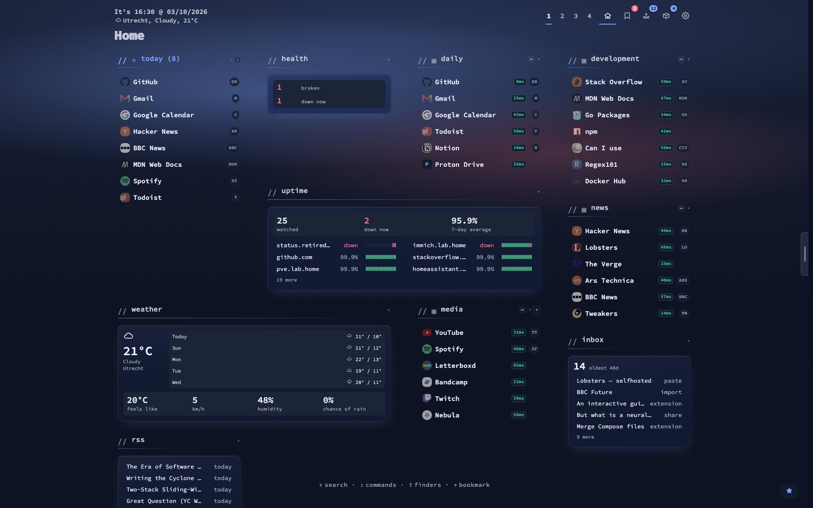
      <br />
      <sub><b>Dashboard</b> <i>(Gloss Chrome)</i> — Categories in columns with a live response time on every monitored link, and widgets between them: health, uptime with a heartbeat per site and the weather across two columns, the inbox and an RSS feed. The header is one row — clock and weather, page tabs, destinations with their badges.</sub>
    </td>
    <td width="50%" align="center" valign="top">
      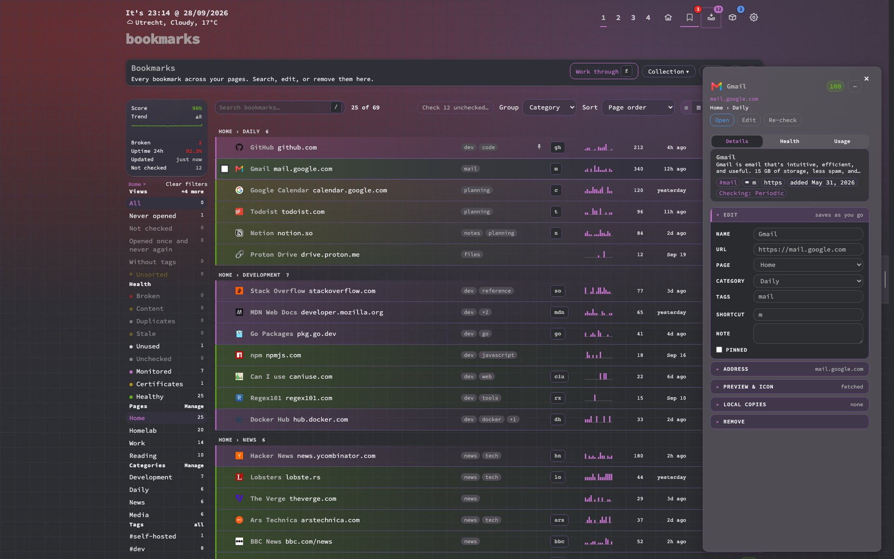
      <br />
      <sub><b>Bookmarks view</b> <i>(Cosmic Editor)</i> — The whole collection in one place: a rail of views, health filters, pages, categories and tags; one-line rows with tags, shortcut, opens and when each was last used; a side panel with Details, Health and Usage that saves as you type.</sub>
    </td>
  </tr>
  <tr>
    <td width="50%" align="center" valign="top">
      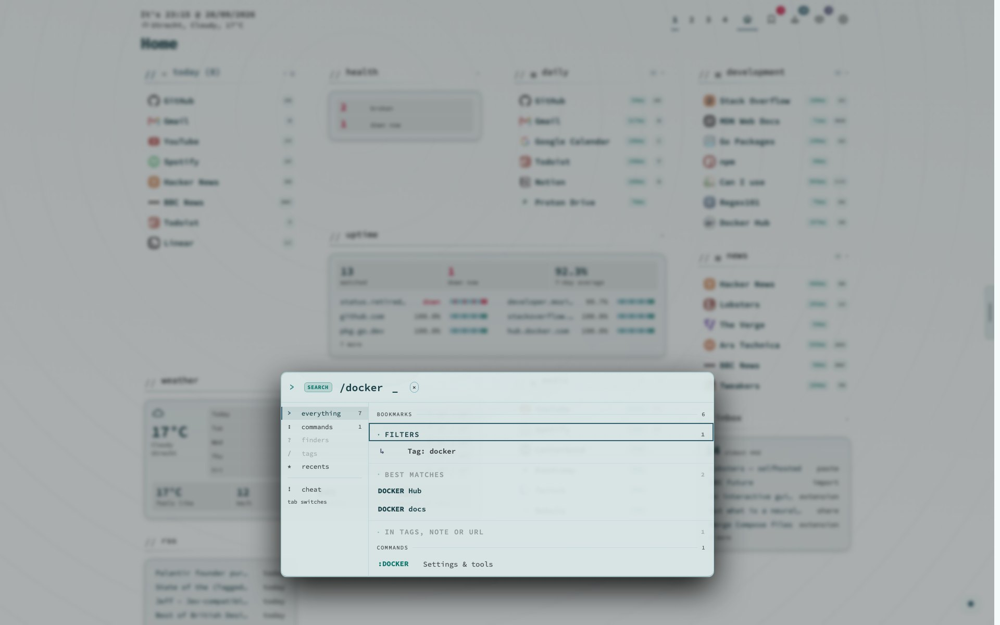
      <br />
      <sub><b>Search</b> <i>(Frosted Juniper, light)</i> — One panel for bookmarks, commands and finders. Type a word and <kbd>/</kbd> turns it into a name search: best matches first, a tag to filter on, and the commands that fit. <kbd>Tab</kbd> switches between the modes on the left.</sub>
    </td>
    <td width="50%" align="center" valign="top">
      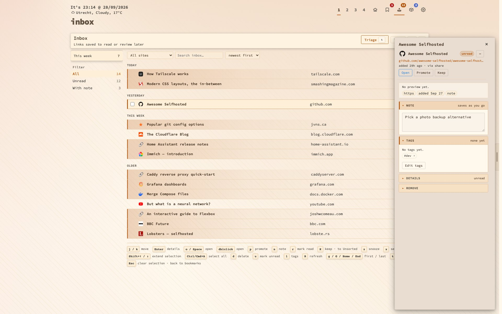
      <br />
      <sub><b>Inbox</b> <i>(Desert Sand, light)</i> — Links saved before you knew where they belong, grouped by when they arrived. The side panel holds the note and tags; open, promote or keep a link without leaving the list.</sub>
    </td>
  </tr>
</table>

<details>
<summary><b>More screenshots</b> — ten more views, in other themes</summary>
<br />

<table border="0" width="100%">
  <tr>
    <td width="50%" align="center" valign="top">
      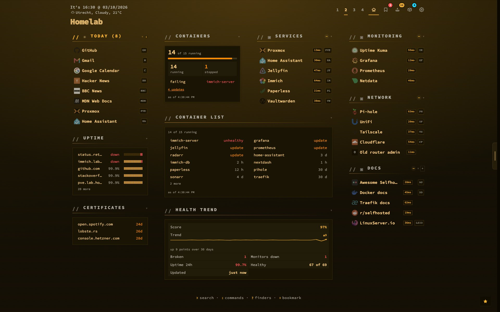
      <br />
      <sub><b>A second page</b> <i>(Matrix Rain)</i> — A homelab page: the container count and the Container list widget two columns wide, uptime for this page, certificates close to expiry and the health trend over 30 days, beside self-hosted services with their own icons.</sub>
    </td>
    <td width="50%" align="center" valign="top">
      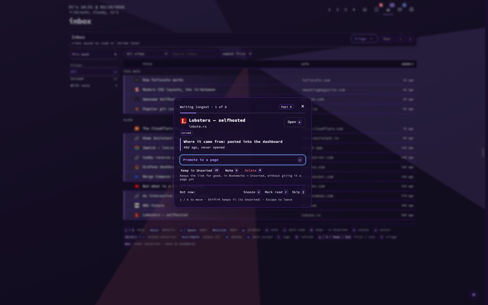
      <br />
      <sub><b>Triage</b> <i>(Matrix Rain)</i> — <kbd>t</kbd> in the inbox takes the links pile by pile — waiting longest, new this week, with a note — one at a time, each saying where it came from, with Promote as the one clear next step.</sub>
    </td>
  </tr>
  <tr>
    <td width="50%" align="center" valign="top">
      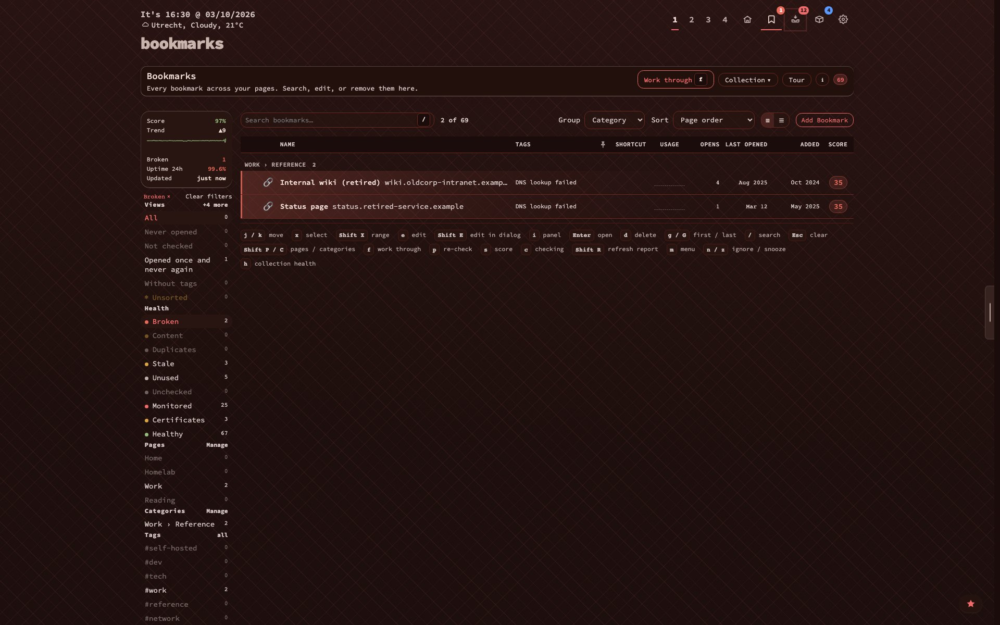
      <br />
      <sub><b>Broken links</b> <i>(Gloss Amber)</i> — The Bookmarks view on its Broken filter: what does not answer and why, a score per bookmark, and Work through to clear them one at a time.</sub>
    </td>
    <td width="50%" align="center" valign="top">
      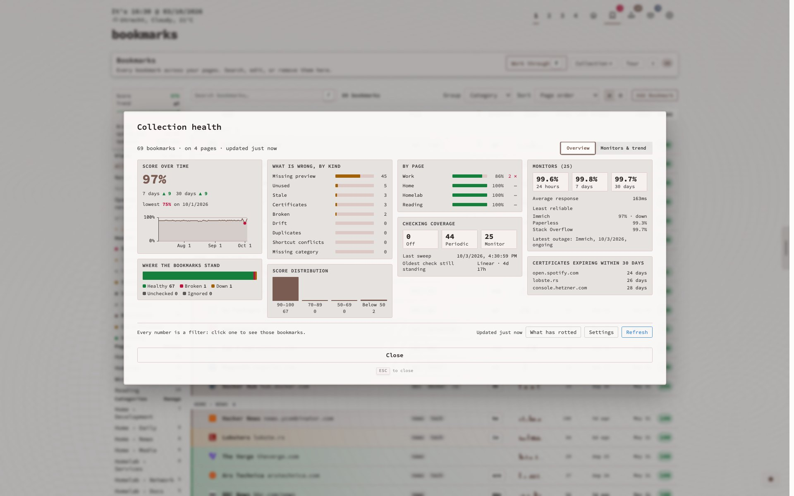
      <br />
      <sub><b>Collection health</b> <i>(Desert Sand, light)</i> — Score over time, what is wrong and by what kind, health per page, checking coverage, monitor uptime and certificates on one screen; every number opens its filter.</sub>
    </td>
  </tr>
  <tr>
    <td width="50%" align="center" valign="top">
      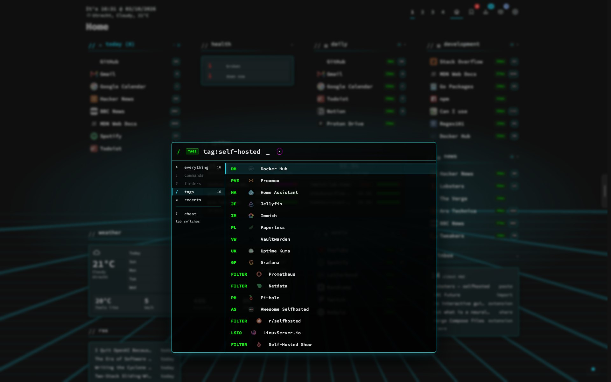
      <br />
      <sub><b>Search by tag</b> <i>(ThinkDashboard)</i> — <code>tag:self-hosted</code> narrows search to one tag across every page, each result with its shortcut.</sub>
    </td>
    <td width="50%" align="center" valign="top">
      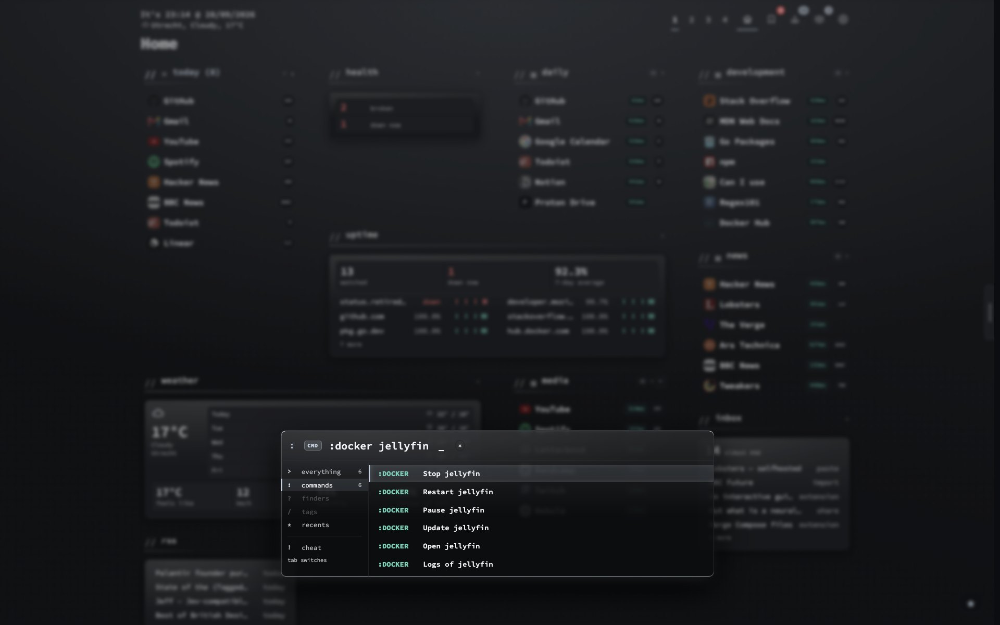
      <br />
      <sub><b>Command palette</b> <i>(Gloss Chrome)</i> — <code>:docker jellyfin</code> offers what can be done to that container — stop, restart, pause, update, open its web UI or read its logs.</sub>
    </td>
  </tr>
  <tr>
    <td width="50%" align="center" valign="top">
      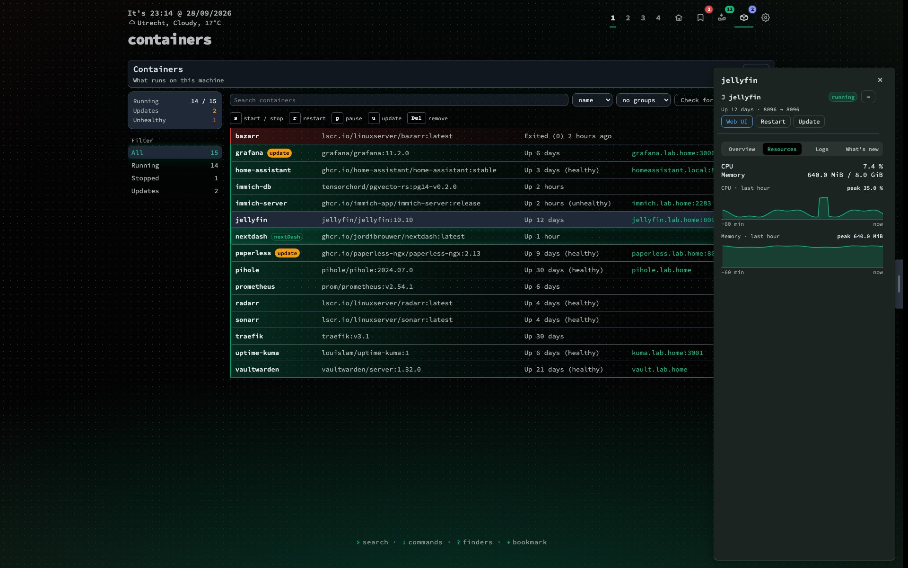
      <br />
      <sub><b>Containers</b> <i>(ThinkDashboard)</i> — Every container on the host with a status glow, its ports and a web UI column. The side panel shows CPU, memory, network and disk over the last hour, and a web UI's bookmark carries its health. Start, stop and update are one key away when you turn control on — or updates run at night, rolled back if they fail.</sub>
    </td>
    <td width="50%" align="center" valign="top">
      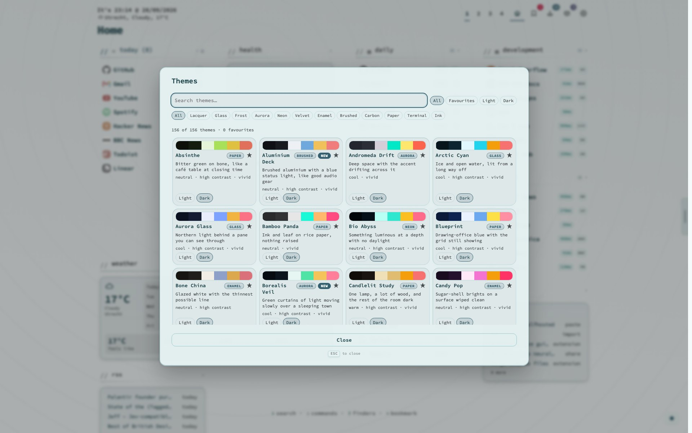
      <br />
      <sub><b>Themes</b> <i>(Frosted Juniper, light)</i> — 160 theme families, each with a light and a dark half, searchable and filtered by character: lacquer, glass, velvet, terminal and eight more; the newest wear a <i>new</i> badge. <kbd>Shift</kbd>+<kbd>A</kbd> opens the browser from anywhere.</sub>
    </td>
  </tr>
  <tr>
    <td width="50%" align="center" valign="top">
      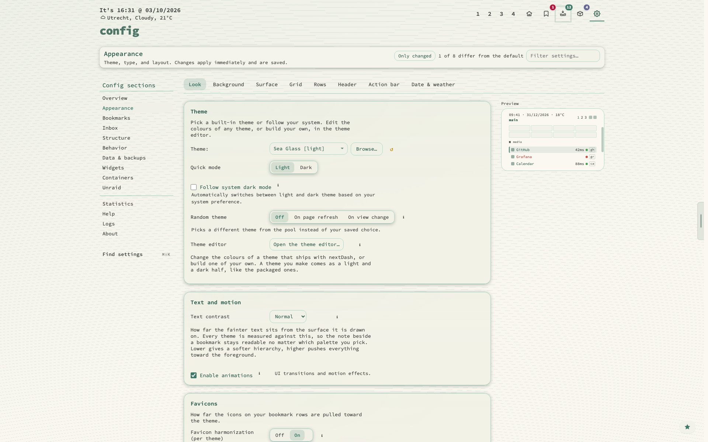
      <br />
      <sub><b>Config → Appearance</b> <i>(Gloss Amber)</i> — Appearance in tabs — Look, Grid, Rows, Header, Action bar, Date &amp; weather — with a small live preview of your dashboard beside it. Every change applies and saves at once.</sub>
    </td>
    <td width="50%" align="center" valign="top">
      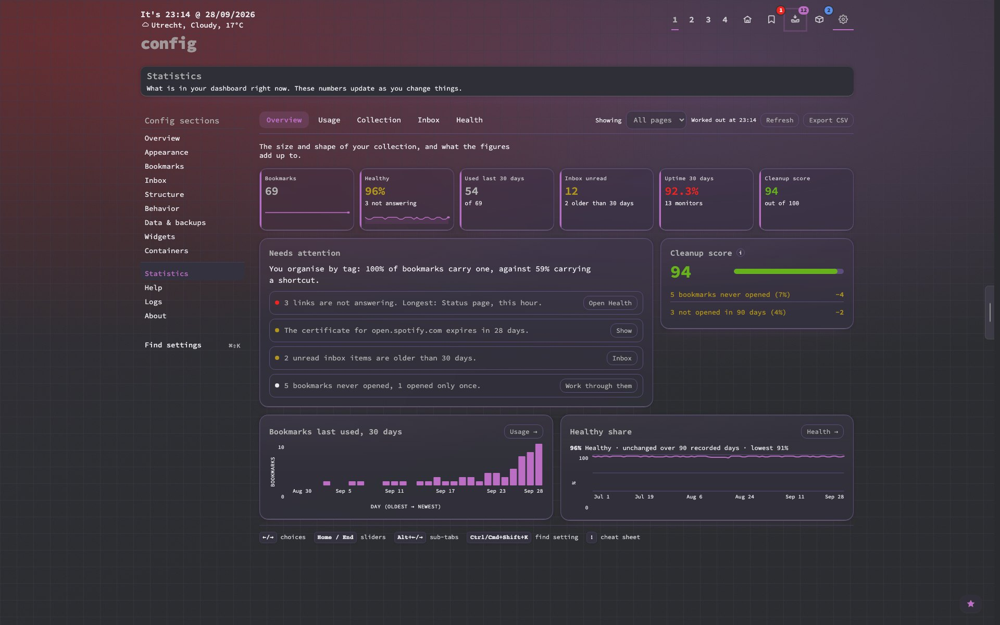
      <br />
      <sub><b>Config → Statistics</b> <i>(Cosmic Editor)</i> — Six figures per tab, what needs attention with a button for each, the cleanup score and the charts behind them — across Overview, Usage, Collection, Inbox and Health.</sub>
    </td>
  </tr>
</table>

</details>

---

## Quick Start

### Docker Compose (recommended)

```yaml
services:
  nextDash:
    image: ghcr.io/jordibrouwer/nextdash:latest
    container_name: nextDash
    ports:
      - "8080:8080"
    volumes:
      - ./data:/app/data
    environment:
      - PORT=8080
      # On a LAN or VPS, require a token for every write (see Security):
      # - NEXTDASH_WRITE_TOKEN=change-me-to-a-long-random-string
    restart: unless-stopped
```

```sh
docker compose up -d
```

Open `http://localhost:8080`.

**From a git checkout:** `docker-compose.prod.yml` is for production (only `./data` is mounted; CSS and JavaScript are built into the image). `docker-compose.yml` is for development (it mounts `./static`, `./locales` and `./templates`, with Docker actions and root off and the socket commented out). Put your own mounts and variables in `docker-compose.override.yml`; Compose reads it automatically.

```sh
docker compose -f docker-compose.prod.yml up -d --build
```

### Build from source

```sh
go build -o nextDash && ./nextDash
```

Data is stored in `./data`. `NEXTDASH_DATA_DIR` moves it.

### System widgets

The **Processor**, **Memory**, **Disks**, **Containers** and **Container list** widgets report on the machine nextDash runs on. The binary needs no setup; a container needs read-only mounts:

```yaml
    volumes:
      - ./data:/app/data
      - /mnt:/host/root/mnt:ro,rslave                     # Disks: required
      # - /proc:/host/proc:ro                             # Processor, Memory: optional
      # - /var/run/docker.sock:/var/run/docker.sock:ro    # Containers: a real grant
    environment:
      - NEXTDASH_HOST_ROOT=/host/root
      # - NEXTDASH_HOST_PROC=/host/proc
      # - NEXTDASH_DOCKER_SOCKET=/var/run/docker.sock
      # - NEXTDASH_DOCKER_CONTROL=1                       # Containers: start/stop/update/remove
```

### Containers view

> [!IMPORTANT]
> **The Containers view needs three settings before it does anything — and one more on some hosts.**
>
> 1. **The Docker socket.** Mount `/var/run/docker.sock` and set `NEXTDASH_DOCKER_SOCKET=/var/run/docker.sock`. Without both, the view shows a setup card and the Containers widget stays hidden. Read-only (`:ro`) is enough to look.
> 2. **Actions: `NEXTDASH_DOCKER_CONTROL=1`.** Start, stop, pause, restart, update and remove need it. Without it the view only reads.
> 3. **A write token, and a gate in front: `NEXTDASH_WRITE_TOKEN`.** Access to the socket is root on the host — `:ro` on the mount does not stop the Docker API from accepting writes. The token stops other websites and scripts that do not know it. It is not a login: the dashboard hands it to every browser that opens the page. Set one, and keep nextDash behind Tailscale or a reverse proxy with authentication — with actions on, anyone who can open the dashboard can stop, update or remove your containers.
> 4. **Sometimes: `NEXTDASH_RUN_AS_ROOT=1`.** The container starts as root, then drops to its own `nextdash` user, which joins the group the socket belongs to (`docker`, gid 281 on Unraid). When the socket belongs to root's group (gid 0) — Docker Desktop, some NAS systems — that user cannot read it: the log says `is owned by gid 0` and Config → Containers shows **No access to the socket**. `NEXTDASH_RUN_AS_ROOT=1` keeps the app running as root so it can. Only set it then.

**Docker Compose** — add to the nextDash service:

```yaml
    volumes:
      - /var/run/docker.sock:/var/run/docker.sock:ro
    environment:
      - NEXTDASH_DOCKER_SOCKET=/var/run/docker.sock
      - NEXTDASH_DOCKER_CONTROL=1                        # start/stop/restart/update/remove
      - NEXTDASH_WRITE_TOKEN=change-me-to-a-long-random-string
      # - NEXTDASH_RUN_AS_ROOT=1                         # only if the log says "owned by gid 0"
```

**Unraid** — Docker → nextDash → Edit:

- Fill in the template's **Docker socket** path (`/var/run/docker.sock`), **Docker socket variable** (`/var/run/docker.sock`) and **Write token**.
- For actions: set the template's **Docker actions** to `1` (it starts at `0`).
- Unraid's socket belongs to the `docker` group, so leave **Run as root** at `0`.

Once it runs, the `#docker` view lists every container with a status glow, CPU and RAM and a link to its web UI, a side panel with health, a timeline, logs, an hour of CPU and memory charts and release notes, a logs window, a Disk tab, and a badge for images with an update waiting. **Config → Containers** shows the connection as the server sees it — socket, actions, write token, its own container — and holds the update checks and an optional GitHub token. The [manual](MANUAL.md#146-what-it-needs) has the details, including Synology and QNAP.

---

## Security

nextDash is built for **personal or small-team use on a trusted network**. There are no user accounts: anyone who can reach the address can read and change the data unless you put something in front of it.

**Do not expose nextDash directly to the internet.** Use one of these:

- **A private network** — [Tailscale](https://tailscale.com/) or another mesh VPN.
- **A reverse proxy with authentication** — Traefik, Caddy or nginx with basic auth, OAuth2 Proxy or SSO.
- **Local only** — bind to `127.0.0.1` and use an SSH tunnel.

The short version is below; [MANUAL § 21](MANUAL.md#23-security-and-self-hosting) has the details.

- **Write token.** Set `NEXTDASH_WRITE_TOKEN` and every write or destructive API call needs the header `X-NextDash-Token`. The dashboard supplies it for you, which means the page hands it to every browser that opens it. So the token keeps out other websites (a page that fires requests at your network) and scripts that only know the address — not someone who can open the dashboard. Keeping those out is the job of the network or proxy above. Use a long random string, such as `openssl rand -hex 32`; the server warns at startup when a token is short or still the example value. The capture routes (`/add` and the share target) cannot send a header; give them `NEXTDASH_CAPTURE_TOKEN`, which opens capture and nothing else.
- **CORS.** Only browser extensions receive CORS headers. `NEXTDASH_CORS_ORIGINS` allows pages of your own; `*` allows every origin.
- **Outgoing requests.** With local bookmarks disallowed, the server only reaches public hosts, re-checks addresses when it connects, and is rate-limited per client.
- **The data directory is not served.** Only icons and an uploaded favicon or font are public.
- **Activity trail.** A machine-readable JSON record, with seventeen channels. Changes and check results are on by default; choose the rest under **Config → Logs → Activity trail** or with `NEXTDASH_ACTIVITY_LOG`. URLs and searches can appear in it, so treat the files as private.
- **Docker actions.** Starting, stopping or updating a container needs `NEXTDASH_DOCKER_CONTROL=1` plus the write token when one is set; reading the container list and running an update check need only the socket.

### Production Docker

`docker-compose.prod.yml` serves CSS and JavaScript from the binary, mounts only `./data`, and sets a 256 MB memory limit. The entrypoint starts as root so host Docker hooks can run, then switches to the `nextdash` user (`NEXTDASH_RUN_AS_ROOT=1` keeps root). For TLS and long-cache static serving, run `docker compose -f docker-compose.proxy.yml up -d` with `deploy/Caddyfile`.

Recommended LAN/VPS environment:

```yaml
environment:
  - PORT=8080
  - NEXTDASH_WRITE_TOKEN=change-me-to-a-long-random-string
  - NEXTDASH_CORS_ORIGINS=https://dash.example.com
  - NEXTDASH_ACTIVITY_LOG=mutate,status,security
  - NEXTDASH_ACTIVITY_LOG_PERSIST=1
  # Capture from a bookmarklet, share sheet or script without the write token:
  # - NEXTDASH_CAPTURE_TOKEN=a-second-long-random-string
  # Automatic backups:
  # - NEXTDASH_AUTO_BACKUP_KEEP=7
  # - NEXTDASH_AUTO_BACKUP_DIR=/backups            # mount a volume there
  # Logging:
  # - NEXTDASH_LOG_LEVEL=warn
  # - NEXTDASH_ACTIVITY_LOG_FORMAT=json            # for Loki or Vector
  # - NEXTDASH_ACTIVITY_LOG_URLS=host
  # - NEXTDASH_ACTIVITY_LOG_MAX_AGE_DAYS=30
  # System widgets (see Quick Start):
  # - NEXTDASH_HOST_ROOT=/host/root
  # - NEXTDASH_DOCKER_SOCKET=/var/run/docker.sock
  # - NEXTDASH_DOCKER_CONTROL=1
  # Rate limits and headers:
  # - NEXTDASH_OUTBOUND_REQUESTS_PER_MIN=120
  # - NEXTDASH_SSRF_API_RATE_PER_MIN=60
  # - NEXTDASH_STATUS_PING_RATE_PER_MIN=300
  # - NEXTDASH_TRUSTED_PROXIES=10.0.0.0/8
  # - NEXTDASH_CSP=off
  # For everyone on this server:
  # - DISABLE_TELEMETRY=true
  # - DISABLE_UPDATE_CHECK=true
  # - DISABLE_NEWS_FEED=true
```

Every variable is listed in the reference table below.

`GET /version` returns the version and commit. `GET /api/data-revision` returns a hash, so open dashboard tabs notice changes made elsewhere.

### Environment variables (reference)

| Variable | Default | Purpose |
|----------|---------|---------|
| `PORT` | `8080` | HTTP port (1–65535) |
| `NEXTDASH_DATA_DIR` | `./data` | Where pages, bookmarks, settings and uploads live |
| `NEXTDASH_WRITE_TOKEN` | *(unset)* | Require `X-NextDash-Token` on writes |
| `NEXTDASH_CAPTURE_TOKEN` | *(unset)* | A token that opens only `/add` and the share target |
| `NEXTDASH_CORS_ORIGINS` | *(unset)* | Extra origins allowed to use the API, comma-separated; `*` for all. Extensions are always allowed. |
| `NEXTDASH_CSP` | on | `off` disables the Content-Security-Policy header |
| `NEXTDASH_OUTBOUND_REQUESTS_PER_MIN` | `120` | Rate limit for requests the server makes for you |
| `NEXTDASH_SSRF_API_RATE_PER_MIN` | `60` | Rate limit for the preview, icon, archive, check-URL and alert-test APIs |
| `NEXTDASH_STATUS_PING_RATE_PER_MIN` | `300` | Rate limit for `/api/ping`, the status checks the dashboard runs in your browser |
| `NEXTDASH_TRUSTED_PROXIES` | *(unset)* | Addresses and CIDR ranges whose `X-Forwarded-For` is believed, comma-separated. Unset, the header is ignored and rate limits count per connecting address. |
| `NEXTDASH_AUTO_BACKUP_KEEP` | `3` | How many automatic backups are kept (1–50) |
| `NEXTDASH_AUTO_BACKUP_DIR` | `data/auto-backups` | Where automatic backups are stored (absolute path) |
| `NEXTDASH_LOG_LEVEL` | `info` | `error`, `warn`, `info` or `debug`. **Detail level** in the app wins. |
| `NEXTDASH_ACTIVITY_LOG` | `mutate,status` | `off`, or channels: `mutate`, `status`, `open`, `security`, `health`, `sources`, `feeds`, `archive`, `backup`, `store`, `widgets`, `notify`, `search`, `keys`, `nav`, `session`, `clienterror`. **Activity trail** in the app wins. |
| `NEXTDASH_ACTIVITY_LOG_PERSIST` | off | `1` writes a rotating `activity.log` in the data directory |
| `NEXTDASH_ACTIVITY_LOG_FILE` | `data/activity.log` | Another path for that file |
| `NEXTDASH_ACTIVITY_LOG_FORMAT` | `text` | `text` (a readable sentence) or `json` on stdout, for Loki or Vector |
| `NEXTDASH_ACTIVITY_LOG_URLS` | `full` | `full`, `host` or `off` — how URLs and search text appear in the trail |
| `NEXTDASH_ACTIVITY_LOG_SAMPLE` | *(unset)* | Sampling per channel, e.g. `open=0.1,keys=0.25` |
| `NEXTDASH_ACTIVITY_LOG_MAX_AGE_DAYS` | `0` (off) | Delete rotated `activity.log.N` files older than this |
| `NEXTDASH_ACTIVITY_OPEN_DETAIL` | `basic` | `off`, `basic` or `full` — what a bookmark-open record holds. **Open detail** in the app wins. |
| `NEXTDASH_HOST_ROOT` | *(unset)* | Prefix the host's disks are mounted under, for the **Disks** widget |
| `NEXTDASH_HOST_PROC` | `/proc` | The host's `/proc`, for **Processor** and **Memory** |
| `NEXTDASH_DOCKER_SOCKET` | *(unset)* | The Docker socket, for the **Containers** widget and view; unset hides the widget |
| `NEXTDASH_DOCKER_CONTROL` | off | `1` allows start, stop, pause, restart, update and remove in the **Containers** view |
| `NEXTDASH_DISABLE_PREFETCH` | off | `1` skips the icon prefetch at start-up |
| `NEXTDASH_RUN_AS_ROOT` | off | `1` keeps the container running as root |
| `NEXTDASH_BUNDLE` | on | `off` serves scripts and stylesheets one by one, for debugging |
| `NEXTDASH_STATIC_MUTABLE` | off | `1` re-hashes assets on every request, for a bind-mounted `./static` |
| `DISABLE_ICON_SETS` | off | `1` stops fetching the app icon sets (dashboard-icons, selfh.st/icons) from jsDelivr |
| `DISABLE_TELEMETRY` | off | `true` turns analytics off for everyone |
| `DISABLE_UPDATE_CHECK` | off | `true` turns the daily GitHub release check off for everyone |
| `DISABLE_NEWS_FEED` | off | `true` stops fetching posts from nextdash.cc |

---

## Features

Each line links to the part of the [manual](MANUAL.md) that explains it.

**Bookmarks and pages**

- Pages and categories, each with an icon, a colour and a sort; drag to reorder, spread a category across columns. *[Manual §9](MANUAL.md#9-pages-categories-and-collections)*
- Add a link with one key, the full form, a paste, the extension, the share sheet or a bookmarklet. *[Manual §5](MANUAL.md#5-adding-bookmarks)*
- Tags, notes, shortcuts and pins, a preview card that says what a page is without opening it, and a QR code (`Shift + J`) to open a bookmark on your phone. *[Manual §6](MANUAL.md#6-opening-and-editing-bookmarks), [§10](MANUAL.md#10-tags)*
- **Tag suggestions** tag whole groups at once — from your own tags, a shipped list of 463 subjects, and rules you write. Nothing is tagged until you accept. *[Manual §10.4](MANUAL.md#104-tag-suggestions)*
- A **Bookmarks view** for the whole collection: a rail of pages, categories and health filters, one-line rows with a score and open counts, and a side panel with Details, Health and Usage. Group, sort, work through what needs attention, export to CSV. *[Bookmarks view](MANUAL.md#11-the-bookmarks-view)*
- An **inbox** for links you have not filed yet — snooze, promote, or triage it pile by pile: waiting longest, new this week, with a note. Keep puts a link in **Bookmarks → Unsorted** without filing it; promote it from there once it has a place. *[Manual §14](MANUAL.md#13-inbox)*
- **Config → Inbox** sets how it collects, lists, and opens: Collecting, List, Panel & clicks and Header icon, each with a live preview. *[Config → Inbox](MANUAL.md#176-config-inbox)*
- **Smart collections** fill themselves; custom collections follow your rules. *[Manual §9.6](MANUAL.md#96-smart-collections)*

**Search and keyboard**

- Everything is reachable from the keyboard: one rule for the shortcuts and a searchable cheat sheet on `!`. *[Manual §7](MANUAL.md#7-keyboard)*
- One panel for search, commands and finders, plus search from the browser's address bar. *[Manual §8](MANUAL.md#8-search-commands-and-finders)*
- Filters for tag, category, page, status, added and opened — each also in the negative. *[Manual §8.2](MANUAL.md#82-filters)*

**Health and monitoring**

- Health lives in the **Bookmarks view**: filters for broken, stale, duplicated, unchecked and changed, a Health tab in the side panel, and Work through to clear a pile — broken, changed, stale, never opened — one bookmark at a time, each with the reason it is there. **Collection health** (Overview, Monitors & trend) covers the whole collection; open one bookmark's own **Health in Large** for its uptime, response time, status codes and every check, with CSV export. *[Health and monitoring](MANUAL.md#11-the-bookmarks-view)*
- **Uptime monitoring** with 30 days of history, response times, outages, certificate expiry, expected-response checks and drift detection. *[Manual §13.4](MANUAL.md#118-collection-health)*
- Alerts to Slack, Discord, Telegram, Gotify, ntfy, Pushover, Apprise (and from there mail, Matrix, Signal and a hundred more), a JSON receiver or your browser, with maintenance windows and per-bookmark muting. *[Manual §13.7](MANUAL.md#124-alerts)*
- **Fresh** shows which bookmarked sites published something new. *[Manual §13.9](MANUAL.md#126-fresh)*
- Keep a copy of a page on your own disk or in the Web Archive. *[Manual §13.10](MANUAL.md#127-keeping-a-copy-of-a-page)*

**Widgets**

- Twenty-nine kinds: health, uptime, certificates, trend, inbox, Unsorted, feeds, sources, neglected, blind spots, duplicates, archive, trash, backups, processor, memory, disks, containers, container list, weather, calendar and RSS, and seven that read an **Unraid** server through its API — an overview, the array, parity, shares, VMs, UPS and its notifications — set up once under **Config → Unraid**. A row on the Unsorted or containers widget opens the Bookmarks or Containers view on it. *[Manual §11](MANUAL.md#15-widgets)*
- A widget set to two columns says more rather than the same thing larger: the load behind the processor's percentage, the container failing by name, the expiry date of a certificate, what the weather feels like. One column keeps the important half. *[Manual §11.2](MANUAL.md#152-adding-and-arranging)*
- A **Custom widget** reads any service that answers with JSON, with 41 self-hosted services filled in — Sonarr, Plex, Pi-hole, Proxmox, Home Assistant, Uptime Kuma, Beszel and more — each tested against the service's recorded answer. *[Manual §11.5](MANUAL.md#155-the-custom-widget)*

**Containers and your homelab**

- A **Containers view** (`#docker`, `Shift + Y`) for everything on the host: status glow, sortable columns with CPU, RAM and each container's size on disk, group by status or compose project, a web UI column, and a side panel with health checks, a timeline of what happened, stats, an hour of CPU and memory charts and environment. Give any container a web UI address of your own; the list, the widget and `:docker <name> open` all use it. *[Containers view](MANUAL.md#14-containers)*
- Start, stop, pause, restart, update and remove — one container, a whole compose stack, or every container you tick — behind `NEXTDASH_DOCKER_CONTROL` and the write token; set it all under **Config → Containers**. *[Containers view](MANUAL.md#145-actions-and-updates)*
- Image update checks, on request and on an interval, show what changed; skip a version, hold a container's updates, see what updates did and roll the last one back. The header icon carries a badge for how many are waiting. *[Containers view](MANUAL.md#145-actions-and-updates)*
- A **logs window** that follows a container's log live, a **Disk** tab for what images, volumes and the build cache take up, and **notices** when a container stops, keeps restarting or turns unhealthy. *[Logs](MANUAL.md#148-the-logs-window) · [Disk](MANUAL.md#147-disk) · [Notices](MANUAL.md#149-notices)*
- **App icons.** Containers and bookmarks to self-hosted apps get the app's own icon from dashboard-icons and selfh.st/icons, matched by image, name or address and drawn for light or dark themes; choose another in the bookmark form or the container drawer. *[Manual §19.4](MANUAL.md#194-icons-previews)*
- **Containers and bookmarks know each other.** A container's web UI is matched to its bookmark, and the row shows that bookmark's health in colour; the bookmark names the container it runs in. Monitor the bookmark and you watch the service from the outside while the Containers view watches it from the inside. *[Self-hosted guide](MANUAL.md#self-hosted-guide)*
- **One place for bad news.** Container notices — stopped, restarting, unhealthy, too much CPU or memory, an automatic update done or rolled back — use the same alert channels and phone push notifications as downtime and certificate alerts. Mute one container or one bookmark without muting the rest. *[Self-hosted guide](MANUAL.md#sh-get-told)*
- **Updates at night, with a way back.** Pick containers that update themselves in a window you choose; each one is watched for five minutes and put back on its old image if it fails. *[Containers view](MANUAL.md#145-actions-and-updates)*

**Appearance**

- 160 theme families in light and dark, each with a character that decides how its surfaces are drawn — lacquer, glass, velvet, terminal and more — plus an editor for your own. *[Manual §16](MANUAL.md#16-appearance)*
- **A theme browser that is a look studio.** It opens beside the dashboard and changes the page live: the theme, its backdrop, depth and card glass, the category headers and the type. Twelve ready-made looks set them in one go; Compare shows what you had, and nothing is saved until Apply. *[Theme browser](MANUAL.md#the-theme-browser)*
- 26 backdrops drawn in each theme's own colours, from aurora and dunes to stars and hexagons, each theme with one picked for it — or choose your own and tune it with intensity, scale, blur and tint. *[Manual §16.4](MANUAL.md#164-type-and-background)*
- Character, depth, glow, effects, card glass and contrast for any theme; category header styles, layout presets, columns, density and fonts. *[Manual §16.3](MANUAL.md#163-surfaces)*
- A header you arrange yourself: four page-switcher styles, and action buttons in a dock, a side column, the header or one menu. *[Manual §4](MANUAL.md#4-the-dashboard)*
- Six languages: English, Dutch, German, French, Spanish and Chinese. *[Manual §15](MANUAL.md#17-config)*

**Data**

- Import the bookmark file every browser exports — and Pocket, Pinboard, Raindrop, linkding, Shiori, Linkwarden and Karakeep — plus CSV. Export to HTML and CSV. *[Manual §17.1](MANUAL.md#191-backups-data)*
- **Sources** keep bookmarks arriving from GitHub stars, Raindrop.io, Hacker News, YouTube and Mastodon. *[Manual §17.2](MANUAL.md#192-sources)*
- Automatic backups of the whole data directory, and a 30-day trash. *[Manual §17](MANUAL.md#19-data-backups-and-import)*
- A server log and an activity trail in the app. *[Manual §18](MANUAL.md#20-logs)*

**Self-hosting**

- One Go binary and a directory of plain JSON. No database, no accounts, and analytics only if you switch them on. *[Manual §21](MANUAL.md#23-security-and-self-hosting)*
- A write token, a CORS allowlist, rate limits, SSRF protection and an activity trail for when it faces a network. *[Security](#security)*

---

## What nextDash talks to

- **Browser extension** (`extension/`) — saves the current tab to a page or to the inbox. Open `chrome://extensions/`, switch on **Developer mode**, click **Load unpacked** and choose the `extension/` folder. *[Manual §19](MANUAL.md#21-browser-extension-and-capture)*
- **A capture route** — `GET /add?url=…&title=…` saves to the inbox and answers with a readable page, so anything that can open a URL or run `curl` can save to nextDash. *[Manual §19.2](MANUAL.md#212-capture-without-the-extension)*
- **[`integrations/`](integrations/)** — a shell one-liner, two Raycast commands, a **Dropzone 5** action, a Ulauncher extension, and recipes for Alfred and Apple Shortcuts, all built on that route. The [Dropzone 5 action](https://github.com/jordibrouwer/dropzone-script-for-nextdash-on-macos) also has its own repository. *[`integrations/README.md`](integrations/README.md)*
- **A bookmarklet and the phone share sheet** — **Config → Help → Inbox** builds a bookmarklet for your install; installed as an app, nextDash joins the share sheet. *[Manual §20](MANUAL.md#22-phones-tablets-and-the-installed-app)*
- **Outgoing webhooks** — six events, signed with the [Standard Webhooks](https://www.standardwebhooks.com/) scheme. *[Manual §17.3](MANUAL.md#193-webhooks)*
- **An MCP endpoint** — four tools for MCP clients to search and add bookmarks, off until you switch it on. *[Manual §21.6](MANUAL.md#236-the-mcp-endpoint)*
- **The machine it runs on** — the system widgets read `/proc`, the disks you name and optionally the Docker socket, read-only unless you set `NEXTDASH_DOCKER_CONTROL=1`, which also uses the socket to write. Update checks reach the image registries, and optionally GitHub. *[Manual §11.4](MANUAL.md#154-system-widgets-and-what-they-need)*

---

## Contributing

Issues and pull requests are welcome — bugs, features and translations alike.

### Branch workflow

| Branch | Purpose |
|--------|---------|
| **`dev`** | Day-to-day development (tests, CI, scripts) |
| **`main`** | The published release, for Docker and the public repository page |

1. Branch from **`dev`** and open pull requests **into `dev`**.
2. CI runs on pushes and pull requests to **`dev`**.
3. When a release is ready, merge **`dev` → `main`** with:

   ```bash
   git checkout dev
   ./scripts/release-to-main.sh v1.11.0
   ```

   The script merges, removes development-only files from `main` (tests, Playwright, internal scripts), tags the release, pushes, and publishes a **GitHub Release** with [`gh`](https://cli.github.com/). One-time setup: `brew install gh` and `gh auth login`.

Do **not** merge `dev` into `main` by hand on GitHub.

**Clone for development:** `git clone`, then `git checkout dev`.
**Clone for Docker or stable use:** stay on the default **`main`** branch.

## License

MIT
